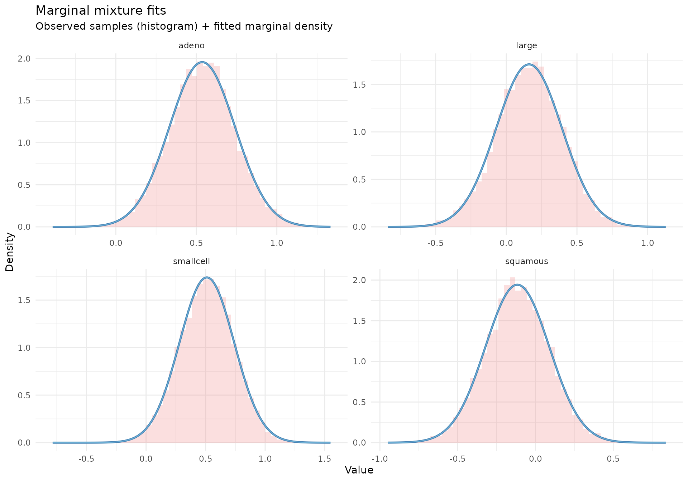
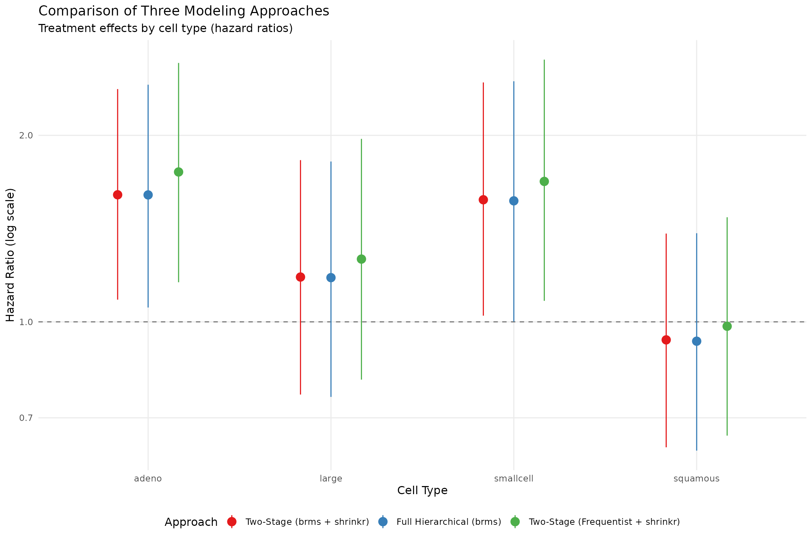
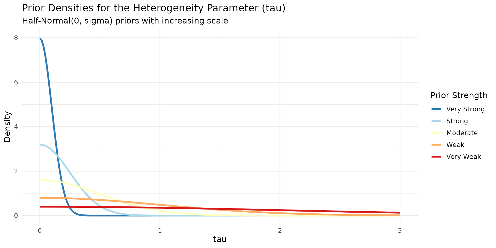
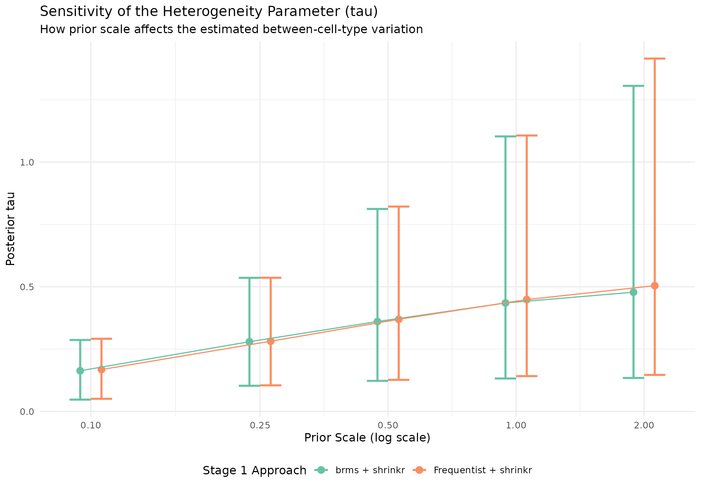
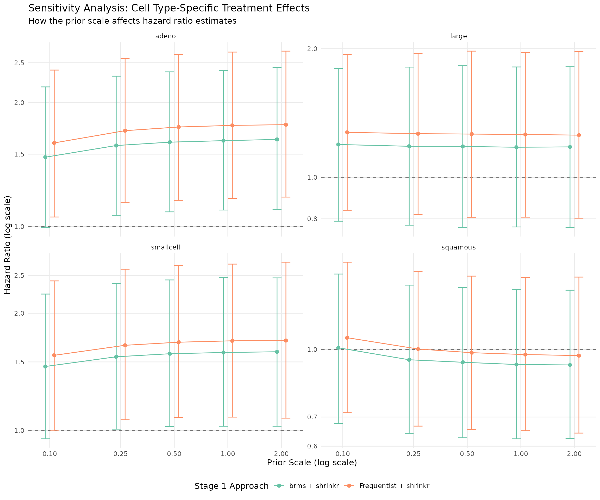

# Survival Analysis with brms and shrinkr

## Overview

This vignette demonstrates hierarchical shrinkage for survival analysis
using the classic `veteran` lung cancer dataset. We explore a key
clinical question: **Does the treatment effect vary by lung cancer cell
type?**

Rather than treating cell type-specific treatment effects as fixed
interaction terms, we model them as **random effects drawn from a common
distribution**. This hierarchical structure allows us to:

- Borrow strength across cell types, especially for small subgroups
- Estimate the overall mean treatment effect (`mu`)
- Quantify heterogeneity in treatment effects (`tau`)
- Shrink extreme subgroup estimates toward the group mean

We compare **three modeling approaches**:

1.  **Two-stage (brms + shrinkr)**: fit a Cox model in `brms`, then
    apply hierarchical shrinkage in `shrinkr`
2.  **Full hierarchical (brms)**: fit the hierarchical Cox model in one
    step
3.  **Two-stage (frequentist + shrinkr)**: use Cox model estimates from
    [`survival::coxph()`](https://rdrr.io/pkg/survival/man/coxph.html),
    then apply shrinkage

The two-stage `brms` workflow produces nearly identical results to the
full hierarchical model, while making it easy to explore alternative
hierarchical priors without repeatedly refitting the Stage 1 model.

Some model-fitting steps are computationally intensive and are not
evaluated during routine package checks. All code needed to reproduce
the analysis is shown below.

## Setup

``` r

library(shrinkr)
library(brms)
library(tidybayes)
library(distributional)
library(tidyverse)
library(survival)
library(posterior)
library(patchwork)

theme_set(theme_minimal(base_size = 12))

cell_types <- c("squamous", "smallcell", "adeno", "large")

prior_specs <- list(
  very_strong = list(name = "Very Strong", scale = 0.1),
  strong = list(name = "Strong", scale = 0.25),
  moderate = list(name = "Moderate", scale = 0.5),
  weak = list(name = "Weak", scale = 1.0),
  very_weak = list(name = "Very Weak", scale = 2.0)
)
```

## The Veteran Dataset

``` r

data(veteran, package = "survival")

head(veteran)
#>   trt celltype time status karno diagtime age prior
#> 1   1 squamous   72      1    60        7  69     0
#> 2   1 squamous  411      1    70        5  64    10
#> 3   1 squamous  228      1    60        3  38     0
#> 4   1 squamous  126      1    60        9  63    10
#> 5   1 squamous  118      1    70       11  65    10
#> 6   1 squamous   10      1    20        5  49     0
table(veteran$celltype, veteran$trt)
#>            
#>              1  2
#>   squamous  15 20
#>   smallcell 30 18
#>   adeno      9 18
#>   large     15 12

veteran %>%
  group_by(celltype, trt) %>%
  summarise(
    n = n(),
    deaths = sum(status),
    median_time = median(time),
    .groups = "drop"
  )
#> # A tibble: 8 × 5
#>   celltype    trt     n deaths median_time
#>   <fct>     <dbl> <int>  <dbl>       <dbl>
#> 1 squamous      1    15     13       100  
#> 2 squamous      2    20     18       156. 
#> 3 smallcell     1    30     28        53  
#> 4 smallcell     2    18     17        27  
#> 5 adeno         1     9      9        92  
#> 6 adeno         2    18     17        49.5
#> 7 large         1    15     14       177  
#> 8 large         2    12     12        82
```

**Variables:**

- `time`: survival time (days)
- `status`: death indicator (`1 = died`)
- `trt`: treatment (`1 = standard`, `2 = test`)
- `celltype`: cancer type (`squamous`, `smallcell`, `adeno`, `large`)
- `karno`: Karnofsky score (performance status)
- `age`: age in years

The dataset contains 137 patients across four cell types, with varying
sample sizes.

## Approach 1: Two-Stage (brms + shrinkr)

### Stage 1: Fit Cox Model

We begin by fitting a Cox proportional hazards model that allows the
treatment effect to vary by cell type. At this stage we estimate
subgroup-specific treatment effects without adding hierarchical
shrinkage across cell types. That hierarchical regularization is
introduced in Stage 2.

``` r

brms_uninformative <- brm(
  time | cens(1 - status) ~ trt:celltype + karno + age,
  data = veteran,
  family = cox(),
  chains = 4,
  iter = 4000,
  warmup = 1000,
  seed = 123
)

brms_uninformative_summary <- capture.output(print(summary(brms_uninformative)))
```

**What this model does:**

- Estimates a separate log hazard ratio for the test treatment in each
  cell type
- Adjusts for baseline performance status (`karno`) and age
- Leaves pooling across cell types to the second-stage hierarchical
  model

Results:

``` r

cat(brms_uninformative_summary, sep = "\n")
#>  Family: cox 
#>   Links: mu = log 
#> Formula: time | cens(1 - status) ~ trt:celltype + karno + age 
#>    Data: veteran (Number of observations: 137) 
#>   Draws: 4 chains, each with iter = 4000; warmup = 1000; thin = 1;
#>          total post-warmup draws = 12000
#> 
#> Regression Coefficients:
#>                       Estimate Est.Error l-95% CI
#> Intercept                 4.16      0.74     2.70
#> karno                    -0.03      0.01    -0.04
#> age                      -0.01      0.01    -0.02
#> trt:celltypesquamous     -0.12      0.21    -0.52
#> trt:celltypesmallcell     0.51      0.23     0.05
#> trt:celltypeadeno         0.54      0.20     0.13
#> trt:celltypelarge         0.16      0.23    -0.31
#>                       u-95% CI Rhat Bulk_ESS Tail_ESS
#> Intercept                 5.61 1.00     9000     8957
#> karno                    -0.02 1.00    11647     9539
#> age                       0.01 1.00     9875     8676
#> trt:celltypesquamous      0.29 1.00     5515     7429
#> trt:celltypesmallcell     0.95 1.00     5310     7315
#> trt:celltypeadeno         0.94 1.00     5398     7230
#> trt:celltypelarge         0.61 1.00     5399     7077
#> 
#> Draws were sampled using sampling(NUTS). For each parameter, Bulk_ESS
#> and Tail_ESS are effective sample size measures, and Rhat is the potential
#> scale reduction factor on split chains (at convergence, Rhat = 1).
```

### Stage 2: Apply Hierarchical Shrinkage

Now we extract the cell type-specific treatment effect posteriors and
apply hierarchical shrinkage.

#### Step 1: Extract posterior samples

``` r

brms_posteriors <- brms_uninformative %>%
  spread_draws(`b_trt:celltypesquamous`, `b_trt:celltypesmallcell`,
               `b_trt:celltypeadeno`, `b_trt:celltypelarge`) %>%
  select(-c(.chain, .iteration, .draw)) %>%
  pivot_longer(everything(), names_to = "celltype", values_to = "value") %>%
  mutate(celltype = gsub("b_trt:celltype", "", celltype)) %>%
  group_by(celltype) %>%
  summarise(draws = list(matrix(value, ncol = 1)), .groups = "drop") %>%
  deframe()
```

`brms_posteriors` is a named list containing posterior draws for each
cell type.

#### Step 2: Fit a Gaussian mixture approximation

The [`fit_mixture()`](../reference/fit_mixture.md) function approximates
each subgroup posterior with a mixture of Gaussian components. This
creates a flexible representation of the Stage 1 posterior that can be
passed to [`shrink()`](../reference/shrink.md).

``` r

mix_brms <- fit_mixture(brms_posteriors, K_max = 3, verbose = TRUE)
```

``` r

print(mix_brms)
plot(mix_brms, draws = brms_posteriors)
```



**Understanding the mixture approximation:**

- Each posterior is approximated as a weighted sum of Gaussian
  components
- The number of components is chosen separately for each cell type
- This allows the approximation to capture skewness or heavier tails
  when needed

#### Step 3: Apply a hierarchical prior

``` r

priors_moderate <- list(
  mu = dist_normal(0, 1),
  tau = dist_truncated(dist_normal(0, 0.5), lower = 0)
)
```

``` r

fit_twostage_brms <- shrink(
  mixture = mix_brms,
  hierarchical_priors = priors_moderate,
  chains = 4,
  iter = 4000,
  warmup = 1000,
  seed = 456
)

moderate_brms_output <- capture.output(print(fit_twostage_brms))
```

Results:

``` r

cat(moderate_brms_output, sep = "\n")
#> # A tibble: 3 × 7
#>   variable     mean    sd    q2.5   q50 q97.5  rhat
#>   <chr>       <dbl> <dbl>   <dbl> <dbl> <dbl> <dbl>
#> 1 mu          0.246 0.265 -0.272  0.245 0.757  1.00
#> 2 tau         0.361 0.176  0.123  0.324 0.812  1.00
#> 3 tau_squared 0.161 0.177  0.0150 0.105 0.659  1.00
```

**Interpreting the shrinkage:**

- Cell type-specific estimates are pulled toward the overall mean (`mu`)
- The amount of shrinkage depends on `tau`, the between-cell-type
  heterogeneity
- Smaller `tau` implies stronger pooling
- Larger `tau` implies weaker pooling

## Approach 2: Full Hierarchical (brms)

For comparison, we fit the corresponding one-stage hierarchical Cox
model directly in `brms`.

``` r

brms_hierarchical <- brm(
  time | cens(1 - status) ~ trt + (0 + trt | celltype) + karno + age,
  data = veteran,
  family = cox(),
  prior = c(
    prior(normal(0, 1), class = b, coef = "trt"),
    prior(normal(0, 0.5), class = sd, group = "celltype", lb = 0)
  ),
  chains = 4,
  iter = 4000,
  warmup = 1000,
  seed = 123
)

brms_hierarchical_summary <- capture.output(print(summary(brms_hierarchical)))

brms_hier_effects <- brms_hierarchical %>%
  spread_draws(r_celltype[celltype, term], b_trt) %>%
  filter(term == "trt") %>%
  mutate(theta = b_trt + r_celltype) %>%
  group_by(celltype) %>%
  summarise(
    hr_mean = exp(mean(theta)),
    hr_lower = exp(quantile(theta, 0.025)),
    hr_upper = exp(quantile(theta, 0.975)),
    .groups = "drop"
  )
```

Results:

``` r

cat(brms_hierarchical_summary, sep = "\n")
#>  Family: cox 
#>   Links: mu = log 
#> Formula: time | cens(1 - status) ~ trt + (0 + trt | celltype) + karno + age 
#>    Data: veteran (Number of observations: 137) 
#>   Draws: 4 chains, each with iter = 4000; warmup = 1000; thin = 1;
#>          total post-warmup draws = 12000
#> 
#> Multilevel Hyperparameters:
#> ~celltype (Number of levels: 4) 
#>         Estimate Est.Error l-95% CI u-95% CI Rhat
#> sd(trt)     0.36      0.18     0.13     0.80 1.00
#>         Bulk_ESS Tail_ESS
#> sd(trt)     4188     6657
#> 
#> Regression Coefficients:
#>           Estimate Est.Error l-95% CI u-95% CI Rhat
#> Intercept     4.11      0.74     2.66     5.55 1.00
#> trt           0.26      0.26    -0.24     0.79 1.00
#> karno        -0.03      0.01    -0.04    -0.02 1.00
#> age          -0.01      0.01    -0.02     0.01 1.00
#>           Bulk_ESS Tail_ESS
#> Intercept    11705     9033
#> trt           5386     6740
#> karno        13722     9846
#> age          11879     7469
#> 
#> Draws were sampled using sampling(NUTS). For each parameter, Bulk_ESS
#> and Tail_ESS are effective sample size measures, and Rhat is the potential
#> scale reduction factor on split chains (at convergence, Rhat = 1).
```

## Approach 3: Two-Stage (Frequentist + shrinkr)

We can also apply the second-stage shrinkage model to standard Cox model
estimates and their covariance matrix.

``` r

cox_model <- coxph(
  Surv(time, status) ~ trt:celltype + karno + age,
  data = veteran
)

cox_summary <- summary(cox_model)

trt_idx <- grep("^trt:celltype", names(coef(cox_model)))

trt_effects <- coef(cox_model)[trt_idx]
trt_vcov <- vcov(cox_model)[trt_idx, trt_idx, drop = FALSE]

names(trt_effects) <- gsub("^trt:celltype", "", names(trt_effects))
rownames(trt_vcov) <- colnames(trt_vcov) <- names(trt_effects)
```

``` r

print(cox_summary)
#> Call:
#> coxph(formula = Surv(time, status) ~ trt:celltype + karno + age, 
#>     data = veteran)
#> 
#>   n= 137, number of events= 128 
#> 
#>                            coef exp(coef)  se(coef)      z Pr(>|z|)    
#> karno                 -0.031511  0.968980  0.005412 -5.823  5.8e-09 ***
#> age                   -0.009056  0.990985  0.009125 -0.992  0.32102    
#> trt:celltypesquamous  -0.058593  0.943091  0.210626 -0.278  0.78087    
#> trt:celltypesmallcell  0.585704  1.796254  0.238641  2.454  0.01411 *  
#> trt:celltypeadeno      0.626150  1.870396  0.210631  2.973  0.00295 ** 
#> trt:celltypelarge      0.236620  1.266960  0.237554  0.996  0.31922    
#> ---
#> Signif. codes:  0 '***' 0.001 '**' 0.01 '*' 0.05 '.' 0.1 ' ' 1
#> 
#>                       exp(coef) exp(-coef) lower .95 upper .95
#> karno                    0.9690     1.0320    0.9588    0.9793
#> age                      0.9910     1.0091    0.9734    1.0089
#> trt:celltypesquamous     0.9431     1.0603    0.6241    1.4251
#> trt:celltypesmallcell    1.7963     0.5567    1.1252    2.8675
#> trt:celltypeadeno        1.8704     0.5346    1.2378    2.8263
#> trt:celltypelarge        1.2670     0.7893    0.7953    2.0182
#> 
#> Concordance= 0.733  (se = 0.021 )
#> Likelihood ratio test= 63.27  on 6 df,   p=1e-11
#> Wald test            = 62.9  on 6 df,   p=1e-11
#> Score (logrank) test = 67.8  on 6 df,   p=1e-12
```

``` r

print("Treatment effects (log HR):")
#> [1] "Treatment effects (log HR):"
print(trt_effects)
#>   squamous  smallcell      adeno      large 
#> -0.0585926  0.5857036  0.6261501  0.2366201

print("\nStandard errors:")
#> [1] "\nStandard errors:"
print(sqrt(diag(trt_vcov)))
#>  squamous smallcell     adeno     large 
#> 0.2106261 0.2386409 0.2106312 0.2375536
```

``` r

fit_twostage_freq <- shrink(
  mle = trt_effects,
  var_matrix = trt_vcov,
  hierarchical_priors = priors_moderate,
  chains = 4,
  iter = 4000,
  warmup = 1000,
  seed = 456
)

moderate_freq_output <- capture.output(print(fit_twostage_freq))
```

Results:

``` r

cat(moderate_freq_output, sep = "\n")
#> # A tibble: 3 × 7
#>   variable     mean    sd    q2.5   q50 q97.5  rhat
#>   <chr>       <dbl> <dbl>   <dbl> <dbl> <dbl> <dbl>
#> 1 mu          0.313 0.266 -0.218  0.312 0.834  1.00
#> 2 tau         0.369 0.178  0.127  0.334 0.822  1.00
#> 3 tau_squared 0.168 0.182  0.0160 0.112 0.675  1.00
```

## Compare Three Approaches

### Numerical comparison

``` r

theta_brms <- summary(fit_twostage_brms)$theta %>%
  transmute(
    celltype = group,
    twostage_brms = mean
  )

theta_freq <- summary(fit_twostage_freq)$theta %>%
  transmute(
    celltype = group,
    twostage_freq = mean
  )

comparison <- brms_hier_effects %>%
  transmute(
    celltype,
    full_hier_brms = log(hr_mean)
  ) %>%
  left_join(theta_brms, by = "celltype") %>%
  left_join(theta_freq, by = "celltype") %>%
  mutate(
    diff_two_stage_vs_full = twostage_brms - full_hier_brms
  )
```

``` r

knitr::kable(
  comparison[, 1:4],
  digits = 3,
  caption = "Comparison of treatment effects (log HR scale)"
)
```

| celltype  | brms_hierarchical | brms_shrinkr | freq_shrinkr |
|:----------|------------------:|-------------:|-------------:|
| squamous  |            -0.072 |       -0.067 |       -0.016 |
| smallcell |             0.450 |        0.454 |        0.522 |
| adeno     |             0.472 |        0.472 |        0.557 |
| large     |             0.164 |        0.167 |        0.233 |

Comparison of treatment effects (log HR scale) {.table}

**Key observations:**

- The two-stage `brms + shrinkr` and full hierarchical `brms` fits are
  nearly identical
- This supports the equivalence of the two formulations in this example
- The frequentist Stage 1 approach differs modestly because the
  first-stage estimates differ
- All approaches show shrinkage toward a common mean

### Visual comparison

``` r

theta_brms_plot <- summary(fit_twostage_brms)$theta %>%
  mutate(
    approach = "Two-Stage (brms + shrinkr)",
    hr_mean = exp(mean),
    hr_lower = exp(q2.5),
    hr_upper = exp(q97.5),
    celltype = group
  ) %>%
  select(celltype, approach, hr_mean, hr_lower, hr_upper)

theta_freq_plot <- summary(fit_twostage_freq)$theta %>%
  mutate(
    approach = "Two-Stage (Frequentist + shrinkr)",
    hr_mean = exp(mean),
    hr_lower = exp(q2.5),
    hr_upper = exp(q97.5),
    celltype = group
  ) %>%
  select(celltype, approach, hr_mean, hr_lower, hr_upper)

all_approaches <- bind_rows(
  theta_brms_plot,
  brms_hier_effects %>% mutate(approach = "Full Hierarchical (brms)"),
  theta_freq_plot
) %>%
  mutate(
    approach = factor(approach, levels = c(
      "Two-Stage (brms + shrinkr)",
      "Full Hierarchical (brms)",
      "Two-Stage (Frequentist + shrinkr)"
    ))
  )
```

``` r

ggplot(all_approaches, aes(x = celltype, y = hr_mean, color = approach)) +
  geom_hline(yintercept = 1, linetype = "dashed", alpha = 0.5) +
  geom_pointrange(
    aes(ymin = hr_lower, ymax = hr_upper),
    position = position_dodge(width = 0.5),
    size = 0.8
  ) +
  scale_y_log10() +
  scale_color_brewer(palette = "Set1") +
  labs(
    title = "Comparison of Three Modeling Approaches",
    subtitle = "Treatment effects by cell type (hazard ratios)",
    x = "Cell Type",
    y = "Hazard Ratio (log scale)",
    color = "Approach"
  ) +
  theme(
    legend.position = "bottom",
    panel.grid.minor = element_blank()
  )
```



## Sensitivity Analysis: Exploring Different Priors

A main advantage of the two-stage framework is that we can explore many
hierarchical priors in Stage 2 without refitting the Stage 1 survival
model.

``` r

prior_summary <- tibble(
  Strength = c("Very Strong", "Strong", "Moderate", "Weak", "Very Weak"),
  Prior = c(
    "Half-Normal(0, 0.1)",
    "Half-Normal(0, 0.25)",
    "Half-Normal(0, 0.5)",
    "Half-Normal(0, 1.0)",
    "Half-Normal(0, 2.0)"
  ),
  Scale = c(0.1, 0.25, 0.5, 1.0, 2.0),
  Interpretation = c(
    "Very similar effects expected",
    "Similar effects expected",
    "Moderate heterogeneity allowed",
    "Substantial differences allowed",
    "Large differences allowed"
  )
)

knitr::kable(prior_summary)
```

| Strength    | Prior                | Scale | Interpretation                  |
|:------------|:---------------------|------:|:--------------------------------|
| Very Strong | Half-Normal(0, 0.1)  |  0.10 | Very similar effects expected   |
| Strong      | Half-Normal(0, 0.25) |  0.25 | Similar effects expected        |
| Moderate    | Half-Normal(0, 0.5)  |  0.50 | Moderate heterogeneity allowed  |
| Weak        | Half-Normal(0, 1.0)  |  1.00 | Substantial differences allowed |
| Very Weak   | Half-Normal(0, 2.0)  |  2.00 | Large differences allowed       |

``` r

all_priors <- list(
  very_strong = list(
    mu = dist_normal(0, 1),
    tau = dist_truncated(dist_normal(0, 0.1), lower = 0)
  ),
  strong = list(
    mu = dist_normal(0, 1),
    tau = dist_truncated(dist_normal(0, 0.25), lower = 0)
  ),
  moderate = list(
    mu = dist_normal(0, 1),
    tau = dist_truncated(dist_normal(0, 0.5), lower = 0)
  ),
  weak = list(
    mu = dist_normal(0, 1),
    tau = dist_truncated(dist_normal(0, 1.0), lower = 0)
  ),
  very_weak = list(
    mu = dist_normal(0, 1),
    tau = dist_truncated(dist_normal(0, 2.0), lower = 0)
  )
)

# --- brms fits ---
sensitivity_fits_brms <- lapply(all_priors, function(prior) {
  shrink(
    mixture = mix_brms,
    hierarchical_priors = prior,
    chains = 4,
    iter = 4000,
    warmup = 1000
  )
})

# --- frequentist fits ---
sensitivity_fits_freq <- lapply(all_priors, function(prior) {
  shrink(
    mle = trt_effects,
    var_matrix = trt_vcov,
    hierarchical_priors = prior,
    chains = 4,
    iter = 4000,
    warmup = 1000
  )
})

# --- summaries ---
sensitivity_summaries <- c(
  purrr::imap(sensitivity_fits_brms, function(fit, nm) {
    summ <- summary(fit)
    list(
      theta_summary = summ$theta,
      mu_tau_summary = summ$mu_tau,
      print_output = capture.output(print(fit))
    )
  }),
  purrr::imap(sensitivity_fits_freq, function(fit, nm) {
    summ <- summary(fit)
    list(
      theta_summary = summ$theta,
      mu_tau_summary = summ$mu_tau,
      print_output = capture.output(print(fit))
    )
  })
)

# --- name them clearly ---
names(sensitivity_summaries) <- c(
  paste0(names(all_priors), "_brms"),
  paste0(names(all_priors), "_freq")
)
```

### Prior densities

``` r

tau_seq <- seq(0, 3, length.out = 200)

prior_densities <- lapply(names(prior_specs), function(spec_name) {
  spec <- prior_specs[[spec_name]]
  tibble(
    tau = tau_seq,
    density = dnorm(tau_seq, 0, spec$scale) * 2,
    prior_strength = spec$name,
    scale = spec$scale
  )
}) %>%
  bind_rows() %>%
  mutate(
    prior_strength = factor(prior_strength, levels = c(
      "Very Strong", "Strong", "Moderate", "Weak", "Very Weak"
    ))
  )

ggplot(prior_densities, aes(x = tau, y = density, color = prior_strength)) +
  geom_line(linewidth = 1.2) +
  scale_color_brewer(palette = "RdYlBu", direction = -1) +
  labs(
    title = "Prior Densities for the Heterogeneity Parameter (tau)",
    subtitle = "Half-Normal(0, sigma) priors with increasing scale",
    x = "tau",
    y = "Density",
    color = "Prior Strength"
  ) +
  theme(legend.position = "right")
```



### Heterogeneity estimates

``` r

tau_results <- lapply(names(sensitivity_summaries), function(fit_name) {
  summary_obj <- sensitivity_summaries[[fit_name]]
  prior_name <- sub("_(brms|freq)$", "", fit_name)
  approach <- if (grepl("_brms$", fit_name)) "brms + shrinkr" else "Frequentist + shrinkr"

  summary_obj$mu_tau_summary %>%
    filter(parameter == "tau") %>%
    mutate(
      prior_strength = prior_specs[[prior_name]]$name,
      prior_scale = prior_specs[[prior_name]]$scale,
      approach = approach
    )
}) %>%
  bind_rows() %>%
  mutate(
    prior_strength = factor(
      prior_strength,
      levels = c("Very Strong", "Strong", "Moderate", "Weak", "Very Weak")
    )
  )

if (all(c("q2.5", "q97.5") %in% names(tau_results))) {
  tau_results <- tau_results %>%
    mutate(lower = `q2.5`, upper = `q97.5`)
} else if (all(c("q5", "q95") %in% names(tau_results))) {
  tau_results <- tau_results %>%
    mutate(lower = q5, upper = q95)
} else {
  stop(
    "Could not find interval columns in sensitivity_summaries$mu_tau_summary. ",
    "Available columns are: ",
    paste(names(tau_results), collapse = ", ")
  )
}

ggplot(tau_results, aes(x = prior_scale, y = mean, color = approach)) +
  geom_point(size = 3, position = position_dodge(width = 0.1)) +
  geom_errorbar(
    aes(ymin = lower, ymax = upper),
    width = 0.1,
    linewidth = 1,
    position = position_dodge(width = 0.1)
  ) +
  geom_line(aes(group = approach), position = position_dodge(width = 0.1)) +
  scale_x_log10(breaks = c(0.1, 0.25, 0.5, 1.0, 2.0)) +
  scale_color_brewer(palette = "Set2") +
  labs(
    title = "Sensitivity of the Heterogeneity Parameter (tau)",
    subtitle = "How prior scale affects the estimated between-cell-type variation",
    x = "Prior Scale (log scale)",
    y = "Posterior tau",
    color = "Stage 1 Approach"
  ) +
  theme(legend.position = "bottom")
```



**Interpretation:**

- Stronger priors constrain `tau` toward smaller values and produce more
  shrinkage
- Weaker priors allow more between-cell-type variation
- The posterior for `tau` stabilizes as the prior becomes less
  restrictive

### Impact on cell type estimates

``` r

theta_sensitivity <- lapply(names(sensitivity_summaries), function(fit_name) {
  summary_obj <- sensitivity_summaries[[fit_name]]
  prior_name <- sub("_(brms|freq)$", "", fit_name)
  approach <- if (grepl("_brms$", fit_name)) "brms + shrinkr" else "Frequentist + shrinkr"

  summary_obj$theta_summary %>%
    mutate(
      prior_strength = prior_specs[[prior_name]]$name,
      prior_scale = prior_specs[[prior_name]]$scale,
      approach = approach,
      hr_mean = exp(mean),
      hr_lower = exp(q2.5),
      hr_upper = exp(q97.5)
    )
}) %>%
  bind_rows() %>%
  mutate(
    prior_strength = factor(prior_strength, levels = c(
      "Very Strong", "Strong", "Moderate", "Weak", "Very Weak"
    ))
  )
```

``` r

ggplot(theta_sensitivity, aes(x = prior_scale, y = hr_mean, color = approach)) +
  geom_hline(yintercept = 1, linetype = "dashed", alpha = 0.5) +
  geom_point(size = 2, position = position_dodge(width = 0.1)) +
  geom_errorbar(
    aes(ymin = hr_lower, ymax = hr_upper),
    width = 0.1,
    position = position_dodge(width = 0.1)
  ) +
  geom_line(aes(group = approach), position = position_dodge(width = 0.1)) +
  facet_wrap(~group, ncol = 2, scales = "free_y") +
  scale_x_log10(breaks = c(0.1, 0.25, 0.5, 1.0, 2.0)) +
  scale_y_log10() +
  scale_color_brewer(palette = "Set2") +
  labs(
    title = "Sensitivity Analysis: Cell Type-Specific Treatment Effects",
    subtitle = "How the prior scale affects hazard ratio estimates",
    x = "Prior Scale (log scale)",
    y = "Hazard Ratio (log scale)",
    color = "Stage 1 Approach"
  ) +
  theme(
    legend.position = "bottom",
    panel.grid.minor = element_blank()
  )
```



## Key Takeaways

1.  The two-stage `brms + shrinkr` workflow closely matches the full
    hierarchical `brms` analysis in this example.
2.  The two-stage approach is modular: fit the survival model once, then
    explore many hierarchical priors efficiently.
3.  Sensitivity analysis becomes straightforward because Stage 2 can be
    rerun without refitting Stage 1.
4.  [`fit_mixture()`](../reference/fit_mixture.md) provides a flexible
    approximation to the subgroup posteriors, and
    [`shrink()`](../reference/shrink.md) adds hierarchical
    regularization on top of that approximation.

## Session Info

``` r

sessionInfo()
#> R version 4.6.0 (2026-04-24)
#> Platform: x86_64-pc-linux-gnu
#> Running under: Ubuntu 24.04.4 LTS
#> 
#> Matrix products: default
#> BLAS:   /usr/lib/x86_64-linux-gnu/openblas-pthread/libblas.so.3 
#> LAPACK: /usr/lib/x86_64-linux-gnu/openblas-pthread/libopenblasp-r0.3.26.so;  LAPACK version 3.12.0
#> 
#> locale:
#>  [1] LC_CTYPE=C.UTF-8       LC_NUMERIC=C           LC_TIME=C.UTF-8       
#>  [4] LC_COLLATE=C.UTF-8     LC_MONETARY=C.UTF-8    LC_MESSAGES=C.UTF-8   
#>  [7] LC_PAPER=C.UTF-8       LC_NAME=C              LC_ADDRESS=C          
#> [10] LC_TELEPHONE=C         LC_MEASUREMENT=C.UTF-8 LC_IDENTIFICATION=C   
#> 
#> time zone: UTC
#> tzcode source: system (glibc)
#> 
#> attached base packages:
#> [1] stats     graphics  grDevices utils     datasets  methods   base     
#> 
#> other attached packages:
#>  [1] patchwork_1.3.2      posterior_1.7.0      survival_3.8-6      
#>  [4] lubridate_1.9.5      forcats_1.0.1        stringr_1.6.0       
#>  [7] dplyr_1.2.1          purrr_1.2.2          readr_2.2.0         
#> [10] tidyr_1.3.2          tibble_3.3.1         ggplot2_4.0.3       
#> [13] tidyverse_2.0.0      distributional_0.7.1 tidybayes_3.0.7     
#> [16] brms_2.23.0          Rcpp_1.1.1-1.1       shrinkr_0.4.3       
#> 
#> loaded via a namespace (and not attached):
#>  [1] tidyselect_1.2.1      svUnit_1.0.8          farver_2.1.2         
#>  [4] loo_2.9.0             S7_0.2.2              fastmap_1.2.0        
#>  [7] tensorA_0.36.2.1      digest_0.6.39         timechange_0.4.0     
#> [10] lifecycle_1.0.5       StanHeaders_2.32.10   magrittr_2.0.5       
#> [13] compiler_4.6.0        rlang_1.2.0           sass_0.4.10          
#> [16] tools_4.6.0           utf8_1.2.6            yaml_2.3.12          
#> [19] knitr_1.51            labeling_0.4.3        bridgesampling_1.2-1 
#> [22] htmlwidgets_1.6.4     pkgbuild_1.4.8        mclust_6.1.2         
#> [25] RColorBrewer_1.1-3    abind_1.4-8           withr_3.0.2          
#> [28] desc_1.4.3            grid_4.6.0            stats4_4.6.0         
#> [31] inline_0.3.21         scales_1.4.0          cli_3.6.6            
#> [34] mvtnorm_1.4-1         rmarkdown_2.31        ragg_1.5.2           
#> [37] generics_0.1.4        otel_0.2.0            RcppParallel_5.1.11-2
#> [40] tzdb_0.5.0            cachem_1.1.0          rstan_2.32.7         
#> [43] splines_4.6.0         bayesplot_1.15.0      parallel_4.6.0       
#> [46] matrixStats_1.5.0     vctrs_0.7.3           Matrix_1.7-5         
#> [49] jsonlite_2.0.0        hms_1.1.4             arrayhelpers_1.1-0   
#> [52] systemfonts_1.3.2     ggdist_3.3.3          jquerylib_0.1.4      
#> [55] glue_1.8.1            pkgdown_2.2.0         codetools_0.2-20     
#> [58] stringi_1.8.7         gtable_0.3.6          QuickJSR_1.10.0      
#> [61] pillar_1.11.1         htmltools_0.5.9       Brobdingnag_1.2-9    
#> [64] R6_2.6.1              textshaping_1.0.5     evaluate_1.0.5       
#> [67] lattice_0.22-9        backports_1.5.1       bslib_0.11.0         
#> [70] rstantools_2.6.0      coda_0.19-4.1         gridExtra_2.3        
#> [73] nlme_3.1-169          checkmate_2.3.4       xfun_0.58            
#> [76] fs_2.1.0              pkgconfig_2.0.3
```
