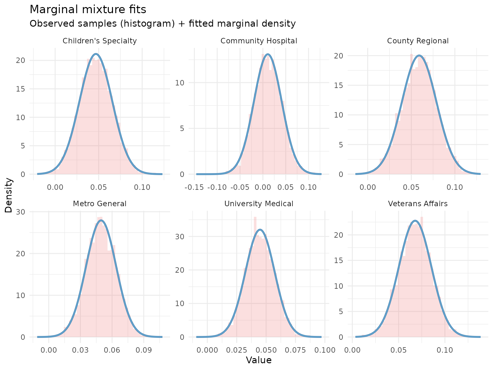
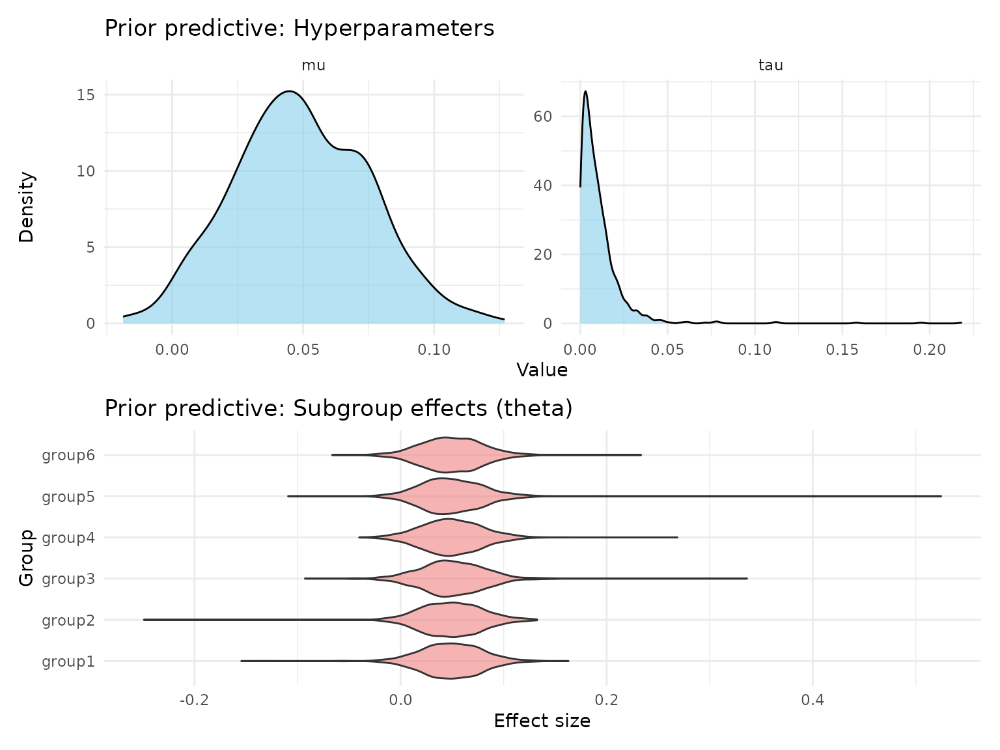
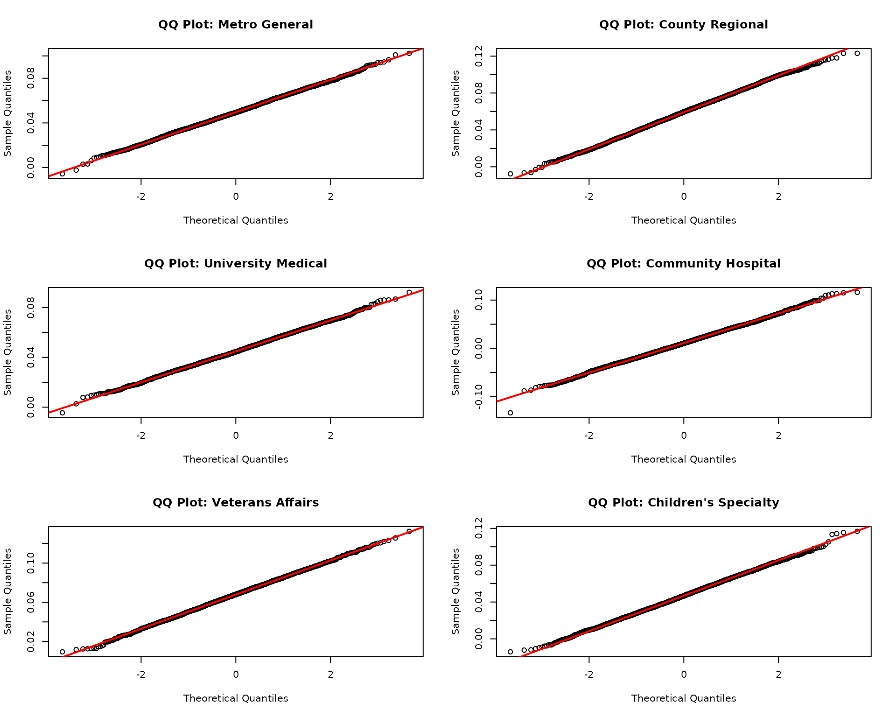
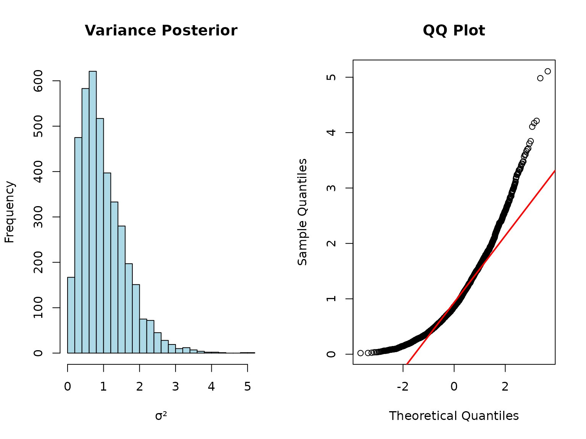
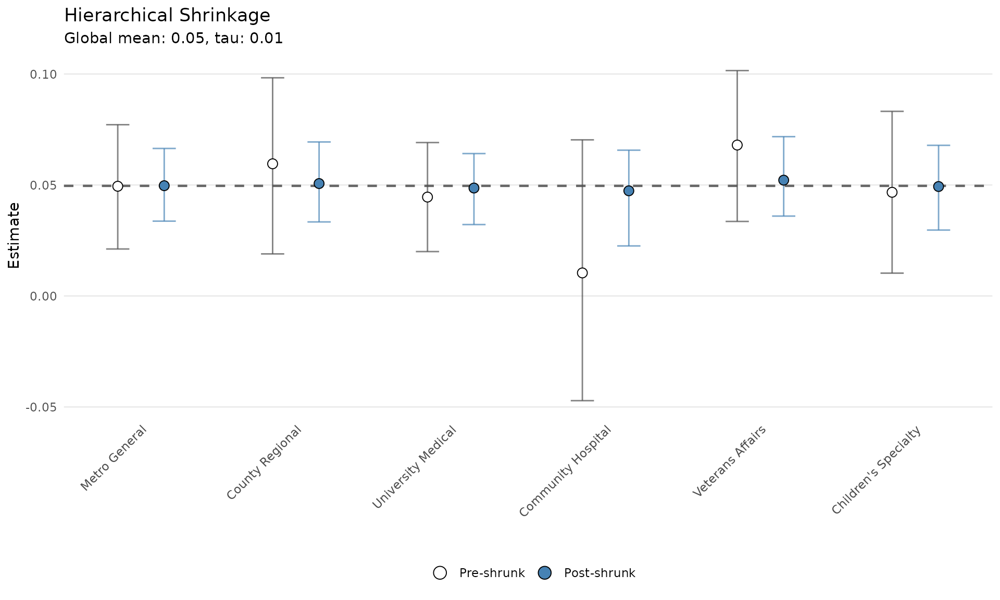
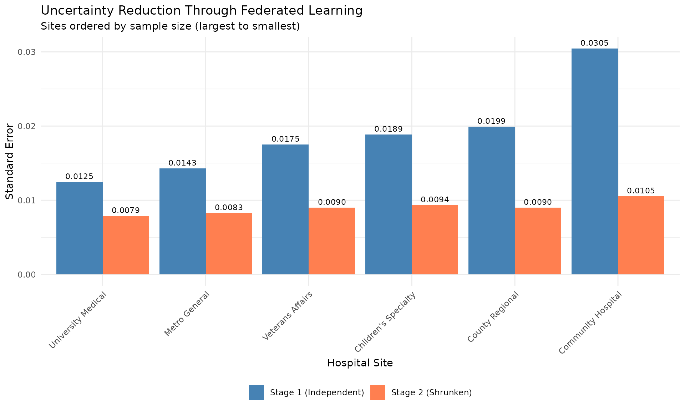
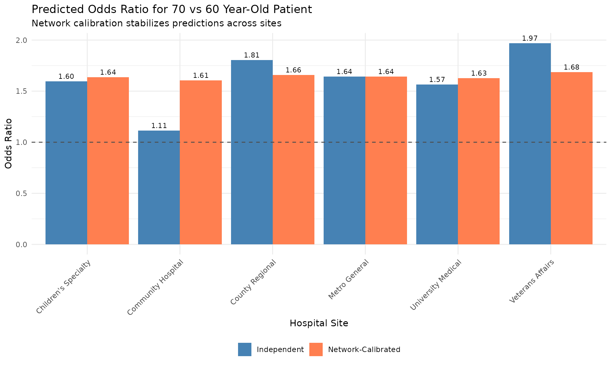

# Federated Learning with shrinkr

## Introduction

**Federated learning** enables collaborative analysis across multiple
sites without centralizing data. This is critical when:

- Data cannot leave institutional firewalls (HIPAA, GDPR)
- Each site has proprietary or sensitive data
- Centralizing data is logistically infeasible
- You want to preserve patient privacy

**shrinkr’s two-stage architecture naturally enables federated
learning:**

    Site 1: Stage 1 model -> Posterior samples (or summaries)
    Site 2: Stage 1 model -> Posterior samples (or summaries)  } -> Central
    Site 3: Stage 1 model -> Posterior samples (or summaries)  }   Coordinator
       ...                                                     }   applies
    Site K: Stage 1 model -> Posterior samples (or summaries)  }   Stage 2 shrinkage

**Data never leaves the sites**, only statistical summaries are shared.

> **Important: CLT Assumption for Summary Statistics**
>
> If sites share only summary statistics (means + SEs) rather than full
> posteriors, the analysis relies on the **Bayesian Central Limit
> Theorem**. This assumes posteriors are approximately normal, which
> requires:
>
> - Adequate sample sizes at each site
> - Parameters in the interior (not near boundaries)
> - Well-behaved likelihood functions
> - Regular posterior geometry
>
> **Always verify** posterior normality before using summary statistics!
> When in doubt, share full posteriors or send mixture approximations,
> for example by sending [`fit_mixture()`](../reference/fit_mixture.md)
> output.

``` r

library(shrinkr)
library(distributional)
library(posterior)
library(dplyr)
library(ggplot2)
library(tidyr)
```

## Use Case: Multi-Hospital Mortality Prediction

We’ll analyze a federated clinical prediction model across 6 hospitals.
Each hospital:

- Has developed a logistic regression model for 30-day mortality
- Cannot share patient-level data (HIPAA compliance)
- Wants to improve predictions by borrowing strength across sites

**Goal**: Combine site-specific models while respecting data governance
constraints.

## Scenario Setup

### The Federated Network

``` r

hospitals <- data.frame(
  site_id = 1:6,
  name = c("Metro General", "County Regional", "University Medical", 
           "Community Hospital", "Veterans Affairs", "Children's Specialty"),
  location = c("Urban", "Suburban", "Academic", "Rural", "Urban", "Urban"),
  n_patients = c(1500, 800, 2200, 350, 1100, 900),
  baseline_risk = c(0.15, 0.12, 0.18, 0.10, 0.20, 0.14)
)

print(hospitals)
#>   site_id                 name location n_patients baseline_risk
#> 1       1        Metro General    Urban       1500          0.15
#> 2       2      County Regional Suburban        800          0.12
#> 3       3   University Medical Academic       2200          0.18
#> 4       4   Community Hospital    Rural        350          0.10
#> 5       5     Veterans Affairs    Urban       1100          0.20
#> 6       6 Children's Specialty    Urban        900          0.14
```

### The Clinical Model

Each site fits:

``` math
\text{logit}(\text{mortality})
=
\beta_0
+
\beta_1(\text{age})
+
\beta_2(\text{severity\_score})
+
\beta_3(\text{comorbidities})
```

**Parameter of interest**: $`\beta_1`$ (age effect on mortality)

- We want site-specific estimates
- But want to borrow strength across the network

## Federated Workflow

### Step 1: Each Site Fits Independently

In practice, this happens behind each site’s firewall. We simulate:

``` r

set.seed(1104)

# True network-level parameters (unknown in practice)
true_mu_age <- 0.05    # log-OR per year
true_tau_age <- 0.015  # between-site heterogeneity
true_site_effects <- rnorm(6, true_mu_age, true_tau_age)

# Simulate Stage 1: Each site fits their model independently
# In reality: glm(), stan_glm(), or other Bayesian logistic regression

site_posteriors <- list()
site_sample_sizes <- hospitals$n_patients

for(i in 1:6) {
  # Posterior for age coefficient beta_1
  # SE inversely proportional to sqrt(sample size)
  se_i <- 0.02 * sqrt(800 / site_sample_sizes[i])
  
  site_posteriors[[hospitals$name[i]]] <- matrix(
    rnorm(4000, true_site_effects[i], se_i),
    ncol = 1
  )
}

# Each site computes summaries
site_summaries <- data.frame(
  site = hospitals$name,
  n_patients = site_sample_sizes,
  beta_age_mean = sapply(site_posteriors, mean),
  beta_age_se = sapply(site_posteriors, sd)
) %>%
  mutate(
    ci_lower = beta_age_mean - 1.96 * beta_age_se,
    ci_upper = beta_age_mean + 1.96 * beta_age_se
  )

print(site_summaries)
#>                                      site n_patients beta_age_mean beta_age_se
#> Metro General               Metro General       1500    0.04958522  0.01428679
#> County Regional           County Regional        800    0.05905738  0.01992675
#> University Medical     University Medical       2200    0.04482541  0.01246048
#> Community Hospital     Community Hospital        350    0.01077674  0.03047231
#> Veterans Affairs         Veterans Affairs       1100    0.06783668  0.01752091
#> Children's Specialty Children's Specialty        900    0.04679578  0.01888196
#>                          ci_lower   ci_upper
#> Metro General         0.021583117 0.07758733
#> County Regional       0.020000961 0.09811381
#> University Medical    0.020402874 0.06924794
#> Community Hospital   -0.048948992 0.07050247
#> Veterans Affairs      0.033495692 0.10217766
#> Children's Specialty  0.009787133 0.08380442
```

**Key observations:**

- Smaller sites, for example Community Hospital, have wider intervals
- Point estimates vary across sites
- The rural site with fewer patients is least precise

### Step 2: Sites Share Summaries with Coordinator

Two federated learning paths are possible:

#### Path A: Share Full Posteriors (if permitted)

``` r

# Sites share posterior samples (4000 draws each)
# This is more informative but requires more data transfer

cat("Data shared per site:\n")
#> Data shared per site:
cat("  Posterior samples: 4000 draws\n")
#>   Posterior samples: 4000 draws
cat("  Total data transfer:", 6 * 4000 * 8, "bytes (", 
    round(6 * 4000 * 8 / 1024, 1), "KB)\n")
#>   Total data transfer: 192000 bytes ( 187.5 KB)
```

#### Path B: Share Only Summary Statistics (requires assumptions)

``` r

# Sites share only mean and SE
# Minimal data transfer, maximum privacy
# BUT: Only valid if posteriors are approximately normal!

summary_only <- site_summaries %>%
  select(site, beta_age_mean, beta_age_se)

cat("Data shared per site:\n")
#> Data shared per site:
cat("  Point estimate: 1 number\n")
#>   Point estimate: 1 number
cat("  Standard error: 1 number\n")
#>   Standard error: 1 number
cat("  Total data transfer:", 6 * 2 * 8, "bytes (", 
    round(6 * 2 * 8 / 1024, 3), "KB)\n")
#>   Total data transfer: 96 bytes ( 0.094 KB)

print(summary_only)
#>                                      site beta_age_mean beta_age_se
#> Metro General               Metro General    0.04958522  0.01428679
#> County Regional           County Regional    0.05905738  0.01992675
#> University Medical     University Medical    0.04482541  0.01246048
#> Community Hospital     Community Hospital    0.01077674  0.03047231
#> Veterans Affairs         Veterans Affairs    0.06783668  0.01752091
#> Children's Specialty Children's Specialty    0.04679578  0.01888196
```

**Privacy consideration**: Path B shares much less data than Path A.

**Critical assumption**: Path B relies on the **Bayesian Central Limit
Theorem**:

- Large sample sizes at each site
- Parameters not near boundaries
- Well-behaved likelihoods
- Regular posterior geometry

## Central Coordinator: Stage 2 Shrinkage

The coordinator, for example a coordinating center or trusted third
party, now applies hierarchical shrinkage.

### Path A: Using Full Posteriors

``` r

# Fit mixture approximation
mix <- fit_mixture(
  samples = site_posteriors,
  K_max = 2,  # Age effects should be fairly normal
  verbose = TRUE
)

# Check quality
plot(mix, draws = site_posteriors, type = "density")
```



#### Specify Network-Level Priors

``` r

# Based on clinical knowledge:
# - Age effect should be positive but moderate
# - Some heterogeneity expected across hospital types

hierarchical_priors <- list(
  mu = dist_normal(0.05, 0.025),  # Centered on 5% increase per year
  tau = dist_truncated(dist_student_t(3, 0, 0.01), lower = 0)  # Modest heterogeneity
)

# Visualize prior implications
prior_pred <- sample_prior_predictive(
  hierarchical_priors = hierarchical_priors,
  n_groups = 6,
  n_draws = 1000
)

plot(prior_pred, type = "both")
```



#### Fit Hierarchical Model

``` r

fit_full_post <- shrink(
  mixture = mix,
  hierarchical_priors = hierarchical_priors,
  chains = 4,
  iter = 2000,
  warmup = 1000,
  seed = 123
)
```

``` r

print(fit_full_post)
#> # A tibble: 3 × 7
#>   variable         mean       sd         q2.5       q50    q97.5  rhat
#>   <chr>           <dbl>    <dbl>        <dbl>     <dbl>    <dbl> <dbl>
#> 1 mu          0.0496    0.00717  0.0351       0.0498    0.0636    1.00
#> 2 tau         0.00624   0.00520  0.000263     0.00493   0.0195    1.00
#> 3 tau_squared 0.0000660 0.000119 0.0000000689 0.0000243 0.000381  1.00

# Network-level estimates
mu_tau_full <- extract_mu_tau(fit_full_post)
cat("\nNetwork-level age effect (mu):\n")
#> 
#> Network-level age effect (mu):
cat("  Posterior mean:", round(mean(mu_tau_full$mu), 4), "\n")
#>   Posterior mean: 0.0496
cat("  95% CI: [", round(quantile(mu_tau_full$mu, 0.025), 4), ",",
    round(quantile(mu_tau_full$mu, 0.975), 4), "]\n")
#>   95% CI: [ 0.0351 , 0.0636 ]

cat("\nBetween-site heterogeneity (tau):\n")
#> 
#> Between-site heterogeneity (tau):
cat("  Posterior mean:", round(mean(mu_tau_full$tau), 4), "\n")
#>   Posterior mean: 0.0062
cat("  95% CI: [", round(quantile(mu_tau_full$tau, 0.025), 4), ",",
    round(quantile(mu_tau_full$tau, 0.975), 4), "]\n")
#>   95% CI: [ 3e-04 , 0.0195 ]
```

### Path B: Using Only Summary Statistics

**Before using summary statistics**, we must verify posteriors are
approximately normal.

#### Step 1: Check Normality Assumption

``` r

# Visual checks for approximate normality
par(mfrow = c(3, 2))
for(i in 1:6) {
  site_name <- names(site_posteriors)[i]
  samples_i <- as.vector(site_posteriors[[i]])
  
  # QQ plot against normal
  qqnorm(samples_i, main = paste("QQ Plot:", site_name))
  qqline(samples_i, col = "red", lwd = 2)
}
```



``` r

par(mfrow = c(1, 1))
```

``` r

# Quantitative checks
normality_checks <- data.frame(
  site = names(site_posteriors),
  skewness = sapply(site_posteriors, function(x) {
    m3 <- mean((x - mean(x))^3)
    s3 <- sd(x)^3
    m3 / s3
  }),
  kurtosis = sapply(site_posteriors, function(x) {
    m4 <- mean((x - mean(x))^4)
    s4 <- sd(x)^4
    m4 / s4 - 3  # Excess kurtosis
  })
)

print(normality_checks)
#>                                      site     skewness     kurtosis
#> Metro General               Metro General  0.006067498  0.009199907
#> County Regional           County Regional -0.050758390 -0.116123944
#> University Medical     University Medical  0.035950881 -0.005600149
#> Community Hospital     Community Hospital  0.008651589  0.118037106
#> Veterans Affairs         Veterans Affairs -0.041185160 -0.015861386
#> Children's Specialty Children's Specialty  0.010783310 -0.090076276

cat("\nNormality assessment:\n")
#> 
#> Normality assessment:
cat("  Skewness close to 0? (|skew| < 0.5 is good)\n")
#>   Skewness close to 0? (|skew| < 0.5 is good)
cat("  Kurtosis close to 0? (|kurt| < 1.0 is good)\n")
#>   Kurtosis close to 0? (|kurt| < 1.0 is good)
cat("  All sites pass:", 
    all(abs(normality_checks$skewness) < 0.5 & abs(normality_checks$kurtosis) < 1.0),
    "\n")
#>   All sites pass: TRUE
```

**Decision rule**:

- If posteriors look approximately normal, Path B is likely valid
- If posteriors are skewed/heavy-tailed, use Path A
- If unsure, use Path A

#### When CLT Fails: A Counter-Example

To illustrate why normality matters, consider a scenario where we are
estimating a **variance parameter**:

``` r

# Simulated: posterior for a variance parameter (boundary at 0)
set.seed(999)
variance_posterior <- matrix(rchisq(4000, df = 5) / 5, ncol = 1)

# Compute summary statistics
var_mean <- mean(variance_posterior)
var_se <- sd(variance_posterior)

# Check normality
par(mfrow = c(1, 2))
hist(variance_posterior, breaks = 30, main = "Variance Posterior",
     xlab = "sigma^2", col = "lightblue")
qqnorm(variance_posterior, main = "QQ Plot")
qqline(variance_posterior, col = "red", lwd = 2)
```



``` r

par(mfrow = c(1, 1))

# Skewness
skew <- mean((variance_posterior - var_mean)^3) / var_se^3
cat("Skewness:", round(skew, 2), "(should be about 0 for normal)\n")
#> Skewness: 1.24 (should be about 0 for normal)
cat("This posterior is right-skewed - CLT approximation would be poor!\n")
#> This posterior is right-skewed - CLT approximation would be poor!
```

**For this scenario:**

- Path B summaries would give biased results
- Path A mixture handles the skewness correctly

#### Step 2: Fit Using CLT Approximation

``` r

# Extract means and variances
mle_estimates <- site_summaries$beta_age_mean
names(mle_estimates) <- site_summaries$site

mle_variances <- site_summaries$beta_age_se^2
names(mle_variances) <- site_summaries$site

# Fit using MLE path (CLT approximation)
fit_summaries <- shrink(
  mle = mle_estimates,
  var_matrix = mle_variances,
  hierarchical_priors = hierarchical_priors,
  chains = 4,
  iter = 2000,
  warmup = 1000,
  seed = 123,
  verbose = FALSE,
  refresh = 0
)

print(fit_summaries)
#> # A tibble: 3 × 7
#>   variable         mean       sd         q2.5       q50    q97.5  rhat
#>   <chr>           <dbl>    <dbl>        <dbl>     <dbl>    <dbl> <dbl>
#> 1 mu          0.0497    0.00738  0.0351       0.0500    0.0640   1.00 
#> 2 tau         0.00625   0.00522  0.000223     0.00506   0.0189   1.000
#> 3 tau_squared 0.0000663 0.000123 0.0000000498 0.0000256 0.000357 1.000
```

### Compare Paths

``` r

mu_tau_summaries <- extract_mu_tau(fit_summaries)

comparison <- data.frame(
  parameter = c("mu", "tau"),
  full_posteriors = c(
    mean(mu_tau_full$mu),
    mean(mu_tau_full$tau)
  ),
  summaries_only = c(
    mean(mu_tau_summaries$mu),
    mean(mu_tau_summaries$tau)
  )
) %>%
  mutate(difference = abs(full_posteriors - summaries_only))

print(comparison)
#>   parameter full_posteriors summaries_only   difference
#> 1        mu     0.049595359    0.049744508 1.491484e-04
#> 2       tau     0.006242385    0.006248864 6.478663e-06

cat("\nMaximum difference:", round(max(comparison$difference), 5), "\n")
#> 
#> Maximum difference: 0.00015
```

**Conclusion**: Both paths give nearly identical results **because**
posteriors are approximately normal in this case. This will not always
be true.

**When each path is appropriate:**

| Situation | Recommended Path | Reason |
|----|----|----|
| Posteriors are normal (verified) | Path B acceptable | CLT holds; minimal sharing |
| Posteriors are skewed/multimodal | Path A required | CLT fails; mixture needed |
| Small sample sizes per site | Path A safer | CLT may not hold yet |
| Boundary constraints | Path A required | CLT assumes interior parameters |
| Unknown posterior shape | Path A safer | Conservative choice |
| Maximum privacy needed and normal posteriors | Path B acceptable | But verify normality |

## Results: Improved Site-Specific Estimates

### Visualize Shrinkage Effect

``` r

# Using Path A results (nearly identical for Path B)
plot(fit_full_post)
```



**Key insights:**

- **Community Hospital** shrinks most toward the network mean
- **University Medical** keeps closest to its original estimate
- **Metro General** and **VA Hospital** are pulled slightly toward the
  center
- Adaptive borrowing is based on precision

### Quantify Uncertainty Reduction

``` r

# Get Stage 2 estimates
theta_post <- summarize_theta(fit_full_post)

# Compare Stage 1 vs Stage 2 uncertainty
uncertainty_comparison <- data.frame(
  site = site_summaries$site,
  n_patients = site_summaries$n_patients,
  stage1_se = site_summaries$beta_age_se,
  stage2_se = theta_post$sd
) %>%
  mutate(
    reduction_pct = 100 * (stage1_se - stage2_se) / stage1_se,
    stage1_ci_width = 2 * 1.96 * stage1_se,
    stage2_ci_width = 2 * 1.96 * stage2_se,
    ci_width_reduction = 100 * (stage1_ci_width - stage2_ci_width) / stage1_ci_width
  )

print(uncertainty_comparison)
#>                   site n_patients  stage1_se   stage2_se reduction_pct
#> 1        Metro General       1500 0.01428679 0.008272696      42.09548
#> 2      County Regional        800 0.01992675 0.008979639      54.93675
#> 3   University Medical       2200 0.01246048 0.007916911      36.46382
#> 4   Community Hospital        350 0.03047231 0.010540811      65.40856
#> 5     Veterans Affairs       1100 0.01752091 0.009019055      48.52405
#> 6 Children's Specialty        900 0.01888196 0.009357809      50.44048
#>   stage1_ci_width stage2_ci_width ci_width_reduction
#> 1      0.05600421      0.03242897           42.09548
#> 2      0.07811285      0.03520019           54.93675
#> 3      0.04884507      0.03103429           36.46382
#> 4      0.11945147      0.04131998           65.40856
#> 5      0.06868197      0.03535470           48.52405
#> 6      0.07401729      0.03668261           50.44048
```

**Largest improvements** occur in smaller sites.

### Visualize Uncertainty Reduction

``` r

# Prepare data for plotting
uncertainty_long <- uncertainty_comparison %>%
  select(site, n_patients, stage1_se, stage2_se) %>%
  pivot_longer(
    cols = c(stage1_se, stage2_se),
    names_to = "stage",
    values_to = "standard_error"
  ) %>%
  mutate(
    stage = factor(stage, 
                   levels = c("stage1_se", "stage2_se"),
                   labels = c("Stage 1 (Independent)", "Stage 2 (Shrunken)"))
  )

ggplot(uncertainty_long, aes(x = reorder(site, -n_patients), y = standard_error, 
                              fill = stage)) +
  geom_col(position = "dodge") +
  geom_text(aes(label = sprintf("%.4f", standard_error)),
            position = position_dodge(width = 0.9),
            vjust = -0.5, size = 3) +
  scale_fill_manual(values = c("Stage 1 (Independent)" = "steelblue",
                               "Stage 2 (Shrunken)" = "coral")) +
  labs(
    title = "Uncertainty Reduction Through Federated Learning",
    subtitle = "Sites ordered by sample size (largest to smallest)",
    x = "Hospital Site",
    y = "Standard Error",
    fill = NULL
  ) +
  theme_minimal() +
  theme(
    axis.text.x = element_text(angle = 45, hjust = 1),
    legend.position = "bottom"
  )
```



## Clinical Impact: Network-Calibrated Predictions

### Stage 1: Independent Site Predictions

``` r

# Example: 70-year-old patient
age <- 70
baseline_age <- 60  # Reference age

# Stage 1 predictions (independent)
stage1_log_or <- site_summaries$beta_age_mean * (age - baseline_age)
stage1_or <- exp(stage1_log_or)

stage1_preds <- data.frame(
  site = site_summaries$site,
  log_or = stage1_log_or,
  odds_ratio = stage1_or,
  stage = "Independent"
)
```

### Stage 2: Network-Calibrated Predictions

``` r

# Stage 2 predictions (network-calibrated)
stage2_log_or <- theta_post$mean * (age - baseline_age)
stage2_or <- exp(stage2_log_or)

stage2_preds <- data.frame(
  site = theta_post$group,
  log_or = stage2_log_or,
  odds_ratio = stage2_or,
  stage = "Network-Calibrated"
)

# Combine
all_preds <- rbind(stage1_preds, stage2_preds)
```

### Visualize Prediction Changes

``` r

ggplot(all_preds, aes(x = site, y = odds_ratio, fill = stage)) +
  geom_col(position = "dodge") +
  geom_hline(yintercept = 1, linetype = "dashed", color = "gray30") +
  geom_text(aes(label = sprintf("%.2f", odds_ratio)),
            position = position_dodge(width = 0.9),
            vjust = -0.5, size = 3) +
  scale_fill_manual(values = c("Independent" = "steelblue",
                               "Network-Calibrated" = "coral")) +
  labs(
    title = "Predicted Odds Ratio for 70 vs 60 Year-Old Patient",
    subtitle = "Network calibration stabilizes predictions across sites",
    x = "Hospital Site",
    y = "Odds Ratio",
    fill = NULL
  ) +
  theme_minimal() +
  theme(
    axis.text.x = element_text(angle = 45, hjust = 1),
    legend.position = "bottom"
  )
```



**Clinical interpretation:**

- Independent estimates vary across sites
- Network-calibrated estimates are more consistent
- Small sites benefit most from network information
- Meaningful site-specific variation is preserved

## Privacy-Preserving Benefits

### What Gets Shared

``` r

privacy_comparison <- data.frame(
  approach = c("Centralized Data", "Path A: Full Posteriors", "Path B: Summaries"),
  patient_data_shared = c("Yes - All records", "No", "No"),
  data_per_site = c("about 50-200 MB", "about 200 KB", "about 16 bytes"),
  privacy_risk = c("High", "Low", "Minimal"),
  validity = c("N/A", "Always valid", "Only if CLT holds"),
  when_to_use = c("Not for federated", "Default choice", "When posteriors normal")
)

knitr::kable(privacy_comparison, align = "lccccl")
```

| approach | patient_data_shared | data_per_site | privacy_risk | validity | when_to_use |
|:---|:--:|:--:|:--:|:--:|:---|
| Centralized Data | Yes - All records | about 50-200 MB | High | N/A | Not for federated |
| Path A: Full Posteriors | No | about 200 KB | Low | Always valid | Default choice |
| Path B: Summaries | No | about 16 bytes | Minimal | Only if CLT holds | When posteriors normal |

**Key insight**: Path A shares much less data than centralized analysis
while being valid in all scenarios. Path B shares even less data but
requires approximate posterior normality.

### Compliance Benefits

**Certain data privacy policies satisfied:**

- No patient-level data leaves sites
- Only aggregate statistical summaries are shared
- De-identified parameter estimates are exchanged

## Advanced Federated Scenarios

### Scenario 1: Heterogeneous Models

Sites use different model specifications:

``` r

# Site 1: Linear model
# Site 2: GLM with splines
# Site 3: Bayesian hierarchical model

# As long as they all estimate the same parameter, shrinkr can combine them.

samples_heterogeneous <- list(
  site1 = samples_from_lm,
  site2 = samples_from_glm,
  site3 = samples_from_bayes
)

# Proceed with shrinkr as usual
mix <- fit_mixture(samples_heterogeneous, K_max = 3)
fit <- shrink(mix, hierarchical_priors = priors)
```

### Scenario 2: Meta-Analysis of Published Studies

Combine published results without raw data:

``` r

# Extracted from publications
published_estimates <- c(
  "Smith et al. (2020)" = 0.45,
  "Jones et al. (2021)" = 0.52,
  "Garcia et al. (2022)" = 0.38,
  "Williams et al. (2023)" = 0.48
)

published_ses <- c(0.12, 0.15, 0.10, 0.13)

# Apply shrinkr for Bayesian meta-analysis
# NOTE: This assumes published estimates are approximately normal.

fit_meta <- shrink(
  mle = published_estimates,
  var_matrix = published_ses^2,
  hierarchical_priors = priors
)
```

### Scenario 3: Iterative Federated Updates

New sites join the network over time:

``` r

# Initial network
fit_initial <- shrink(samples_initial, priors)

# New site joins
samples_updated <- c(samples_initial, list(new_site = new_samples))
fit_updated <- shrink(samples_updated, priors)

# Compare network estimates before/after
mu_before <- mean(extract_mu_tau(fit_initial)$mu)
mu_after <- mean(extract_mu_tau(fit_updated)$mu)
```

## Federated Learning Best Practices

### 1. Establish Data Governance

**Before sharing any summaries:**

- Define what parameters will be shared
- Establish data use agreements for summary statistics
- Document privacy protections
- Get institutional approval

### 2. Standardize Stage 1 Models

**Ensure comparability:**

- Use consistent outcome definitions
- Standardize predictor coding/scaling
- Document any site-specific modifications
- Agree on parameter naming conventions

### 3. Verify Normality if Using Summaries

**If using Path B, sites must:**

- Generate QQ plots of posteriors
- Compute skewness and excess kurtosis
- Share diagnostic plots with the coordinator
- Agree normality is reasonable before proceeding

**Red flags for non-normality:**

- Boundary constraints, such as variance parameters or probabilities
- Small sample sizes
- Highly skewed or heavy-tailed data

**When in doubt, use Path A**.

### 4. Quality Control

**Central coordinator should:**

- Check for outliers in shared summaries
- Verify mixture approximation quality for Path A
- Assess prior-data conflicts
- Report back site-specific diagnostics

``` r

# Example: Flag suspicious estimates
qc_results <- site_summaries %>%
  mutate(
    z_score = (beta_age_mean - median(beta_age_mean)) / mad(beta_age_mean),
    flag = ifelse(abs(z_score) > 3, "Review", "OK")
  )

cat("Quality control flags:\n")
#> Quality control flags:
print(qc_results %>% select(site, beta_age_mean, z_score, flag))
#>                                      site beta_age_mean    z_score   flag
#> Metro General               Metro General    0.04958522  0.1321992     OK
#> County Regional           County Regional    0.05905738  1.0300204     OK
#> University Medical     University Medical    0.04482541 -0.3189611     OK
#> Community Hospital     Community Hospital    0.01077674 -3.5462732 Review
#> Veterans Affairs         Veterans Affairs    0.06783668  1.8621681     OK
#> Children's Specialty Children's Specialty    0.04679578 -0.1321992     OK
```

### 5. Sensitivity Analysis

Test robustness to prior specifications:

``` r

# Alternative prior: More heterogeneity
priors_alt <- list(
  mu = dist_normal(0.05, 0.025),
  tau = dist_truncated(dist_student_t(3, 0, 0.02), lower = 0)
)

fit_alt <- shrink(
  mixture = mix,
  hierarchical_priors = priors_alt,
  chains = 2,
  iter = 1000,
  warmup = 500,
  seed = 456
)
```

``` r

# Compare key results
mu_base <- mean(extract_mu_tau(fit_full_post)$mu)
mu_alt <- mean(extract_mu_tau(fit_alt)$mu)

tau_base <- mean(extract_mu_tau(fit_full_post)$tau)
tau_alt <- mean(extract_mu_tau(fit_alt)$tau)

cat("Sensitivity to prior on tau:\n")
#> Sensitivity to prior on tau:
cat("  mu: Base =", round(mu_base, 4), ", Alternative =", round(mu_alt, 4), "\n")
#>   mu: Base = 0.0496 , Alternative = 0.0502
cat("  tau: Base =", round(tau_base, 4), ", Alternative =", round(tau_alt, 4), "\n")
#>   tau: Base = 0.0062 , Alternative = 0.0085
```

### 6. Transparent Reporting

**Share with network participants:**

- Network-level estimates
- Site-specific shrunken estimates
- Diagnostics, including convergence and sensitivity
- Quantified uncertainty reduction

``` r

# Create site-specific report
site_report <- data.frame(
  site = theta_post$group,
  original_estimate = site_summaries$beta_age_mean,
  original_se = site_summaries$beta_age_se,
  calibrated_estimate = theta_post$mean,
  calibrated_se = theta_post$sd,
  uncertainty_reduction = uncertainty_comparison$reduction_pct
) %>%
  mutate(across(where(is.numeric), ~round(.x, 4)))

cat("\nFederated Learning Results Report\n")
#> 
#> Federated Learning Results Report
cat("==================================\n\n")
#> ==================================
cat("Network-level estimate (mu):", round(mean(mu_tau_full$mu), 4), "\n")
#> Network-level estimate (mu): 0.0496
cat("Between-site heterogeneity (tau):", round(mean(mu_tau_full$tau), 4), "\n\n")
#> Between-site heterogeneity (tau): 0.0062
cat("Site-specific calibrated estimates:\n")
#> Site-specific calibrated estimates:
print(site_report)
#>                   site original_estimate original_se calibrated_estimate
#> 1        Metro General            0.0496      0.0143              0.0497
#> 2      County Regional            0.0591      0.0199              0.0506
#> 3   University Medical            0.0448      0.0125              0.0486
#> 4   Community Hospital            0.0108      0.0305              0.0474
#> 5     Veterans Affairs            0.0678      0.0175              0.0522
#> 6 Children's Specialty            0.0468      0.0189              0.0493
#>   calibrated_se uncertainty_reduction
#> 1        0.0083               42.0955
#> 2        0.0090               54.9368
#> 3        0.0079               36.4638
#> 4        0.0105               65.4086
#> 5        0.0090               48.5241
#> 6        0.0094               50.4405
```

## Advantages of shrinkr for Federated Learning

| Feature | Benefit |
|----|----|
| **Two-stage design** | Clean separation between local Stage 1 and collaborative Stage 2 analysis |
| **Flexible sharing options** | Can share full posteriors, mixture approximations, or summaries if CLT holds |
| **Privacy preserving** | No patient-level data exposure |
| **Flexible Stage 1** | Each site can use their preferred modeling approach |
| **Transparent shrinkage** | Sites understand how their estimates are adjusted |
| **Uncertainty quantification** | Proper propagation of both within-site and between-site uncertainty |
| **Handles non-normality** | Mixture approximation works for skewed or multimodal posteriors |
| **Regulatory friendly** | Supports HIPAA, GDPR, and institutional privacy constraints |

## When to Use Federated shrinkr

**Ideal scenarios:**

- Multi-center clinical trials
- Hospital network collaborations
- International consortia
- Meta-analyses with limited published data
- Any setting where data cannot be centralized

**Requirements:**

- Sites can fit Bayesian models independently
- Sites can share posterior samples or mixture approximations
- Or sites can share means and SEs and posteriors are approximately
  normal
- Common parameter of interest across sites
- Central coordinator to run Stage 2

**Not recommended when:**

- Sites have very different populations
- Sites cannot agree on parameter definitions
- Posteriors are highly non-normal and sites cannot share full
  posteriors or mixtures

## Summary

The shrinkr package enables **privacy-preserving federated learning**
through its two-stage design:

1.  **Stage 1**: Fit local models behind each site’s firewall
2.  **Check normality**: Verify CLT assumptions if using summaries
3.  **Share**: Full posteriors, mixtures, or summaries
4.  **Stage 2**: Apply hierarchical shrinkage centrally
5.  **Return**: Improved site-specific estimates

**Key advantages:**

- Data sovereignty preserved
- Flexible sharing options
- Handles non-normal posteriors via mixture approximation
- Improved estimates for all sites
- Proper uncertainty quantification
- Compatible with privacy-focused workflows

**Critical decision: Which path?**

- **Path A**: Always valid and handles any posterior shape
- **Path B**: Valid only if posteriors are approximately normal
- **When uncertain**: Use Path A

## Additional Resources

``` r

# See also:
vignette("getting_started")
vignette("tidy_bayesian_workflow")
vignette("brms_integration")
```

## Session Info

``` r

sessionInfo()
#> R version 4.6.0 (2026-04-24)
#> Platform: x86_64-pc-linux-gnu
#> Running under: Ubuntu 24.04.4 LTS
#> 
#> Matrix products: default
#> BLAS:   /usr/lib/x86_64-linux-gnu/openblas-pthread/libblas.so.3 
#> LAPACK: /usr/lib/x86_64-linux-gnu/openblas-pthread/libopenblasp-r0.3.26.so;  LAPACK version 3.12.0
#> 
#> locale:
#>  [1] LC_CTYPE=C.UTF-8       LC_NUMERIC=C           LC_TIME=C.UTF-8       
#>  [4] LC_COLLATE=C.UTF-8     LC_MONETARY=C.UTF-8    LC_MESSAGES=C.UTF-8   
#>  [7] LC_PAPER=C.UTF-8       LC_NAME=C              LC_ADDRESS=C          
#> [10] LC_TELEPHONE=C         LC_MEASUREMENT=C.UTF-8 LC_IDENTIFICATION=C   
#> 
#> time zone: UTC
#> tzcode source: system (glibc)
#> 
#> attached base packages:
#> [1] stats     graphics  grDevices utils     datasets  methods   base     
#> 
#> other attached packages:
#> [1] tidyr_1.3.2          ggplot2_4.0.3        dplyr_1.2.1         
#> [4] posterior_1.7.0      distributional_0.7.1 shrinkr_0.4.4       
#> 
#> loaded via a namespace (and not attached):
#>  [1] tensorA_0.36.2.1      utf8_1.2.6            sass_0.4.10          
#>  [4] generics_0.1.4        digest_0.6.39         magrittr_2.0.5       
#>  [7] evaluate_1.0.5        grid_4.6.0            RColorBrewer_1.1-3   
#> [10] fastmap_1.2.0         jsonlite_2.0.0        pkgbuild_1.4.8       
#> [13] backports_1.5.1       mclust_6.1.2          gridExtra_2.3        
#> [16] purrr_1.2.2           QuickJSR_1.10.0       scales_1.4.0         
#> [19] codetools_0.2-20      textshaping_1.0.5     jquerylib_0.1.4      
#> [22] abind_1.4-8           cli_3.6.6             rlang_1.2.0          
#> [25] withr_3.0.2           cachem_1.1.0          yaml_2.3.12          
#> [28] otel_0.2.0            StanHeaders_2.32.10   tools_4.6.0          
#> [31] rstan_2.32.7          inline_0.3.21         parallel_4.6.0       
#> [34] rstantools_2.6.0      checkmate_2.3.4       vctrs_0.7.3          
#> [37] R6_2.6.1              matrixStats_1.5.0     stats4_4.6.0         
#> [40] lifecycle_1.0.5       fs_2.1.0              htmlwidgets_1.6.4    
#> [43] ragg_1.5.2            pkgconfig_2.0.3       desc_1.4.3           
#> [46] pkgdown_2.2.0         RcppParallel_5.1.11-2 bslib_0.11.0         
#> [49] pillar_1.11.1         gtable_0.3.6          loo_2.9.0            
#> [52] glue_1.8.1            Rcpp_1.1.1-1.1        systemfonts_1.3.2    
#> [55] xfun_0.58             tibble_3.3.1          tidyselect_1.2.1     
#> [58] knitr_1.51            farver_2.1.2          patchwork_1.3.2      
#> [61] htmltools_0.5.9       labeling_0.4.3        rmarkdown_2.31       
#> [64] compiler_4.6.0        S7_0.2.2
```
