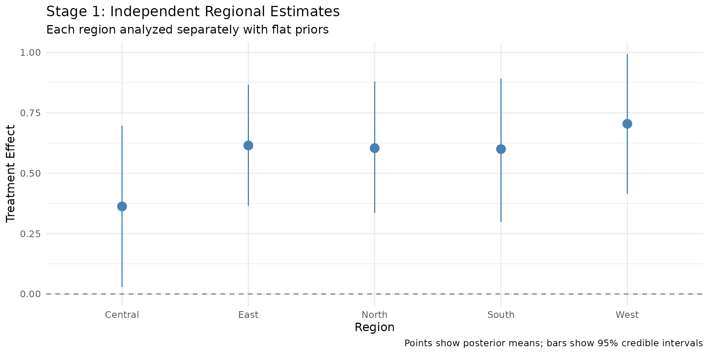
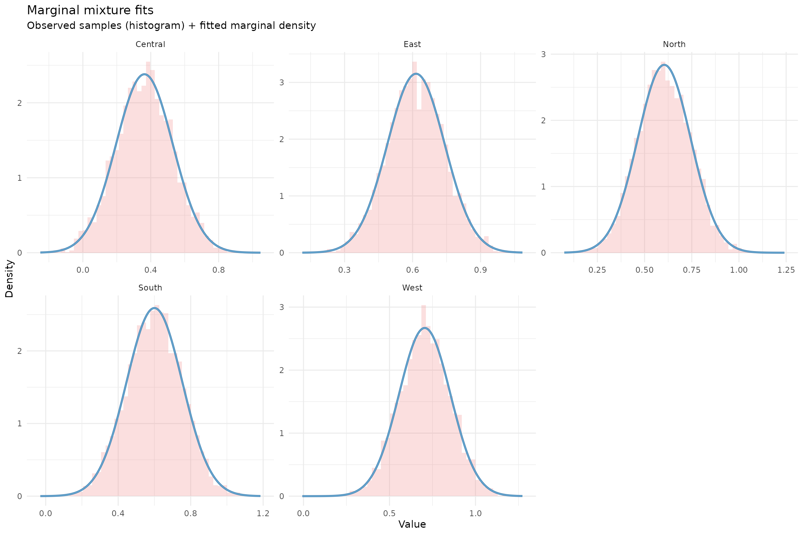
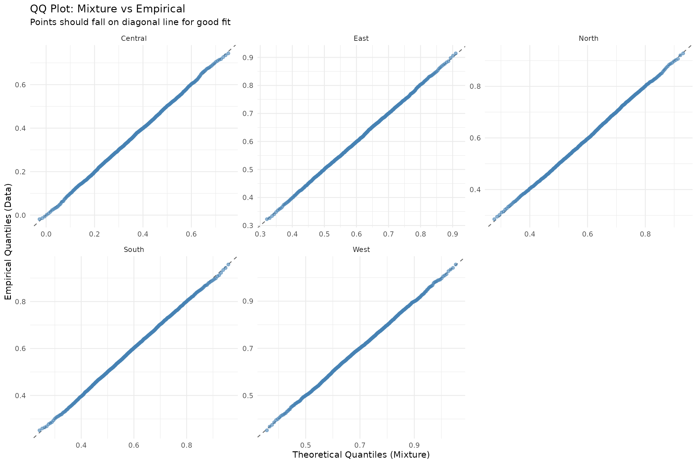
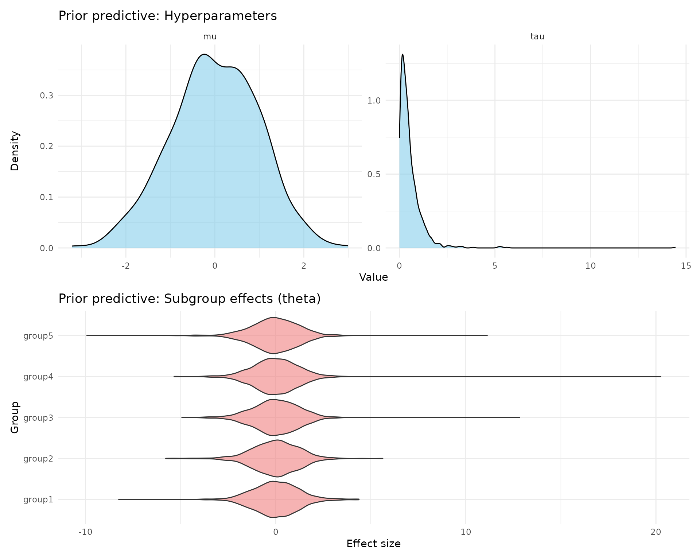
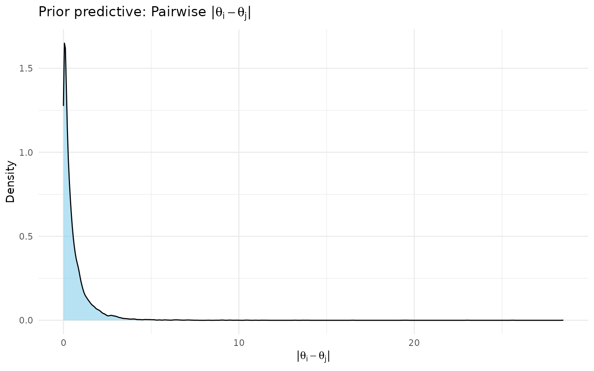
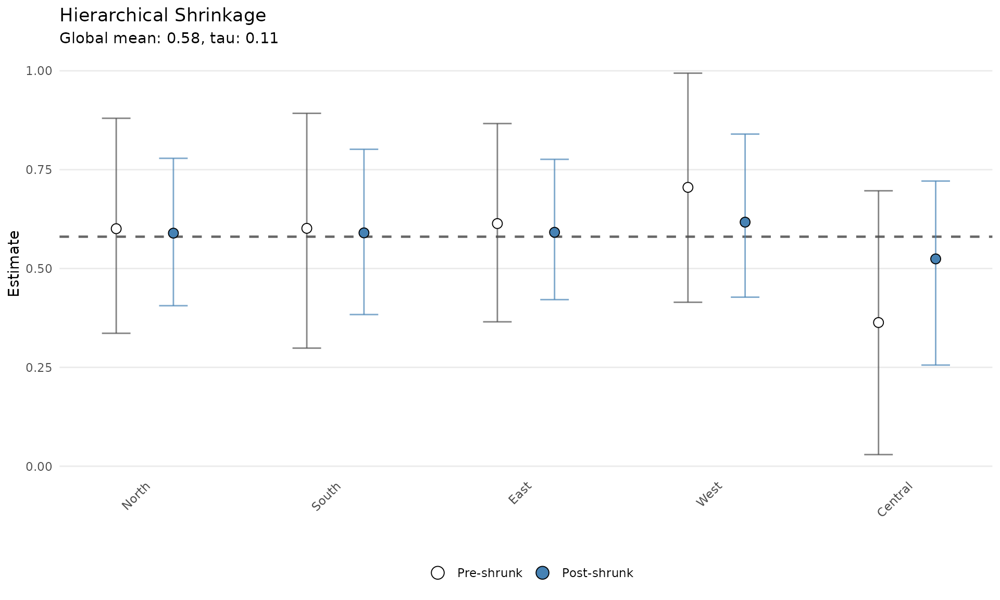
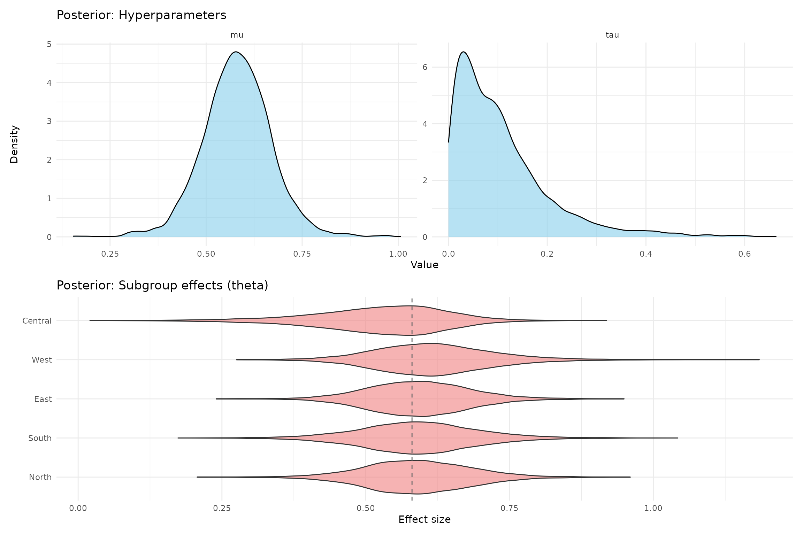

# Getting Started with shrinkr

## What is shrinkr?

**shrinkr** lets you apply Bayesian hierarchical shrinkage to
group-specific estimates in a modular, two-stage workflow:

1.  **Stage 1**: Fit your model separately for each group (region,
    hospital, study, etc.) using **flat priors**
2.  **Stage 2**: Borrow strength across groups through hierarchical
    shrinkage

**Why use shrinkr?**

- You’ve already fit separate models and want to pool information
  afterward
- You want modularity to separate model fitting from shrinkage
  estimation
- You want to simplify shrinkage estimation in complex models
- You want to try different shrinkage priors without refitting expensive
  Stage 1 models
- You need transparency in how much your results depend on the
  hierarchical prior
- You’re doing meta-analysis or federated learning with summary
  statistics

``` r

library(shrinkr)
library(distributional)
library(posterior)
library(tidyverse)
```

## A Complete Example: Regional Clinical Trial

Imagine a clinical trial run independently in 5 regions. Each region
estimated a treatment effect, and now you want to apply shrinkage
analysis.

### Stage 1: Fit Independent Models with Stan

First, let’s create synthetic trial data:

``` r

library(rstan)
set.seed(1104)

true_mu <- 0.5
true_tau <- 0.3
true_effects <- c(0.45, 0.72, 0.38, 0.55, 0.61)

regions <- c("North", "South", "East", "West", "Central")
n_per_region <- c(100, 80, 120, 90, 70)

trial_data <- lapply(seq_along(regions), function(i) {
  n <- n_per_region[i]
  data.frame(
    region = regions[i],
    treatment = rep(c(0, 1), each = n/2),
    outcome = c(
      rnorm(n/2, mean = 0, sd = 1),
      rnorm(n/2, mean = true_effects[i], sd = 1)
    )
  )
}) %>% bind_rows()
```

``` r

head(trial_data)
table(trial_data$region, trial_data$treatment)
```

    #>   region treatment     outcome
    #> 1  North         0 -0.04382439
    #> 2  North         0  0.64111730
    #> 3  North         0 -0.33395868
    #> 4  North         0 -2.60279243
    #> 5  North         0  1.17838867
    #> 6  North         0 -0.20705477
    #>          
    #>            0  1
    #>   Central 35 35
    #>   East    60 60
    #>   North   50 50
    #>   South   40 40
    #>   West    45 45

Now we write a Stan model with treatment-by-region interaction:

``` r

stan_code <- "
data {
  int<lower=0> N;
  int<lower=1> G;
  vector[N] y;
  vector[N] treatment;
  array[N] int<lower=1,upper=G> region;
}
parameters {
  vector[G] beta_region;
  real<lower=0> sigma;
}
model {
  // IMPORTANT: Flat prior on beta_region - critical for the two-stage approach!
  sigma ~ normal(0, 2);
  for (n in 1:N) {
    y[n] ~ normal(treatment[n] * beta_region[region[n]], sigma);
  }
}
"
```

``` r

regions <- c("North", "South", "East", "West", "Central")
region_indices <- as.integer(factor(trial_data$region, levels = regions))

fit_stan <- stan(
  model_code = stan_code,
  data = list(
    N = nrow(trial_data), G = length(regions),
    y = trial_data$outcome, treatment = trial_data$treatment,
    region = region_indices
  ),
  chains = 4, iter = 2000, warmup = 1000, refresh = 0, seed = 123
)

beta_draws <- rstan::extract(fit_stan, pars = "beta_region")$beta_region
samples_list <- lapply(seq_along(regions), function(i) beta_draws[, i])
names(samples_list) <- regions
samples <- lapply(samples_list, function(x) matrix(x, ncol = 1))
```

Let’s examine what we got from Stage 1:

``` r

stage1_summary <- data.frame(
  region = regions,
  mean   = sapply(samples, mean),
  sd     = sapply(samples, sd),
  lower  = sapply(samples, function(x) quantile(x, 0.025)),
  upper  = sapply(samples, function(x) quantile(x, 0.975))
)

print(stage1_summary)
```

    #>          region      mean        sd      lower     upper
    #> North     North 0.6040241 0.1405588 0.33617456 0.8799941
    #> South     South 0.6000233 0.1540522 0.29866430 0.8924705
    #> East       East 0.6152066 0.1265935 0.36515463 0.8666375
    #> West       West 0.7049122 0.1494923 0.41466597 0.9940618
    #> Central Central 0.3626256 0.1676080 0.02935275 0.6966270

**Stage 1 visualization:**

``` r

ggplot(stage1_summary, aes(x = region, y = mean)) +
  geom_hline(yintercept = 0, linetype = "dashed", color = "gray50") +
  geom_pointrange(aes(ymin = lower, ymax = upper),
                  size = 0.8, color = "steelblue") +
  labs(
    title    = "Stage 1: Independent Regional Estimates",
    subtitle = "Each region analyzed separately with flat priors",
    x = "Region", y = "Treatment Effect",
    caption = "Points show posterior means; bars show 95% credible intervals"
  ) +
  theme_minimal(base_size = 12)
```



**Notice:** Central has the widest interval (n=70) and East the
narrowest (n=120). Estimates vary considerably — hierarchical shrinkage
will borrow strength across regions.

### Stage 2: Apply Hierarchical Shrinkage

#### Step 1: Fit Mixture Approximation

``` r

mix <- fit_mixture(samples = samples, K_max = 3, verbose = TRUE)
```

``` r

print(mix)
```

**Check the approximation quality:**

``` r

# Blue line should overlay the histogram well
plot(mix, draws = samples, type = "density")
```



``` r


# Points should fall near the diagonal
plot(mix, draws = samples, type = "qq")
```



#### Step 2: Specify Hierarchical Priors

``` r

hierarchical_priors <- list(
  mu  = dist_normal(0, 1),
  tau = dist_truncated(dist_student_t(3, 0, 0.5), lower = 0)
)
```

**Check prior implications before fitting:**

``` r

prior_pred <- sample_prior_predictive(
  hierarchical_priors = hierarchical_priors,
  n_groups = 5,
  n_draws  = 1000
)
```

``` r

cat("Prior on tau (between-region SD):\n")
cat("  Median:", round(median(prior_pred$tau), 2), "\n")
cat("  95% interval:", round(quantile(prior_pred$tau, c(0.025, 0.975)), 2), "\n\n")

cat("Implied variation in regional effects:\n")
cat("  Typical range:", round(median(prior_pred$implied_range), 2), "\n")
cat("  95% interval:", round(quantile(prior_pred$implied_range, c(0.025, 0.975)), 2), "\n")
```

    #> Prior on tau (between-region SD):
    #>   Median: 0.38
    #>   95% interval: 0.02 1.95
    #> Implied variation in regional effects:
    #>   Typical range: 0.81
    #>   95% interval: 0.03 4.83

``` r

plot(prior_pred)
```



**Check what the prior implies about pairwise subgroup differences:**

The `implied_range` above measures max(theta) - min(theta) across all
groups for each draw. For a more detailed view,
[`prior_pairwise_differences()`](../reference/prior_pairwise_differences.md)
computes the distribution of \|theta_i - theta_j\| for every pair of
groups. This is particularly useful for calibrating whether your prior
places reasonable probability on clinically meaningful differences.

``` r

pw <- prior_pairwise_differences(prior_pred)
print(pw)
#> == Prior Predictive: Pairwise |theta_i - theta_j| ==
#> 
#> Groups:  5 
#> Pairs:   10 
#> Draws:   1000 
#> 
#> Overall quantiles of |theta_i - theta_j|:
#>    q2.5 = 0.005, q25 = 0.094, q50 = 0.302, q75 = 0.752, q97.5 = 2.958 
#> 
#> Per-pair summary:
#> # A tibble: 10 × 6
#>    pair             median    q2.5 q97.5 prob_gt_0.5 prob_gt_1
#>    <chr>             <dbl>   <dbl> <dbl>       <dbl>     <dbl>
#>  1 group1 vs group2  0.314 0.00517  2.94       0.364     0.185
#>  2 group1 vs group3  0.320 0.00507  2.93       0.37      0.182
#>  3 group1 vs group4  0.318 0.00522  3.02       0.362     0.193
#>  4 group1 vs group5  0.298 0.00463  2.95       0.376     0.177
#>  5 group2 vs group3  0.316 0.00555  2.81       0.361     0.185
#>  6 group2 vs group4  0.297 0.00444  2.71       0.35      0.172
#>  7 group2 vs group5  0.297 0.00569  3.07       0.36      0.189
#>  8 group3 vs group4  0.306 0.00333  2.92       0.368     0.167
#>  9 group3 vs group5  0.294 0.00443  3.04       0.336     0.159
#> 10 group4 vs group5  0.277 0.00573  2.90       0.341     0.164
#> 
#> -----------------------------------------------------
#> Use plot() to visualize
```

``` r

# Pooled histogram of |theta_i - theta_j| across all pairs
plot(pw)
```



The `prob_gt_0.5` and `prob_gt_1` columns in the summary show the prior
probability of observing pairwise differences exceeding those thresholds
— useful for assessing whether your prior is consistent with your
clinical expectations about subgroup heterogeneity.

#### Step 3: Fit the Hierarchical Model

``` r

fit <- shrink(
  mixture             = mix,
  hierarchical_priors = hierarchical_priors,
  chains  = 4,
  iter    = 2000,
  warmup  = 1000,
  seed    = 456,
  refresh = 0
)
#> 
#> SAMPLING FOR MODEL 'stage2_shrinkage' NOW (CHAIN 1).
#> Chain 1: 
#> Chain 1: Gradient evaluation took 1.3e-05 seconds
#> Chain 1: 1000 transitions using 10 leapfrog steps per transition would take 0.13 seconds.
#> Chain 1: Adjust your expectations accordingly!
#> Chain 1: 
#> Chain 1: 
#> Chain 1: Iteration:    1 / 2000 [  0%]  (Warmup)
#> Chain 1: Iteration:  100 / 2000 [  5%]  (Warmup)
#> Chain 1: Iteration:  200 / 2000 [ 10%]  (Warmup)
#> Chain 1: Iteration:  300 / 2000 [ 15%]  (Warmup)
#> Chain 1: Iteration:  400 / 2000 [ 20%]  (Warmup)
#> Chain 1: Iteration:  500 / 2000 [ 25%]  (Warmup)
#> Chain 1: Iteration:  600 / 2000 [ 30%]  (Warmup)
#> Chain 1: Iteration:  700 / 2000 [ 35%]  (Warmup)
#> Chain 1: Iteration:  800 / 2000 [ 40%]  (Warmup)
#> Chain 1: Iteration:  900 / 2000 [ 45%]  (Warmup)
#> Chain 1: Iteration: 1000 / 2000 [ 50%]  (Warmup)
#> Chain 1: Iteration: 1001 / 2000 [ 50%]  (Sampling)
#> Chain 1: Iteration: 1100 / 2000 [ 55%]  (Sampling)
#> Chain 1: Iteration: 1200 / 2000 [ 60%]  (Sampling)
#> Chain 1: Iteration: 1300 / 2000 [ 65%]  (Sampling)
#> Chain 1: Iteration: 1400 / 2000 [ 70%]  (Sampling)
#> Chain 1: Iteration: 1500 / 2000 [ 75%]  (Sampling)
#> Chain 1: Iteration: 1600 / 2000 [ 80%]  (Sampling)
#> Chain 1: Iteration: 1700 / 2000 [ 85%]  (Sampling)
#> Chain 1: Iteration: 1800 / 2000 [ 90%]  (Sampling)
#> Chain 1: Iteration: 1900 / 2000 [ 95%]  (Sampling)
#> Chain 1: Iteration: 2000 / 2000 [100%]  (Sampling)
#> Chain 1: 
#> Chain 1:  Elapsed Time: 0.05 seconds (Warm-up)
#> Chain 1:                0.038 seconds (Sampling)
#> Chain 1:                0.088 seconds (Total)
#> Chain 1: 
#> 
#> SAMPLING FOR MODEL 'stage2_shrinkage' NOW (CHAIN 2).
#> Chain 2: 
#> Chain 2: Gradient evaluation took 5e-06 seconds
#> Chain 2: 1000 transitions using 10 leapfrog steps per transition would take 0.05 seconds.
#> Chain 2: Adjust your expectations accordingly!
#> Chain 2: 
#> Chain 2: 
#> Chain 2: Iteration:    1 / 2000 [  0%]  (Warmup)
#> Chain 2: Iteration:  100 / 2000 [  5%]  (Warmup)
#> Chain 2: Iteration:  200 / 2000 [ 10%]  (Warmup)
#> Chain 2: Iteration:  300 / 2000 [ 15%]  (Warmup)
#> Chain 2: Iteration:  400 / 2000 [ 20%]  (Warmup)
#> Chain 2: Iteration:  500 / 2000 [ 25%]  (Warmup)
#> Chain 2: Iteration:  600 / 2000 [ 30%]  (Warmup)
#> Chain 2: Iteration:  700 / 2000 [ 35%]  (Warmup)
#> Chain 2: Iteration:  800 / 2000 [ 40%]  (Warmup)
#> Chain 2: Iteration:  900 / 2000 [ 45%]  (Warmup)
#> Chain 2: Iteration: 1000 / 2000 [ 50%]  (Warmup)
#> Chain 2: Iteration: 1001 / 2000 [ 50%]  (Sampling)
#> Chain 2: Iteration: 1100 / 2000 [ 55%]  (Sampling)
#> Chain 2: Iteration: 1200 / 2000 [ 60%]  (Sampling)
#> Chain 2: Iteration: 1300 / 2000 [ 65%]  (Sampling)
#> Chain 2: Iteration: 1400 / 2000 [ 70%]  (Sampling)
#> Chain 2: Iteration: 1500 / 2000 [ 75%]  (Sampling)
#> Chain 2: Iteration: 1600 / 2000 [ 80%]  (Sampling)
#> Chain 2: Iteration: 1700 / 2000 [ 85%]  (Sampling)
#> Chain 2: Iteration: 1800 / 2000 [ 90%]  (Sampling)
#> Chain 2: Iteration: 1900 / 2000 [ 95%]  (Sampling)
#> Chain 2: Iteration: 2000 / 2000 [100%]  (Sampling)
#> Chain 2: 
#> Chain 2:  Elapsed Time: 0.05 seconds (Warm-up)
#> Chain 2:                0.028 seconds (Sampling)
#> Chain 2:                0.078 seconds (Total)
#> Chain 2: 
#> 
#> SAMPLING FOR MODEL 'stage2_shrinkage' NOW (CHAIN 3).
#> Chain 3: 
#> Chain 3: Gradient evaluation took 5e-06 seconds
#> Chain 3: 1000 transitions using 10 leapfrog steps per transition would take 0.05 seconds.
#> Chain 3: Adjust your expectations accordingly!
#> Chain 3: 
#> Chain 3: 
#> Chain 3: Iteration:    1 / 2000 [  0%]  (Warmup)
#> Chain 3: Iteration:  100 / 2000 [  5%]  (Warmup)
#> Chain 3: Iteration:  200 / 2000 [ 10%]  (Warmup)
#> Chain 3: Iteration:  300 / 2000 [ 15%]  (Warmup)
#> Chain 3: Iteration:  400 / 2000 [ 20%]  (Warmup)
#> Chain 3: Iteration:  500 / 2000 [ 25%]  (Warmup)
#> Chain 3: Iteration:  600 / 2000 [ 30%]  (Warmup)
#> Chain 3: Iteration:  700 / 2000 [ 35%]  (Warmup)
#> Chain 3: Iteration:  800 / 2000 [ 40%]  (Warmup)
#> Chain 3: Iteration:  900 / 2000 [ 45%]  (Warmup)
#> Chain 3: Iteration: 1000 / 2000 [ 50%]  (Warmup)
#> Chain 3: Iteration: 1001 / 2000 [ 50%]  (Sampling)
#> Chain 3: Iteration: 1100 / 2000 [ 55%]  (Sampling)
#> Chain 3: Iteration: 1200 / 2000 [ 60%]  (Sampling)
#> Chain 3: Iteration: 1300 / 2000 [ 65%]  (Sampling)
#> Chain 3: Iteration: 1400 / 2000 [ 70%]  (Sampling)
#> Chain 3: Iteration: 1500 / 2000 [ 75%]  (Sampling)
#> Chain 3: Iteration: 1600 / 2000 [ 80%]  (Sampling)
#> Chain 3: Iteration: 1700 / 2000 [ 85%]  (Sampling)
#> Chain 3: Iteration: 1800 / 2000 [ 90%]  (Sampling)
#> Chain 3: Iteration: 1900 / 2000 [ 95%]  (Sampling)
#> Chain 3: Iteration: 2000 / 2000 [100%]  (Sampling)
#> Chain 3: 
#> Chain 3:  Elapsed Time: 0.051 seconds (Warm-up)
#> Chain 3:                0.032 seconds (Sampling)
#> Chain 3:                0.083 seconds (Total)
#> Chain 3: 
#> 
#> SAMPLING FOR MODEL 'stage2_shrinkage' NOW (CHAIN 4).
#> Chain 4: 
#> Chain 4: Gradient evaluation took 5e-06 seconds
#> Chain 4: 1000 transitions using 10 leapfrog steps per transition would take 0.05 seconds.
#> Chain 4: Adjust your expectations accordingly!
#> Chain 4: 
#> Chain 4: 
#> Chain 4: Iteration:    1 / 2000 [  0%]  (Warmup)
#> Chain 4: Iteration:  100 / 2000 [  5%]  (Warmup)
#> Chain 4: Iteration:  200 / 2000 [ 10%]  (Warmup)
#> Chain 4: Iteration:  300 / 2000 [ 15%]  (Warmup)
#> Chain 4: Iteration:  400 / 2000 [ 20%]  (Warmup)
#> Chain 4: Iteration:  500 / 2000 [ 25%]  (Warmup)
#> Chain 4: Iteration:  600 / 2000 [ 30%]  (Warmup)
#> Chain 4: Iteration:  700 / 2000 [ 35%]  (Warmup)
#> Chain 4: Iteration:  800 / 2000 [ 40%]  (Warmup)
#> Chain 4: Iteration:  900 / 2000 [ 45%]  (Warmup)
#> Chain 4: Iteration: 1000 / 2000 [ 50%]  (Warmup)
#> Chain 4: Iteration: 1001 / 2000 [ 50%]  (Sampling)
#> Chain 4: Iteration: 1100 / 2000 [ 55%]  (Sampling)
#> Chain 4: Iteration: 1200 / 2000 [ 60%]  (Sampling)
#> Chain 4: Iteration: 1300 / 2000 [ 65%]  (Sampling)
#> Chain 4: Iteration: 1400 / 2000 [ 70%]  (Sampling)
#> Chain 4: Iteration: 1500 / 2000 [ 75%]  (Sampling)
#> Chain 4: Iteration: 1600 / 2000 [ 80%]  (Sampling)
#> Chain 4: Iteration: 1700 / 2000 [ 85%]  (Sampling)
#> Chain 4: Iteration: 1800 / 2000 [ 90%]  (Sampling)
#> Chain 4: Iteration: 1900 / 2000 [ 95%]  (Sampling)
#> Chain 4: Iteration: 2000 / 2000 [100%]  (Sampling)
#> Chain 4: 
#> Chain 4:  Elapsed Time: 0.047 seconds (Warm-up)
#> Chain 4:                0.04 seconds (Sampling)
#> Chain 4:                0.087 seconds (Total)
#> Chain 4:

print(fit)
#> # A tibble: 3 × 7
#>   variable      mean     sd      q2.5     q50 q97.5  rhat
#>   <chr>        <dbl>  <dbl>     <dbl>   <dbl> <dbl> <dbl>
#> 1 mu          0.580  0.0901 0.408     0.580   0.759  1.00
#> 2 tau         0.106  0.0962 0.00407   0.0833  0.382  1.00
#> 3 tau_squared 0.0206 0.0405 0.0000166 0.00694 0.146  1.00
```

#### Step 4: Examine Results

``` r

mu_tau <- extract_mu_tau(fit)

cat("Overall treatment effect (mu):\n")
#> Overall treatment effect (mu):
cat("  Mean:", round(mean(mu_tau$mu), 3), "\n")
#>   Mean: 0.58
cat("  95% CI:", round(quantile(mu_tau$mu, c(0.025, 0.975)), 3), "\n\n")
#>   95% CI: 0.408 0.759

cat("Between-region heterogeneity (tau):\n")
#> Between-region heterogeneity (tau):
cat("  Mean:", round(mean(mu_tau$tau), 3), "\n")
#>   Mean: 0.106
cat("  95% CI:", round(quantile(mu_tau$tau, c(0.025, 0.975)), 3), "\n")
#>   95% CI: 0.004 0.382
```

``` r

theta_summary <- summarize_theta(fit)
print(theta_summary)
#> # A tibble: 5 × 9
#>   group    mean     sd  q2.5   q50 q97.5  rhat ess_bulk ess_tail
#>   <chr>   <dbl>  <dbl> <dbl> <dbl> <dbl> <dbl>    <dbl>    <dbl>
#> 1 North   0.589 0.0949 0.406 0.588 0.779  1.00    4705.    3346.
#> 2 South   0.590 0.104  0.384 0.589 0.802  1.00    4419.    2962.
#> 3 East    0.592 0.0895 0.421 0.591 0.776  1.00    5150.    3358.
#> 4 West    0.617 0.103  0.428 0.612 0.840  1.00    3966.    3053.
#> 5 Central 0.524 0.117  0.256 0.537 0.721  1.00    2609.    2684.
```

#### Step 5: Visualize Shrinkage

``` r

plot(fit)
```



**Key observations:**

- Central (most uncertain) shrinks most toward the mean
- East (most precise) shrinks least
- This is **adaptive shrinkage**: uncertain estimates borrow more

``` r

plot(fit, type = "diagnostics")
```



## Alternative Input: Using Summary Statistics Only

If you only have published means and standard errors (no full
posteriors), you can use the MLE approach:

``` r

mle_estimates <- sapply(samples, mean)
mle_variances <- sapply(samples, var)

fit_mle <- shrink(
  mle                 = mle_estimates,
  var_matrix          = mle_variances,
  hierarchical_priors = hierarchical_priors,
  chains  = 4,
  iter    = 2000,
  warmup  = 1000,
  seed    = 456,
  refresh = 0
)
#> 
#> SAMPLING FOR MODEL 'stage2_shrinkage' NOW (CHAIN 1).
#> Chain 1: 
#> Chain 1: Gradient evaluation took 8e-06 seconds
#> Chain 1: 1000 transitions using 10 leapfrog steps per transition would take 0.08 seconds.
#> Chain 1: Adjust your expectations accordingly!
#> Chain 1: 
#> Chain 1: 
#> Chain 1: Iteration:    1 / 2000 [  0%]  (Warmup)
#> Chain 1: Iteration:  100 / 2000 [  5%]  (Warmup)
#> Chain 1: Iteration:  200 / 2000 [ 10%]  (Warmup)
#> Chain 1: Iteration:  300 / 2000 [ 15%]  (Warmup)
#> Chain 1: Iteration:  400 / 2000 [ 20%]  (Warmup)
#> Chain 1: Iteration:  500 / 2000 [ 25%]  (Warmup)
#> Chain 1: Iteration:  600 / 2000 [ 30%]  (Warmup)
#> Chain 1: Iteration:  700 / 2000 [ 35%]  (Warmup)
#> Chain 1: Iteration:  800 / 2000 [ 40%]  (Warmup)
#> Chain 1: Iteration:  900 / 2000 [ 45%]  (Warmup)
#> Chain 1: Iteration: 1000 / 2000 [ 50%]  (Warmup)
#> Chain 1: Iteration: 1001 / 2000 [ 50%]  (Sampling)
#> Chain 1: Iteration: 1100 / 2000 [ 55%]  (Sampling)
#> Chain 1: Iteration: 1200 / 2000 [ 60%]  (Sampling)
#> Chain 1: Iteration: 1300 / 2000 [ 65%]  (Sampling)
#> Chain 1: Iteration: 1400 / 2000 [ 70%]  (Sampling)
#> Chain 1: Iteration: 1500 / 2000 [ 75%]  (Sampling)
#> Chain 1: Iteration: 1600 / 2000 [ 80%]  (Sampling)
#> Chain 1: Iteration: 1700 / 2000 [ 85%]  (Sampling)
#> Chain 1: Iteration: 1800 / 2000 [ 90%]  (Sampling)
#> Chain 1: Iteration: 1900 / 2000 [ 95%]  (Sampling)
#> Chain 1: Iteration: 2000 / 2000 [100%]  (Sampling)
#> Chain 1: 
#> Chain 1:  Elapsed Time: 0.051 seconds (Warm-up)
#> Chain 1:                0.036 seconds (Sampling)
#> Chain 1:                0.087 seconds (Total)
#> Chain 1: 
#> 
#> SAMPLING FOR MODEL 'stage2_shrinkage' NOW (CHAIN 2).
#> Chain 2: 
#> Chain 2: Gradient evaluation took 5e-06 seconds
#> Chain 2: 1000 transitions using 10 leapfrog steps per transition would take 0.05 seconds.
#> Chain 2: Adjust your expectations accordingly!
#> Chain 2: 
#> Chain 2: 
#> Chain 2: Iteration:    1 / 2000 [  0%]  (Warmup)
#> Chain 2: Iteration:  100 / 2000 [  5%]  (Warmup)
#> Chain 2: Iteration:  200 / 2000 [ 10%]  (Warmup)
#> Chain 2: Iteration:  300 / 2000 [ 15%]  (Warmup)
#> Chain 2: Iteration:  400 / 2000 [ 20%]  (Warmup)
#> Chain 2: Iteration:  500 / 2000 [ 25%]  (Warmup)
#> Chain 2: Iteration:  600 / 2000 [ 30%]  (Warmup)
#> Chain 2: Iteration:  700 / 2000 [ 35%]  (Warmup)
#> Chain 2: Iteration:  800 / 2000 [ 40%]  (Warmup)
#> Chain 2: Iteration:  900 / 2000 [ 45%]  (Warmup)
#> Chain 2: Iteration: 1000 / 2000 [ 50%]  (Warmup)
#> Chain 2: Iteration: 1001 / 2000 [ 50%]  (Sampling)
#> Chain 2: Iteration: 1100 / 2000 [ 55%]  (Sampling)
#> Chain 2: Iteration: 1200 / 2000 [ 60%]  (Sampling)
#> Chain 2: Iteration: 1300 / 2000 [ 65%]  (Sampling)
#> Chain 2: Iteration: 1400 / 2000 [ 70%]  (Sampling)
#> Chain 2: Iteration: 1500 / 2000 [ 75%]  (Sampling)
#> Chain 2: Iteration: 1600 / 2000 [ 80%]  (Sampling)
#> Chain 2: Iteration: 1700 / 2000 [ 85%]  (Sampling)
#> Chain 2: Iteration: 1800 / 2000 [ 90%]  (Sampling)
#> Chain 2: Iteration: 1900 / 2000 [ 95%]  (Sampling)
#> Chain 2: Iteration: 2000 / 2000 [100%]  (Sampling)
#> Chain 2: 
#> Chain 2:  Elapsed Time: 0.049 seconds (Warm-up)
#> Chain 2:                0.039 seconds (Sampling)
#> Chain 2:                0.088 seconds (Total)
#> Chain 2: 
#> 
#> SAMPLING FOR MODEL 'stage2_shrinkage' NOW (CHAIN 3).
#> Chain 3: 
#> Chain 3: Gradient evaluation took 5e-06 seconds
#> Chain 3: 1000 transitions using 10 leapfrog steps per transition would take 0.05 seconds.
#> Chain 3: Adjust your expectations accordingly!
#> Chain 3: 
#> Chain 3: 
#> Chain 3: Iteration:    1 / 2000 [  0%]  (Warmup)
#> Chain 3: Iteration:  100 / 2000 [  5%]  (Warmup)
#> Chain 3: Iteration:  200 / 2000 [ 10%]  (Warmup)
#> Chain 3: Iteration:  300 / 2000 [ 15%]  (Warmup)
#> Chain 3: Iteration:  400 / 2000 [ 20%]  (Warmup)
#> Chain 3: Iteration:  500 / 2000 [ 25%]  (Warmup)
#> Chain 3: Iteration:  600 / 2000 [ 30%]  (Warmup)
#> Chain 3: Iteration:  700 / 2000 [ 35%]  (Warmup)
#> Chain 3: Iteration:  800 / 2000 [ 40%]  (Warmup)
#> Chain 3: Iteration:  900 / 2000 [ 45%]  (Warmup)
#> Chain 3: Iteration: 1000 / 2000 [ 50%]  (Warmup)
#> Chain 3: Iteration: 1001 / 2000 [ 50%]  (Sampling)
#> Chain 3: Iteration: 1100 / 2000 [ 55%]  (Sampling)
#> Chain 3: Iteration: 1200 / 2000 [ 60%]  (Sampling)
#> Chain 3: Iteration: 1300 / 2000 [ 65%]  (Sampling)
#> Chain 3: Iteration: 1400 / 2000 [ 70%]  (Sampling)
#> Chain 3: Iteration: 1500 / 2000 [ 75%]  (Sampling)
#> Chain 3: Iteration: 1600 / 2000 [ 80%]  (Sampling)
#> Chain 3: Iteration: 1700 / 2000 [ 85%]  (Sampling)
#> Chain 3: Iteration: 1800 / 2000 [ 90%]  (Sampling)
#> Chain 3: Iteration: 1900 / 2000 [ 95%]  (Sampling)
#> Chain 3: Iteration: 2000 / 2000 [100%]  (Sampling)
#> Chain 3: 
#> Chain 3:  Elapsed Time: 0.046 seconds (Warm-up)
#> Chain 3:                0.04 seconds (Sampling)
#> Chain 3:                0.086 seconds (Total)
#> Chain 3: 
#> 
#> SAMPLING FOR MODEL 'stage2_shrinkage' NOW (CHAIN 4).
#> Chain 4: 
#> Chain 4: Gradient evaluation took 5e-06 seconds
#> Chain 4: 1000 transitions using 10 leapfrog steps per transition would take 0.05 seconds.
#> Chain 4: Adjust your expectations accordingly!
#> Chain 4: 
#> Chain 4: 
#> Chain 4: Iteration:    1 / 2000 [  0%]  (Warmup)
#> Chain 4: Iteration:  100 / 2000 [  5%]  (Warmup)
#> Chain 4: Iteration:  200 / 2000 [ 10%]  (Warmup)
#> Chain 4: Iteration:  300 / 2000 [ 15%]  (Warmup)
#> Chain 4: Iteration:  400 / 2000 [ 20%]  (Warmup)
#> Chain 4: Iteration:  500 / 2000 [ 25%]  (Warmup)
#> Chain 4: Iteration:  600 / 2000 [ 30%]  (Warmup)
#> Chain 4: Iteration:  700 / 2000 [ 35%]  (Warmup)
#> Chain 4: Iteration:  800 / 2000 [ 40%]  (Warmup)
#> Chain 4: Iteration:  900 / 2000 [ 45%]  (Warmup)
#> Chain 4: Iteration: 1000 / 2000 [ 50%]  (Warmup)
#> Chain 4: Iteration: 1001 / 2000 [ 50%]  (Sampling)
#> Chain 4: Iteration: 1100 / 2000 [ 55%]  (Sampling)
#> Chain 4: Iteration: 1200 / 2000 [ 60%]  (Sampling)
#> Chain 4: Iteration: 1300 / 2000 [ 65%]  (Sampling)
#> Chain 4: Iteration: 1400 / 2000 [ 70%]  (Sampling)
#> Chain 4: Iteration: 1500 / 2000 [ 75%]  (Sampling)
#> Chain 4: Iteration: 1600 / 2000 [ 80%]  (Sampling)
#> Chain 4: Iteration: 1700 / 2000 [ 85%]  (Sampling)
#> Chain 4: Iteration: 1800 / 2000 [ 90%]  (Sampling)
#> Chain 4: Iteration: 1900 / 2000 [ 95%]  (Sampling)
#> Chain 4: Iteration: 2000 / 2000 [100%]  (Sampling)
#> Chain 4: 
#> Chain 4:  Elapsed Time: 0.049 seconds (Warm-up)
#> Chain 4:                0.033 seconds (Sampling)
#> Chain 4:                0.082 seconds (Total)
#> Chain 4:
```

``` r

mu_tau_mle <- extract_mu_tau(fit_mle)

cat("Mixture approach:\n")
#> Mixture approach:
cat("  mu =",  round(mean(mu_tau$mu), 3), "\n")
#>   mu = 0.58
cat("  tau =", round(mean(mu_tau$tau), 3), "\n\n")
#>   tau = 0.106

cat("MLE approach:\n")
#> MLE approach:
cat("  mu =",  round(mean(mu_tau_mle$mu), 3), "\n")
#>   mu = 0.584
cat("  tau =", round(mean(mu_tau_mle$tau), 3), "\n")
#>   tau = 0.113
```

| Method | Use When | Pros | Cons |
|----|----|----|----|
| **Mixture** | You have full posteriors | Captures non-normality; More accurate | Requires posterior samples |
| **MLE** | Only means + SEs available | Simpler; Works with published data | Assumes normality |

## Complete Stan → shrinkr Workflow Summary

``` r

# 1. Write Stan model with FLAT PRIORS on parameters of interest
stan_code <- "
data {
  int<lower=0> N;
  int<lower=1> G;
  vector[N] y;
  vector[N] treatment;
  array[N] int<lower=1,upper=G> group;
}
parameters {
  vector[G] theta;  // Group-specific effects - NO PRIOR SPECIFIED
  real<lower=0> sigma;
}
model {
  sigma ~ normal(0, 2);
  for (n in 1:N) {
    y[n] ~ normal(treatment[n] * theta[group[n]], sigma);
  }
}
"

# 2. Fit model once to get all group effects, extract posteriors
group_indices <- as.integer(factor(data$group, levels = groups))
fit_stan <- stan(
  model_code = stan_code,
  data = list(N = nrow(data), G = length(groups),
              y = data$y, treatment = data$treatment,
              group = group_indices),
  chains = 4, iter = 2000, warmup = 1000, refresh = 0
)

theta_draws <- extract(fit_stan)$theta
samples <- lapply(seq_along(groups), function(i) matrix(theta_draws[, i], ncol = 1))
names(samples) <- groups

# 3. Fit mixture approximation and check quality
mix <- fit_mixture(samples, K_max = 3)
plot(mix, draws = samples)

# 4. Specify and check hierarchical priors
priors <- list(
  mu  = dist_normal(0, 5),
  tau = dist_truncated(dist_student_t(3, 0, 1), lower = 0)
)
plot(sample_prior_predictive(priors, n_groups = length(groups)))

# 5. Fit, extract, and visualize
fit <- shrink(mixture = mix, hierarchical_priors = priors)
plot(fit)
summarize_theta(fit)
extract_mu_tau(fit)
```

## Key Concepts Checklist

- **Stage 1 uses flat priors** - This is critical! Don’t specify a prior
  on the parameter you’ll shrink
- **Mixture approximation** - Allows shrinkr to work with any posterior
  shape; check quality with
  [`plot()`](https://rdrr.io/r/graphics/plot.default.html)
- **Hierarchical priors** - Applied only in Stage 2; use
  [`sample_prior_predictive()`](../reference/sample_prior_predictive.md)
  to understand implications
- **Adaptive shrinkage** - Uncertain estimates borrow more; precise
  estimates borrow less
- **Diagnostics matter** - Always check mixture fit, prior-data
  agreement, and MCMC convergence

## Common Pitfalls to Avoid

- **Using informative priors in Stage 1** - This creates “double priors”
  and breaks the equivalence
- **Skipping mixture quality checks** - Poor approximation → biased
  shrinkage, run: `plot(mix, draws = samples)`
- **Ignoring prior implications** - Your prior might be too strong or
  weak, run:
  [`sample_prior_predictive()`](../reference/sample_prior_predictive.md)
  and [`plot()`](https://rdrr.io/r/graphics/plot.default.html)
- **Not checking convergence** - MCMC diagnostics apply to Stage 2 too,
  check: `fit$diagnostics`, Rhat, ESS

## Next Steps

1.  **Advanced integration**: See
    [`vignette("tidy_bayesian_workflow")`](../articles/tidy_bayesian_workflow.md)
    for working with tidyverse tools
2.  **Real applications**: See
    [`vignette("brms_integration")`](../articles/brms_integration.md)
    for survival analysis and brms integration
3.  **Sensitivity analysis**: Learn to explore different prior
    specifications efficiently (this is done in the brms vignette)
4.  **Federated learning**: See
    [`vignette("federated_learning")`](../articles/federated_learning.md)
    for distributed data analysis

## Session Info

``` r

sessionInfo()
#> R version 4.6.0 (2026-04-24)
#> Platform: x86_64-pc-linux-gnu
#> Running under: Ubuntu 24.04.4 LTS
#> 
#> Matrix products: default
#> BLAS:   /usr/lib/x86_64-linux-gnu/openblas-pthread/libblas.so.3 
#> LAPACK: /usr/lib/x86_64-linux-gnu/openblas-pthread/libopenblasp-r0.3.26.so;  LAPACK version 3.12.0
#> 
#> locale:
#>  [1] LC_CTYPE=C.UTF-8       LC_NUMERIC=C           LC_TIME=C.UTF-8       
#>  [4] LC_COLLATE=C.UTF-8     LC_MONETARY=C.UTF-8    LC_MESSAGES=C.UTF-8   
#>  [7] LC_PAPER=C.UTF-8       LC_NAME=C              LC_ADDRESS=C          
#> [10] LC_TELEPHONE=C         LC_MEASUREMENT=C.UTF-8 LC_IDENTIFICATION=C   
#> 
#> time zone: UTC
#> tzcode source: system (glibc)
#> 
#> attached base packages:
#> [1] stats     graphics  grDevices utils     datasets  methods   base     
#> 
#> other attached packages:
#>  [1] lubridate_1.9.5      forcats_1.0.1        stringr_1.6.0       
#>  [4] dplyr_1.2.1          purrr_1.2.2          readr_2.2.0         
#>  [7] tidyr_1.3.2          tibble_3.3.1         ggplot2_4.0.3       
#> [10] tidyverse_2.0.0      posterior_1.7.0      distributional_0.7.1
#> [13] shrinkr_0.4.4       
#> 
#> loaded via a namespace (and not attached):
#>  [1] gtable_0.3.6          tensorA_0.36.2.1      xfun_0.58            
#>  [4] bslib_0.11.0          QuickJSR_1.10.0       htmlwidgets_1.6.4    
#>  [7] inline_0.3.21         tzdb_0.5.0            vctrs_0.7.3          
#> [10] tools_4.6.0           generics_0.1.4        stats4_4.6.0         
#> [13] parallel_4.6.0        pkgconfig_2.0.3       checkmate_2.3.4      
#> [16] RColorBrewer_1.1-3    S7_0.2.2              desc_1.4.3           
#> [19] RcppParallel_5.1.11-2 lifecycle_1.0.5       compiler_4.6.0       
#> [22] farver_2.1.2          textshaping_1.0.5     codetools_0.2-20     
#> [25] htmltools_0.5.9       sass_0.4.10           yaml_2.3.12          
#> [28] pillar_1.11.1         pkgdown_2.2.0         jquerylib_0.1.4      
#> [31] cachem_1.1.0          StanHeaders_2.32.10   abind_1.4-8          
#> [34] mclust_6.1.2          rstan_2.32.7          tidyselect_1.2.1     
#> [37] digest_0.6.39         stringi_1.8.7         labeling_0.4.3       
#> [40] fastmap_1.2.0         grid_4.6.0            cli_3.6.6            
#> [43] magrittr_2.0.5        patchwork_1.3.2       loo_2.9.0            
#> [46] utf8_1.2.6            pkgbuild_1.4.8        withr_3.0.2          
#> [49] scales_1.4.0          backports_1.5.1       timechange_0.4.0     
#> [52] rmarkdown_2.31        matrixStats_1.5.0     otel_0.2.0           
#> [55] gridExtra_2.3         ragg_1.5.2            hms_1.1.4            
#> [58] evaluate_1.0.5        knitr_1.51            rstantools_2.6.0     
#> [61] rlang_1.2.0           Rcpp_1.1.1-1.1        glue_1.8.1           
#> [64] jsonlite_2.0.0        R6_2.6.1              systemfonts_1.3.2    
#> [67] fs_2.1.0
```
