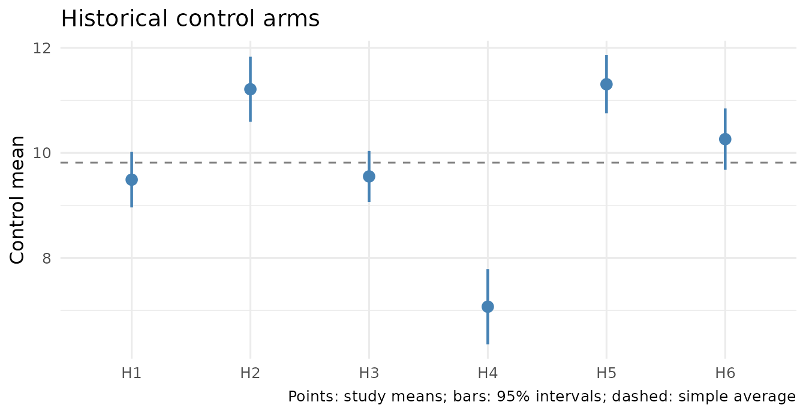
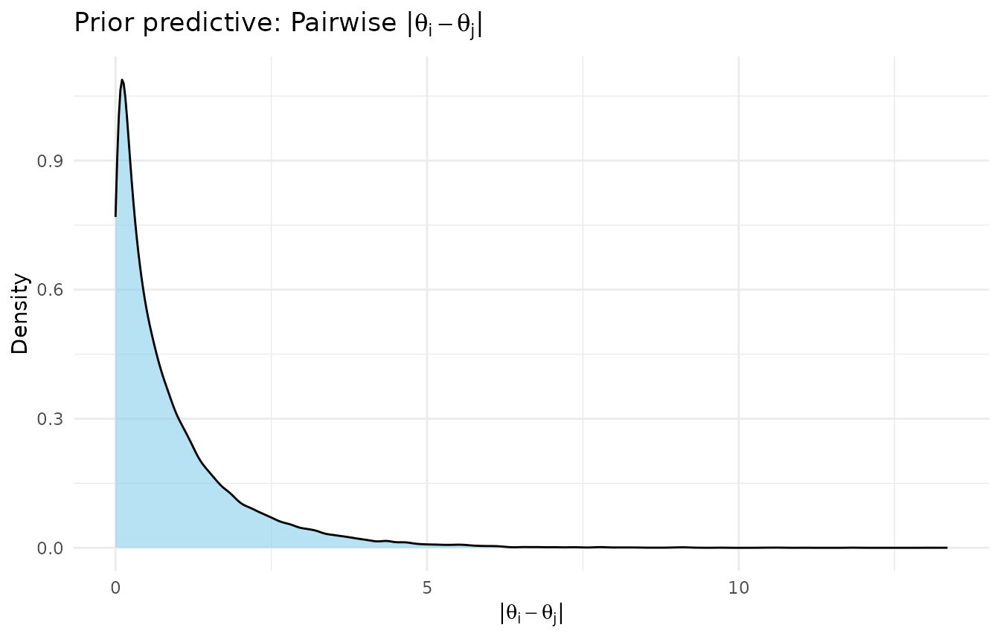
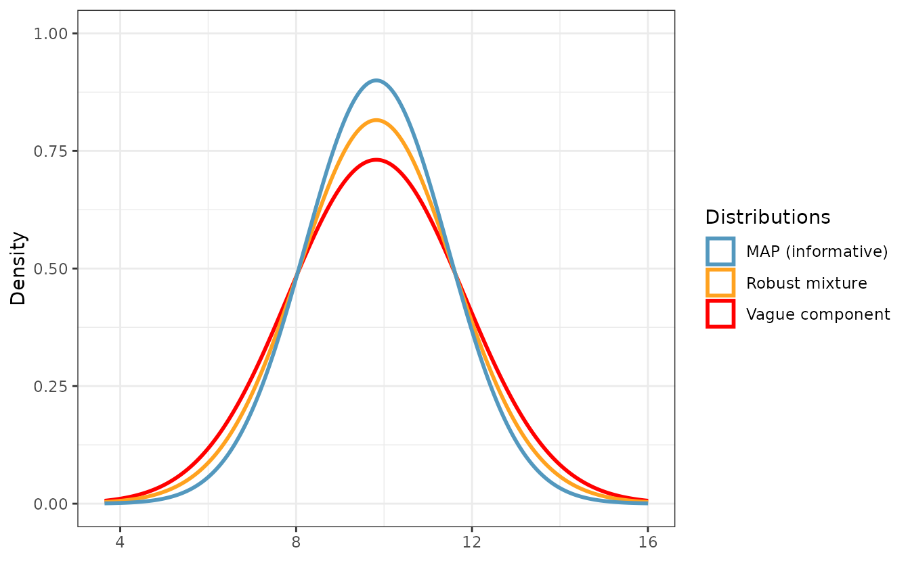
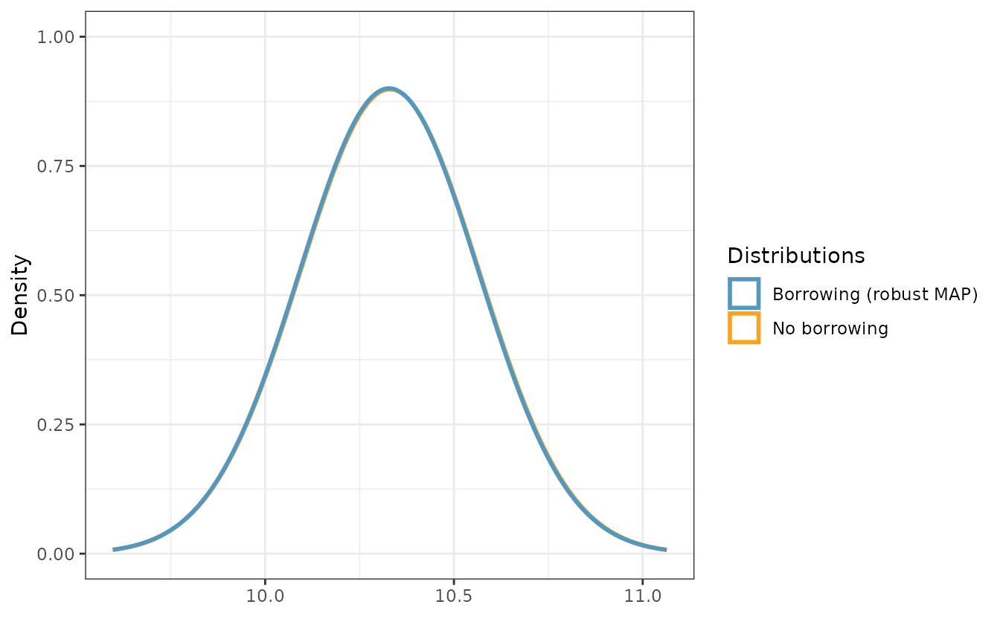

# Meta-Analytic-Predictive (MAP) Priors with shrinkr and beastt

## Overview

A **meta-analytic-predictive (MAP) prior** summarizes several historical
control arms into a single prior for the control mean of a new trial
(Neuenschwander et al., 2010). The recipe is a random-effects
meta-analysis: study-specific control means are treated as exchangeable
draws from a common population, and the prior for the next trial is the
posterior predictive distribution for a new, as-yet-unobserved study. To
protect against prior-data conflict, the MAP is then robustified by
mixing in a vague component (Schmidli et al., 2014), so that the
historical data are automatically down-weighted when they disagree with
the current trial.

This vignette shows how `shrinkr` and `beastt` divide that work cleanly:

- **`shrinkr`** runs the hierarchical meta-analysis across historical
  studies (its Stage-2 shrinkage step) and returns the MAP as a
  `distributional` object.
- **`beastt`** turns that MAP into a robust mixture prior
  ([`robustify_norm()`](https://gsk-biostatistics.github.io/beastt/reference/robustify_norm.html)),
  combines it with the internal control arm to form the posterior
  ([`calc_post_norm()`](https://gsk-biostatistics.github.io/beastt/reference/calc_post_norm.html)),
  and computes the effective sample size (ESS).

The two packages meet at a single, intentionally simple hand-off: a
`dist_normal` object. Everything upstream of it is hierarchical modeling
(`shrinkr`); everything downstream is borrowing and inference for the
current trial (`beastt`).

We focus on a continuous outcome with **known** within-arm standard
deviation, which keeps every step conjugate and lets us see the moving
parts without Stan getting in the way.

``` r

library(shrinkr)
library(beastt)
library(distributional)
library(dplyr)
library(tibble)
library(ggplot2)

set.seed(1104)
```

## Setting

Imagine we are designing a new trial and want to borrow from six
historical studies that each reported a control arm. We have a current
(“internal”) control arm of 70 patients, and we assume a known response
SD (`sigma = 2`) in every arm.

``` r

sigma_known <- 2      # known within-arm response SD (same in all arms)
mu_grand    <- 10     # true population-level control mean
tau_true    <- 1.2    # true between-study SD (genuine heterogeneity)
```

The historical studies are *not* identical: each has its own underlying
control mean drawn around the grand mean, which is precisely the
between-study heterogeneity a MAP prior is meant to capture.

``` r

hist_specs <- tibble(
  study = paste0("H", 1:6),
  n     = c(55, 40, 65, 30, 50, 45),
  # study-specific true means ~ N(mu_grand, tau_true^2)
  theta = rnorm(6, mu_grand, tau_true)
)

# Simulate patient-level control data for each historical study, then reduce
# each study to the summary a publication would actually report: a mean and
# its standard error. (With known sigma, se = sigma / sqrt(n).)
hist_summ <- hist_specs %>%
  rowwise() %>%
  mutate(
    ybar = mean(rnorm(n, theta, sigma_known)),
    se   = sigma_known / sqrt(n)
  ) %>%
  ungroup() %>%
  select(study, n, ybar, se)

hist_summ
#> # A tibble: 6 × 4
#>   study     n  ybar    se
#>   <chr> <dbl> <dbl> <dbl>
#> 1 H1       55  9.49 0.270
#> 2 H2       40 11.2  0.316
#> 3 H3       65  9.55 0.248
#> 4 H4       30  7.07 0.365
#> 5 H5       50 11.3  0.283
#> 6 H6       45 10.3  0.298
```

``` r

# The current trial's control arm.
n_int   <- 70
int_ctrl <- tibble(
  subjid = seq_len(n_int),
  y      = rnorm(n_int, mu_grand, sigma_known)
)
```

A quick forest-style look at the historical evidence we are about to
pool:

``` r

ggplot(hist_summ, aes(x = study, y = ybar)) +
  geom_hline(yintercept = mean(hist_summ$ybar), linetype = "dashed",
             color = "grey50") +
  geom_pointrange(aes(ymin = ybar - 1.96 * se, ymax = ybar + 1.96 * se),
                  color = "steelblue", linewidth = 0.8) +
  labs(x = NULL, y = "Control mean",
       title = "Historical control arms",
       caption = "Points: study means; bars: 95% intervals; dashed: simple average") +
  theme_minimal(base_size = 12)
```



## Stage 1: per-study estimates

`shrinkr` uses a two-stage workflow. **Stage 1** produces a per-group
estimate of the quantity to be shrunk — here, each study’s control mean
— using a flat prior, so that all of the shrinkage happens in Stage 2.
With a known SD and a flat prior on the mean, each study’s Stage-1
posterior is exactly $`N(\bar y_g,\, se_g^2)`$, so the published
summaries `(ybar, se)` *are* the Stage-1 result. No model fitting is
required, and we can pass them straight to
[`shrink()`](../reference/shrink.md) through its summary-statistics
interface.

## Stage 2: hierarchical meta-analysis with `shrinkr`

The hierarchical model is

``` math
\hat\theta_g \mid \theta_g \sim N(\theta_g,\, se_g^2), \qquad
\theta_g \mid \mu, \tau \sim N(\mu, \tau^2),
```

with priors on the population mean `mu` and the between-study SD `tau`.
We use a vague prior on `mu` and a weakly-informative half-normal on
`tau`.

``` r

hierarchical_priors <- list(
  mu  = dist_normal(0, 100),                                  # vague location
  tau = dist_truncated(dist_normal(0, sigma_known / 2),       # half-normal
                       lower = 0)
)
```

### Check what the heterogeneity prior implies

Before fitting, it is worth seeing what the prior on `tau` implies about
differences *between* study means.
[`sample_prior_predictive()`](../reference/sample_prior_predictive.md)
draws `(mu, tau)` and then study effects `theta_g = mu + tau * z_g`;
[`prior_pairwise_differences()`](../reference/prior_pairwise_differences.md)
summarizes the implied $`|\theta_i - \theta_j|`$. Because the location
`mu` cancels in any difference, these diagnostics isolate the
heterogeneity prior even though `mu` is vague.

``` r

prior_pred <- sample_prior_predictive(
  hierarchical_priors = hierarchical_priors,
  n_groups = nrow(hist_summ),
  n_draws  = 2000
)

pw <- prior_pairwise_differences(prior_pred)
print(pw)
#> == Prior Predictive: Pairwise |theta_i - theta_j| ==
#> 
#> Groups:  6 
#> Pairs:   15 
#> Draws:   2000 
#> 
#> Overall quantiles of |theta_i - theta_j|:
#>    q2.5 = 0.009, q25 = 0.178, q50 = 0.531, q75 = 1.23, q97.5 = 3.94 
#> 
#> Per-pair summary:
#> # A tibble: 15 × 6
#>    pair             median    q2.5 q97.5 prob_gt_0.5 prob_gt_1
#>    <chr>             <dbl>   <dbl> <dbl>       <dbl>     <dbl>
#>  1 group1 vs group2  0.536 0.00949  4.04       0.514     0.328
#>  2 group1 vs group3  0.535 0.0110   3.84       0.521     0.317
#>  3 group1 vs group4  0.529 0.00886  3.88       0.513     0.304
#>  4 group1 vs group5  0.530 0.0119   4.03       0.522     0.306
#>  5 group1 vs group6  0.520 0.00866  4.05       0.514     0.306
#>  6 group2 vs group3  0.544 0.00776  3.94       0.52      0.306
#>  7 group2 vs group4  0.539 0.00817  3.75       0.526     0.314
#>  8 group2 vs group5  0.530 0.0101   3.87       0.510     0.322
#>  9 group2 vs group6  0.503 0.00989  4.10       0.501     0.305
#> 10 group3 vs group4  0.518 0.0112   3.93       0.511     0.308
#> 11 group3 vs group5  0.524 0.00878  3.73       0.516     0.316
#> 12 group3 vs group6  0.536 0.00850  4.14       0.518     0.318
#> 13 group4 vs group5  0.528 0.00922  4.07       0.516     0.320
#> 14 group4 vs group6  0.561 0.00976  3.91       0.535     0.320
#> 15 group5 vs group6  0.550 0.00810  3.79       0.520     0.309
#> 
#> -----------------------------------------------------
#> Use plot() to visualize
plot(pw)
```



The pairwise summary lets us sanity-check the prior on a clinical scale:
are differences of a few units between historical control means
plausible but large differences unlikely? If the implied spread looks
unreasonable, adjust the `tau` prior here — not after seeing the
results.

### Fit

`shrinkr`’s [`shrink()`](../reference/shrink.md) accepts study summaries
directly via `mle` (the point estimates) and `var_matrix` (a vector of
per-study variances, treated as independent).

``` r

fit_map <- shrink(
  mle                 = hist_summ$ybar,
  var_matrix          = hist_summ$se^2,
  hierarchical_priors = hierarchical_priors,
  chains  = 4, iter = 4000, warmup = 1000,
  seed    = 2026, refresh = 0, verbose = FALSE
)
```

``` r

summarize_mu_tau(fit_map)
#> # A tibble: 3 × 9
#>   parameter    mean    sd  q2.5   q50 q97.5  rhat ess_bulk ess_tail
#>   <chr>       <dbl> <dbl> <dbl> <dbl> <dbl> <dbl>    <dbl>    <dbl>
#> 1 mu           9.82 0.625 8.58   9.82 11.1   1.00    4468.    6436.
#> 2 tau          1.45 0.388 0.854  1.39  2.35  1.00    5903.    6994.
#> 3 tau_squared  2.25 1.28  0.729  1.93  5.54  1.00    5903.    6994.
```

`mu` is the borrowed estimate of the population control mean and `tau`
is the estimated between-study heterogeneity.

## Constructing the MAP prior

The MAP prior is the posterior **predictive** distribution for a new
study’s control mean. Marginalizing over the posterior of `(mu, tau)`, a
Normal approximation has

``` math
\text{mean} = \mathbb{E}[\mu \mid \text{data}], \qquad
\text{variance} = \mathrm{Var}(\mu \mid \text{data}) + \mathbb{E}[\tau^2 \mid \text{data}].
```

[`extract_mu_tau()`](../reference/extract_mu_tau.md) returns posterior
draws of `mu`, `tau`, and `tau_squared`, so the MAP is a one-liner.

``` r

make_map <- function(fit) {
  d <- extract_mu_tau(fit)
  dist_normal(mean(d$mu), sqrt(stats::var(d$mu) + mean(d$tau_squared)))
}

map_prior <- make_map(fit_map)
map_prior
#> <distribution[1]>
#> [1] N(9.8, 2.6)
```

The MAP’s variance has two pieces: our remaining uncertainty about the
central location (`Var(mu)`) *plus* the predictive spread from genuine
heterogeneity (`E[tau^2]`). That second term is what keeps a MAP
honestly wider than a naive pooled mean.

It is useful to express the MAP’s informativeness as a prior **effective
sample size** — for a Normal prior on a mean with known `sigma`, that is
`sigma^2 / Var(prior)`, i.e., how many control patients the prior is
“worth”.

``` r

prior_ess <- function(prior, sigma) sigma^2 / variance(prior)

cat(sprintf("MAP prior: mean = %.2f, sd = %.2f, prior ESS = %.1f patients\n",
            mean(map_prior), sqrt(variance(map_prior)),
            prior_ess(map_prior, sigma_known)))
#> MAP prior: mean = 9.82, sd = 1.62, prior ESS = 1.5 patients
```

## Robustifying with `beastt`

A MAP prior assumes the new trial is exchangeable with the historical
ones. If that turns out to be wrong, an un-robustified MAP can bias the
analysis. The standard fix (Schmidli et al., 2014) is a **robust mixture
prior**: mix the MAP (“informative” component) with a vague component,
so the data can overrule the prior when they conflict.

[`beastt::robustify_norm()`](https://gsk-biostatistics.github.io/beastt/reference/robustify_norm.html)
does this. Its `n` argument scales the vague component’s variance;
passing the MAP’s prior ESS makes the vague component worth a single
patient’s information (a “unit-information” prior), which is the
conventional choice. We place equal 0.5/0.5 weight on the two
components.

``` r

map_ess <- prior_ess(map_prior, sigma_known)
rmp <- robustify_norm(map_prior, n = map_ess, weights = c(0.5, 0.5))

plot_dist(
  "MAP (informative)" = map_prior,
  "Vague component"   = dist_normal(mix_means(rmp)[["vague"]],
                                    mix_sigmas(rmp)[["vague"]]),
  "Robust mixture"    = rmp
)
```



The robust mixture sits on top of the MAP but carries heavier tails,
courtesy of the vague component — that is the insurance against
prior-data conflict.

## The internal control posterior

Now we combine the robust mixture prior with the current trial’s control
arm using
[`calc_post_norm()`](https://gsk-biostatistics.github.io/beastt/reference/calc_post_norm.html).
With a known SD, the posterior is again a mixture of normals, and
`beastt` updates the mixture weights for us — automatically
down-weighting the informative component if the internal data disagree
with it.

``` r

post_borrow <- calc_post_norm(
  internal_data = int_ctrl,
  response      = y,
  prior         = rmp,
  internal_sd   = sigma_known
)

# A no-borrowing reference: use only the vague component as the prior.
vague_prior <- dist_normal(mix_means(rmp)[["vague"]], mix_sigmas(rmp)[["vague"]])
post_nobrrw <- calc_post_norm(
  internal_data = int_ctrl,
  response      = y,
  prior         = vague_prior,
  internal_sd   = sigma_known
)

plot_dist(
  "No borrowing"          = post_nobrrw,
  "Borrowing (robust MAP)" = post_borrow
)
```



How much did borrowing buy us? The effective sample size compares the
posterior variance with and without borrowing (Pennello & Thompson,
2008): if the no-borrowing posterior from `n_int` patients has variance
`V0`, a borrowed posterior with variance `Vb` is as informative as
`n_int * V0 / Vb` patients.

``` r

ess_post <- n_int * variance(post_nobrrw) / variance(post_borrow)

tibble(
  quantity = c("Posterior mean", "Posterior SD", "Effective sample size"),
  `No borrowing` = c(mean(post_nobrrw), sqrt(variance(post_nobrrw)), n_int),
  `Robust MAP`   = c(mean(post_borrow), sqrt(variance(post_borrow)), ess_post)
) %>%
  mutate(across(where(is.numeric), ~round(., 3)))
#> # A tibble: 3 × 3
#>   quantity              `No borrowing` `Robust MAP`
#>   <chr>                          <dbl>        <dbl>
#> 1 Posterior mean                10.3         10.3  
#> 2 Posterior SD                   0.237        0.237
#> 3 Effective sample size         70           70.3
```

When the historical and internal data are compatible (as here), the
robust MAP sharpens the control posterior and lifts the effective sample
size above the 70 internal controls. Under a prior-data conflict, the
mixture weight on the informative component would drop and the ESS gain
would shrink toward zero — exactly the self-correcting behavior we want.

## Summary

- Use **`shrinkr`** to run the hierarchical meta-analysis across
  historical studies and build the MAP as a `dist_normal` predictive
  distribution, passing the study summaries through the `mle` /
  `var_matrix` interface.
- Use **`beastt`** to
  [`robustify_norm()`](https://gsk-biostatistics.github.io/beastt/reference/robustify_norm.html)
  the MAP, form the internal control posterior with
  [`calc_post_norm()`](https://gsk-biostatistics.github.io/beastt/reference/calc_post_norm.html),
  and report the effective sample size.
- Always interrogate the heterogeneity prior with
  [`sample_prior_predictive()`](../reference/sample_prior_predictive.md)
  /
  [`prior_pairwise_differences()`](../reference/prior_pairwise_differences.md)
  before fitting, and lean on the robust mixture so the data can
  overrule the historical evidence when they disagree.

## References

Neuenschwander, B., Capkun-Niggli, G., Branson, M., & Spiegelhalter, D.
J. (2010). Summarizing historical information on controls in clinical
trials. *Clinical Trials*, 7(1), 5–18.

Schmidli, H., Gsteiger, S., Roychoudhury, S., O’Hagan, A.,
Spiegelhalter, D., & Neuenschwander, B. (2014). Robust
meta-analytic-predictive priors in clinical trials with historical
control information. *Biometrics*, 70(4), 1023–1032.

Pennello, G., & Thompson, L. (2008). Experience with reviewing Bayesian
medical device trials. *Journal of Biopharmaceutical Statistics*, 18(1),
81–115.

``` r

sessionInfo()
#> R version 4.6.0 (2026-04-24)
#> Platform: x86_64-pc-linux-gnu
#> Running under: Ubuntu 24.04.4 LTS
#> 
#> Matrix products: default
#> BLAS:   /usr/lib/x86_64-linux-gnu/openblas-pthread/libblas.so.3 
#> LAPACK: /usr/lib/x86_64-linux-gnu/openblas-pthread/libopenblasp-r0.3.26.so;  LAPACK version 3.12.0
#> 
#> locale:
#>  [1] LC_CTYPE=C.UTF-8       LC_NUMERIC=C           LC_TIME=C.UTF-8       
#>  [4] LC_COLLATE=C.UTF-8     LC_MONETARY=C.UTF-8    LC_MESSAGES=C.UTF-8   
#>  [7] LC_PAPER=C.UTF-8       LC_NAME=C              LC_ADDRESS=C          
#> [10] LC_TELEPHONE=C         LC_MEASUREMENT=C.UTF-8 LC_IDENTIFICATION=C   
#> 
#> time zone: UTC
#> tzcode source: system (glibc)
#> 
#> attached base packages:
#> [1] stats     graphics  grDevices utils     datasets  methods   base     
#> 
#> other attached packages:
#> [1] ggplot2_4.0.3        tibble_3.3.1         dplyr_1.2.1         
#> [4] distributional_0.7.1 beastt_0.0.3         shrinkr_0.4.4       
#> 
#> loaded via a namespace (and not attached):
#>  [1] gtable_0.3.6          tensorA_0.36.2.1      xfun_0.58            
#>  [4] bslib_0.11.0          QuickJSR_1.10.0       htmlwidgets_1.6.4    
#>  [7] lattice_0.22-9        inline_0.3.21         vctrs_0.7.3          
#> [10] tools_4.6.0           generics_0.1.4        stats4_4.6.0         
#> [13] parallel_4.6.0        pkgconfig_2.0.3       Matrix_1.7-5         
#> [16] data.table_1.18.4     checkmate_2.3.4       RColorBrewer_1.1-3   
#> [19] S7_0.2.2              desc_1.4.3            RcppParallel_5.1.11-2
#> [22] lifecycle_1.0.5       stringr_1.6.0         compiler_4.6.0       
#> [25] farver_2.1.2          mixtools_2.0.0.1      textshaping_1.0.5    
#> [28] codetools_0.2-20      htmltools_0.5.9       sass_0.4.10          
#> [31] yaml_2.3.12           lazyeval_0.2.3        plotly_4.12.0        
#> [34] pillar_1.11.1         pkgdown_2.2.0         jquerylib_0.1.4      
#> [37] tidyr_1.3.2           MASS_7.3-65           cachem_1.1.0         
#> [40] StanHeaders_2.32.10   abind_1.4-8           mclust_6.1.2         
#> [43] nlme_3.1-169          posterior_1.7.0       rstan_2.32.7         
#> [46] tidyselect_1.2.1      digest_0.6.39         stringi_1.8.7        
#> [49] kernlab_0.9-33        purrr_1.2.2           labeling_0.4.3       
#> [52] splines_4.6.0         fastmap_1.2.0         grid_4.6.0           
#> [55] cli_3.6.6             magrittr_2.0.5        loo_2.9.0            
#> [58] utf8_1.2.6            survival_3.8-6        pkgbuild_1.4.8       
#> [61] withr_3.0.2           scales_1.4.0          backports_1.5.1      
#> [64] segmented_2.2-1       rmarkdown_2.31        httr_1.4.8           
#> [67] matrixStats_1.5.0     otel_0.2.0            gridExtra_2.3        
#> [70] ragg_1.5.2            evaluate_1.0.5        knitr_1.51           
#> [73] ggdist_3.3.3          viridisLite_0.4.3     rstantools_2.6.0     
#> [76] rlang_1.2.0           Rcpp_1.1.1-1.1        glue_1.8.1           
#> [79] cobalt_4.6.3          jsonlite_2.0.0        R6_2.6.1             
#> [82] systemfonts_1.3.2     fs_2.1.0
```
