# Working with shrinkr in the Tidy Bayesian Ecosystem

``` r

knitr::opts_chunk$set(
  collapse = TRUE,
  comment = "#>",
  fig.width = 8,
  fig.height = 6,
  warning = FALSE,
  message = FALSE
)
```

## Overview

**shrinkr** is designed to work seamlessly with modern R workflows. This
vignette shows practical examples of using shrinkr with:

- **tidyverse**: dplyr, ggplot2, tidyr for data manipulation and
  visualization
- **posterior**: Working with MCMC draws, computing summaries and
  diagnostics
- **bayesplot**: MCMC diagnostic plots (trace plots, pairs plots, etc.)
- **tidybayes**: Tidy manipulation of Bayesian posteriors
- **ggdist**: Modern distribution visualizations

``` r

library(shrinkr)
library(distributional)
library(MASS)

# Bayesian ecosystem
library(posterior)
library(bayesplot)
library(tidybayes)
library(ggdist)

# Tidyverse
library(dplyr)
library(tidyr)
library(ggplot2)

theme_set(theme_minimal(base_size = 12))
```

## Example: Multi-Region Clinical Trial

Imagine a clinical trial run across 5 regions testing a new treatment.
We have Stage 1 posterior samples from region-specific analyses.

### Simulate Stage 1 Results

``` r

set.seed(1104)

# True effects (unknown in practice)
true_effects <- c(0.45, 0.60, 0.38, -0.10, 0.65)
region_names <- c("North", "South", "East", "West", "Central")

# Simulate posterior samples from Stage 1
samples_list <- lapply(1:5, function(i) {
  matrix(rnorm(2000, true_effects[i], 0.20), ncol = 1)
})
names(samples_list) <- region_names
```

### Fit shrinkr Model

``` r

# Fit mixture approximation
mix <- fit_mixture(samples_list, K_max = 3, verbose = FALSE)

# Specify hierarchical priors
priors <- list(
  mu = dist_normal(0, 5),
  tau = dist_truncated(dist_student_t(3, 0, 1), lower = 0)
)

# Run hierarchical shrinkage
fit <- shrink(
  mixture = mix,
  hierarchical_priors = priors,
  chains = 4,
  iter = 2000,
  warmup = 1000,
  cores = 1,
  seed = 2024,
  refresh = 0
)
#> 
#> SAMPLING FOR MODEL 'stage2_shrinkage' NOW (CHAIN 1).
#> Chain 1: 
#> Chain 1: Gradient evaluation took 1e-05 seconds
#> Chain 1: 1000 transitions using 10 leapfrog steps per transition would take 0.1 seconds.
#> Chain 1: Adjust your expectations accordingly!
#> Chain 1: 
#> Chain 1: 
#> Chain 1: Iteration:    1 / 2000 [  0%]  (Warmup)
#> Chain 1: Iteration:  100 / 2000 [  5%]  (Warmup)
#> Chain 1: Iteration:  200 / 2000 [ 10%]  (Warmup)
#> Chain 1: Iteration:  300 / 2000 [ 15%]  (Warmup)
#> Chain 1: Iteration:  400 / 2000 [ 20%]  (Warmup)
#> Chain 1: Iteration:  500 / 2000 [ 25%]  (Warmup)
#> Chain 1: Iteration:  600 / 2000 [ 30%]  (Warmup)
#> Chain 1: Iteration:  700 / 2000 [ 35%]  (Warmup)
#> Chain 1: Iteration:  800 / 2000 [ 40%]  (Warmup)
#> Chain 1: Iteration:  900 / 2000 [ 45%]  (Warmup)
#> Chain 1: Iteration: 1000 / 2000 [ 50%]  (Warmup)
#> Chain 1: Iteration: 1001 / 2000 [ 50%]  (Sampling)
#> Chain 1: Iteration: 1100 / 2000 [ 55%]  (Sampling)
#> Chain 1: Iteration: 1200 / 2000 [ 60%]  (Sampling)
#> Chain 1: Iteration: 1300 / 2000 [ 65%]  (Sampling)
#> Chain 1: Iteration: 1400 / 2000 [ 70%]  (Sampling)
#> Chain 1: Iteration: 1500 / 2000 [ 75%]  (Sampling)
#> Chain 1: Iteration: 1600 / 2000 [ 80%]  (Sampling)
#> Chain 1: Iteration: 1700 / 2000 [ 85%]  (Sampling)
#> Chain 1: Iteration: 1800 / 2000 [ 90%]  (Sampling)
#> Chain 1: Iteration: 1900 / 2000 [ 95%]  (Sampling)
#> Chain 1: Iteration: 2000 / 2000 [100%]  (Sampling)
#> Chain 1: 
#> Chain 1:  Elapsed Time: 0.052 seconds (Warm-up)
#> Chain 1:                0.039 seconds (Sampling)
#> Chain 1:                0.091 seconds (Total)
#> Chain 1: 
#> 
#> SAMPLING FOR MODEL 'stage2_shrinkage' NOW (CHAIN 2).
#> Chain 2: 
#> Chain 2: Gradient evaluation took 6e-06 seconds
#> Chain 2: 1000 transitions using 10 leapfrog steps per transition would take 0.06 seconds.
#> Chain 2: Adjust your expectations accordingly!
#> Chain 2: 
#> Chain 2: 
#> Chain 2: Iteration:    1 / 2000 [  0%]  (Warmup)
#> Chain 2: Iteration:  100 / 2000 [  5%]  (Warmup)
#> Chain 2: Iteration:  200 / 2000 [ 10%]  (Warmup)
#> Chain 2: Iteration:  300 / 2000 [ 15%]  (Warmup)
#> Chain 2: Iteration:  400 / 2000 [ 20%]  (Warmup)
#> Chain 2: Iteration:  500 / 2000 [ 25%]  (Warmup)
#> Chain 2: Iteration:  600 / 2000 [ 30%]  (Warmup)
#> Chain 2: Iteration:  700 / 2000 [ 35%]  (Warmup)
#> Chain 2: Iteration:  800 / 2000 [ 40%]  (Warmup)
#> Chain 2: Iteration:  900 / 2000 [ 45%]  (Warmup)
#> Chain 2: Iteration: 1000 / 2000 [ 50%]  (Warmup)
#> Chain 2: Iteration: 1001 / 2000 [ 50%]  (Sampling)
#> Chain 2: Iteration: 1100 / 2000 [ 55%]  (Sampling)
#> Chain 2: Iteration: 1200 / 2000 [ 60%]  (Sampling)
#> Chain 2: Iteration: 1300 / 2000 [ 65%]  (Sampling)
#> Chain 2: Iteration: 1400 / 2000 [ 70%]  (Sampling)
#> Chain 2: Iteration: 1500 / 2000 [ 75%]  (Sampling)
#> Chain 2: Iteration: 1600 / 2000 [ 80%]  (Sampling)
#> Chain 2: Iteration: 1700 / 2000 [ 85%]  (Sampling)
#> Chain 2: Iteration: 1800 / 2000 [ 90%]  (Sampling)
#> Chain 2: Iteration: 1900 / 2000 [ 95%]  (Sampling)
#> Chain 2: Iteration: 2000 / 2000 [100%]  (Sampling)
#> Chain 2: 
#> Chain 2:  Elapsed Time: 0.053 seconds (Warm-up)
#> Chain 2:                0.041 seconds (Sampling)
#> Chain 2:                0.094 seconds (Total)
#> Chain 2: 
#> 
#> SAMPLING FOR MODEL 'stage2_shrinkage' NOW (CHAIN 3).
#> Chain 3: 
#> Chain 3: Gradient evaluation took 6e-06 seconds
#> Chain 3: 1000 transitions using 10 leapfrog steps per transition would take 0.06 seconds.
#> Chain 3: Adjust your expectations accordingly!
#> Chain 3: 
#> Chain 3: 
#> Chain 3: Iteration:    1 / 2000 [  0%]  (Warmup)
#> Chain 3: Iteration:  100 / 2000 [  5%]  (Warmup)
#> Chain 3: Iteration:  200 / 2000 [ 10%]  (Warmup)
#> Chain 3: Iteration:  300 / 2000 [ 15%]  (Warmup)
#> Chain 3: Iteration:  400 / 2000 [ 20%]  (Warmup)
#> Chain 3: Iteration:  500 / 2000 [ 25%]  (Warmup)
#> Chain 3: Iteration:  600 / 2000 [ 30%]  (Warmup)
#> Chain 3: Iteration:  700 / 2000 [ 35%]  (Warmup)
#> Chain 3: Iteration:  800 / 2000 [ 40%]  (Warmup)
#> Chain 3: Iteration:  900 / 2000 [ 45%]  (Warmup)
#> Chain 3: Iteration: 1000 / 2000 [ 50%]  (Warmup)
#> Chain 3: Iteration: 1001 / 2000 [ 50%]  (Sampling)
#> Chain 3: Iteration: 1100 / 2000 [ 55%]  (Sampling)
#> Chain 3: Iteration: 1200 / 2000 [ 60%]  (Sampling)
#> Chain 3: Iteration: 1300 / 2000 [ 65%]  (Sampling)
#> Chain 3: Iteration: 1400 / 2000 [ 70%]  (Sampling)
#> Chain 3: Iteration: 1500 / 2000 [ 75%]  (Sampling)
#> Chain 3: Iteration: 1600 / 2000 [ 80%]  (Sampling)
#> Chain 3: Iteration: 1700 / 2000 [ 85%]  (Sampling)
#> Chain 3: Iteration: 1800 / 2000 [ 90%]  (Sampling)
#> Chain 3: Iteration: 1900 / 2000 [ 95%]  (Sampling)
#> Chain 3: Iteration: 2000 / 2000 [100%]  (Sampling)
#> Chain 3: 
#> Chain 3:  Elapsed Time: 0.053 seconds (Warm-up)
#> Chain 3:                0.041 seconds (Sampling)
#> Chain 3:                0.094 seconds (Total)
#> Chain 3: 
#> 
#> SAMPLING FOR MODEL 'stage2_shrinkage' NOW (CHAIN 4).
#> Chain 4: 
#> Chain 4: Gradient evaluation took 6e-06 seconds
#> Chain 4: 1000 transitions using 10 leapfrog steps per transition would take 0.06 seconds.
#> Chain 4: Adjust your expectations accordingly!
#> Chain 4: 
#> Chain 4: 
#> Chain 4: Iteration:    1 / 2000 [  0%]  (Warmup)
#> Chain 4: Iteration:  100 / 2000 [  5%]  (Warmup)
#> Chain 4: Iteration:  200 / 2000 [ 10%]  (Warmup)
#> Chain 4: Iteration:  300 / 2000 [ 15%]  (Warmup)
#> Chain 4: Iteration:  400 / 2000 [ 20%]  (Warmup)
#> Chain 4: Iteration:  500 / 2000 [ 25%]  (Warmup)
#> Chain 4: Iteration:  600 / 2000 [ 30%]  (Warmup)
#> Chain 4: Iteration:  700 / 2000 [ 35%]  (Warmup)
#> Chain 4: Iteration:  800 / 2000 [ 40%]  (Warmup)
#> Chain 4: Iteration:  900 / 2000 [ 45%]  (Warmup)
#> Chain 4: Iteration: 1000 / 2000 [ 50%]  (Warmup)
#> Chain 4: Iteration: 1001 / 2000 [ 50%]  (Sampling)
#> Chain 4: Iteration: 1100 / 2000 [ 55%]  (Sampling)
#> Chain 4: Iteration: 1200 / 2000 [ 60%]  (Sampling)
#> Chain 4: Iteration: 1300 / 2000 [ 65%]  (Sampling)
#> Chain 4: Iteration: 1400 / 2000 [ 70%]  (Sampling)
#> Chain 4: Iteration: 1500 / 2000 [ 75%]  (Sampling)
#> Chain 4: Iteration: 1600 / 2000 [ 80%]  (Sampling)
#> Chain 4: Iteration: 1700 / 2000 [ 85%]  (Sampling)
#> Chain 4: Iteration: 1800 / 2000 [ 90%]  (Sampling)
#> Chain 4: Iteration: 1900 / 2000 [ 95%]  (Sampling)
#> Chain 4: Iteration: 2000 / 2000 [100%]  (Sampling)
#> Chain 4: 
#> Chain 4:  Elapsed Time: 0.053 seconds (Warm-up)
#> Chain 4:                0.042 seconds (Sampling)
#> Chain 4:                0.095 seconds (Total)
#> Chain 4:
```

## Working with posterior Package

The **posterior** package provides the foundation for working with MCMC
draws.

### Extract Draws

``` r

# Extract all parameters as draws_df
draws <- as_draws_df(fit)

# See what's available
variables(draws)
#> [1] "mu"          "tau"         "theta[1]"    "theta[2]"    "theta[3]"   
#> [6] "theta[4]"    "theta[5]"    "tau_squared" "lp__"

# Extract specific parameters
mu_tau_draws <- extract_mu_tau(fit)
theta_draws <- extract_theta(fit)
```

### Basic Summaries

``` r

# Quick summary of all parameters
summarize_draws(draws)
#> # A tibble: 9 × 10
#>   variable     mean  median    sd    mad       q5    q95  rhat ess_bulk ess_tail
#>   <chr>       <dbl>   <dbl> <dbl>  <dbl>    <dbl>  <dbl> <dbl>    <dbl>    <dbl>
#> 1 mu          0.386  0.399  0.201 0.154   4.86e-2  0.694 1.00      710.     380.
#> 2 tau         0.308  0.267  0.214 0.190   4.05e-2  0.716 1.00      769.     648.
#> 3 theta[1]    0.428  0.428  0.166 0.157   1.61e-1  0.707 1.00     4634.    3326.
#> 4 theta[2]    0.512  0.501  0.169 0.166   2.52e-1  0.803 1.00     2574.    3156.
#> 5 theta[3]    0.377  0.380  0.168 0.157   9.55e-2  0.645 1.000    4327.    2096.
#> 6 theta[4]    0.110  0.117  0.212 0.229  -2.50e-1  0.441 1.00     1430.    1594.
#> 7 theta[5]    0.543  0.530  0.175 0.175   2.69e-1  0.848 1.00     2649.    3222.
#> 8 tau_squar…  0.141  0.0714 0.204 0.0863  1.64e-3  0.513 1.00      769.     648.
#> 9 lp__       -6.50  -6.13   3.11  3.01   -1.22e+1 -1.97  1.00      960.    1396.

# Focus on theta parameters
summarize_draws(theta_draws, mean, sd, median, mad, ~quantile(.x, c(0.025, 0.975)))
#> # A tibble: 19 × 7
#>    variable        mean    sd   median    mad     `2.5%` `97.5%`
#>    <chr>          <dbl> <dbl>    <dbl>  <dbl>      <dbl>   <dbl>
#>  1 mu           0.386   0.201  0.399   0.154   -0.104      0.780
#>  2 tau          0.308   0.214  0.267   0.190    0.0217     0.847
#>  3 theta_c[1]  -0.0214  0.981 -0.0380  0.974   -1.96       1.89 
#>  4 theta_c[2]   0.0111  0.995 -0.00628 0.985   -1.95       1.95 
#>  5 theta_c[3]   0.00781 0.971  0.00155 0.972   -1.92       1.94 
#>  6 theta_c[4]  -0.0293  0.998 -0.0347  1.00    -1.99       2.01 
#>  7 theta_c[5]  -0.00400 1.01  -0.00935 1.06    -1.94       1.95 
#>  8 z[1]         0.131   0.747  0.123   0.720   -1.31       1.66 
#>  9 z[2]         0.418   0.743  0.403   0.709   -1.03       1.91 
#> 10 z[3]        -0.0597  0.755 -0.0769  0.717   -1.52       1.47 
#> 11 z[4]        -0.971   0.783 -0.968   0.769   -2.52       0.593
#> 12 z[5]         0.502   0.764  0.505   0.706   -1.04       2.03 
#> 13 theta[1]     0.428   0.166  0.428   0.157    0.106      0.756
#> 14 theta[2]     0.512   0.169  0.501   0.166    0.203      0.870
#> 15 theta[3]     0.377   0.168  0.380   0.157    0.0203     0.709
#> 16 theta[4]     0.110   0.212  0.117   0.229   -0.318      0.481
#> 17 theta[5]     0.543   0.175  0.530   0.175    0.227      0.911
#> 18 tau_squared  0.141   0.204  0.0714  0.0863   0.000472   0.717
#> 19 lp__        -6.50    3.11  -6.13    3.01   -13.5       -1.44

# Convergence diagnostics
summarize_draws(draws, default_convergence_measures())
#> # A tibble: 9 × 4
#>   variable     rhat ess_bulk ess_tail
#>   <chr>       <dbl>    <dbl>    <dbl>
#> 1 mu          1.00      710.     380.
#> 2 tau         1.00      769.     648.
#> 3 theta[1]    1.00     4634.    3326.
#> 4 theta[2]    1.00     2574.    3156.
#> 5 theta[3]    1.000    4327.    2096.
#> 6 theta[4]    1.00     1430.    1594.
#> 7 theta[5]    1.00     2649.    3222.
#> 8 tau_squared 1.00      769.     648.
#> 9 lp__        1.00      960.    1396.

# Custom summaries
summarise_draws(
  theta_draws,
  mean,
  sd,
  prob_positive = ~mean(.x > 0),
  prob_large = ~mean(.x > 0.5)
)
#> # A tibble: 19 × 5
#>    variable        mean    sd prob_positive prob_large
#>    <chr>          <dbl> <dbl>         <dbl>      <dbl>
#>  1 mu           0.386   0.201        0.963     0.245  
#>  2 tau          0.308   0.214        1         0.162  
#>  3 theta_c[1]  -0.0214  0.981        0.486     0.29   
#>  4 theta_c[2]   0.0111  0.995        0.497     0.315  
#>  5 theta_c[3]   0.00781 0.971        0.500     0.302  
#>  6 theta_c[4]  -0.0293  0.998        0.485     0.297  
#>  7 theta_c[5]  -0.00400 1.01         0.498     0.315  
#>  8 z[1]         0.131   0.747        0.564     0.304  
#>  9 z[2]         0.418   0.743        0.723     0.455  
#> 10 z[3]        -0.0597  0.755        0.463     0.216  
#> 11 z[4]        -0.971   0.783        0.0988    0.0305 
#> 12 z[5]         0.502   0.764        0.758     0.501  
#> 13 theta[1]     0.428   0.166        0.993     0.318  
#> 14 theta[2]     0.512   0.169        0.999     0.502  
#> 15 theta[3]     0.377   0.168        0.983     0.223  
#> 16 theta[4]     0.110   0.212        0.695     0.018  
#> 17 theta[5]     0.543   0.175        1.000     0.575  
#> 18 tau_squared  0.141   0.204        1         0.0512 
#> 19 lp__        -6.50    3.11         0.0015    0.00025
```

### Check Convergence

``` r

# Check Rhat for all parameters
all_rhats <- summarise_draws(draws, "rhat")
max(all_rhats$rhat, na.rm = TRUE)
#> [1] 1.003039

# Check effective sample size
summarise_draws(draws, "ess_bulk", "ess_tail") %>%
  filter(ess_bulk < 400 | ess_tail < 400)
#> # A tibble: 1 × 3
#>   variable ess_bulk ess_tail
#>   <chr>       <dbl>    <dbl>
#> 1 mu           710.     380.

# Detailed diagnostics for specific parameters
summarise_draws(
  subset_draws(draws, variable = c("mu", "tau")),
  default_convergence_measures()
)
#> # A tibble: 2 × 4
#>   variable  rhat ess_bulk ess_tail
#>   <chr>    <dbl>    <dbl>    <dbl>
#> 1 mu        1.00     710.     380.
#> 2 tau       1.00     769.     648.
```

## Diagnostic Plots with bayesplot

**bayesplot** provides essential MCMC diagnostic visualizations.

### Trace Plots

Check for mixing and stationarity:

``` r

# Check hyperparameters
mcmc_trace(draws, pars = c("mu", "tau", "tau_squared"))
```

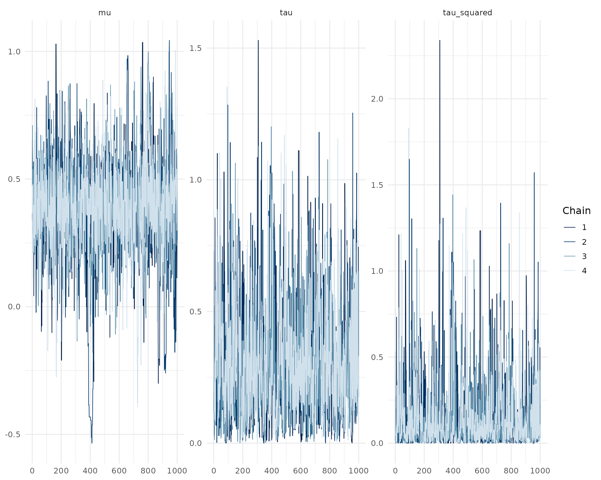

``` r


# Check first few thetas
mcmc_trace(draws, regex_pars = "theta\\[[1-3]\\]")
```

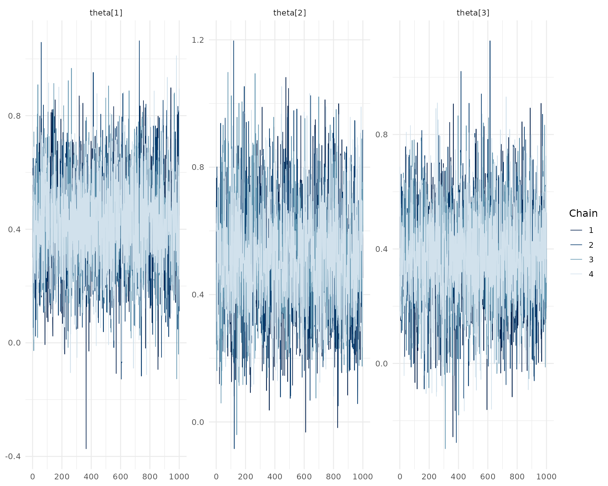

``` r


# All thetas at once (if not too many)
mcmc_trace(draws, regex_pars = "theta")
```

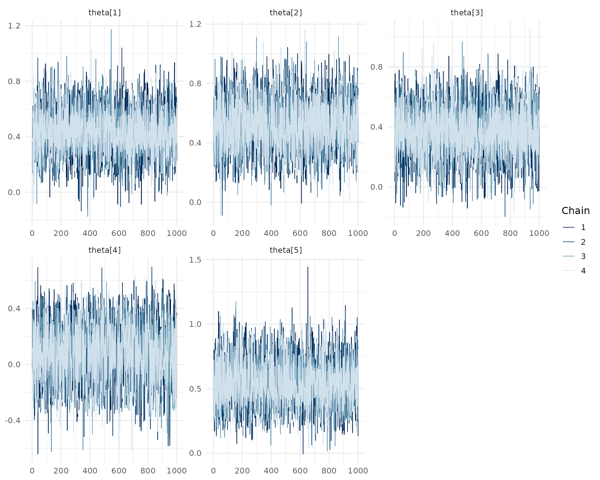

### Density Plots

Compare chains and check for multimodality:

``` r

# Overlay densities from different chains
mcmc_dens_overlay(draws, pars = c("mu", "tau"))
```

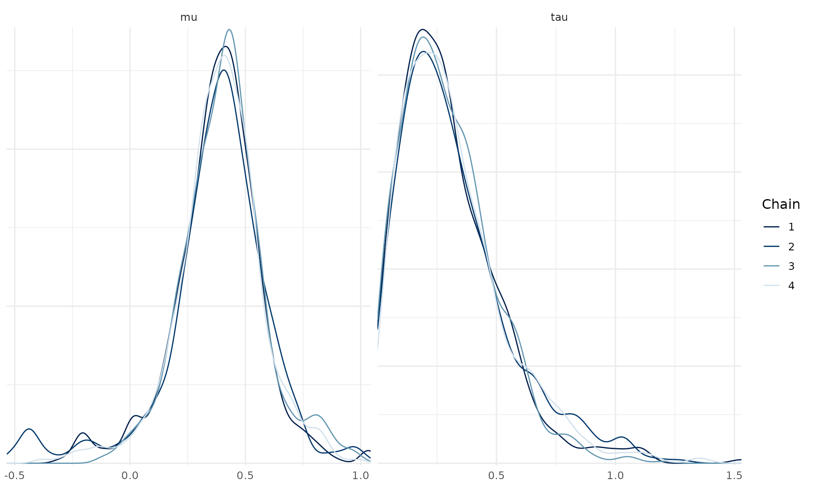

``` r


# Individual densities
mcmc_dens(draws, pars = c("mu", "tau", "tau_squared"))
```

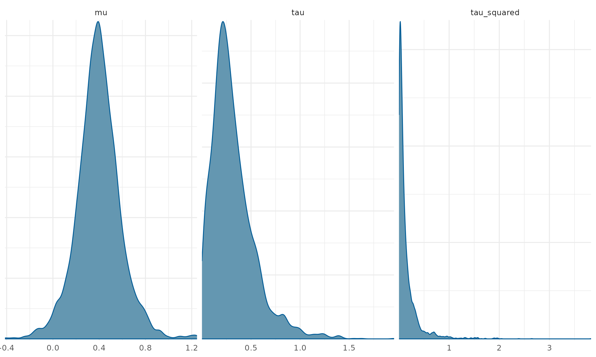

``` r


# Compare all thetas
mcmc_dens_overlay(draws, regex_pars = "theta")
```

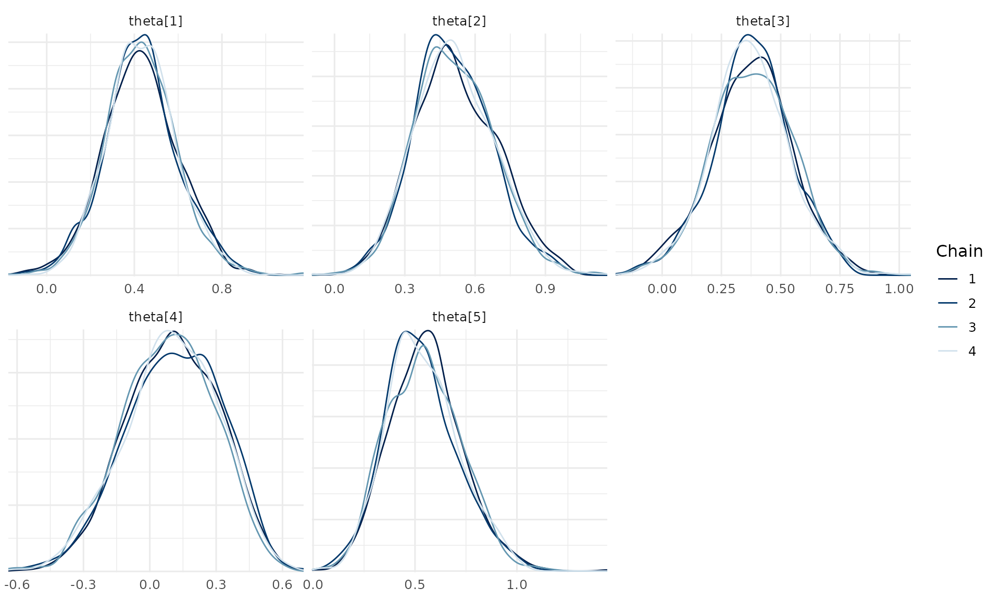

### Interval Plots

Visualize posterior uncertainties:

``` r

# All thetas with 50% and 95% intervals
mcmc_intervals(draws, regex_pars = "theta", prob = 0.5, prob_outer = 0.95)
```

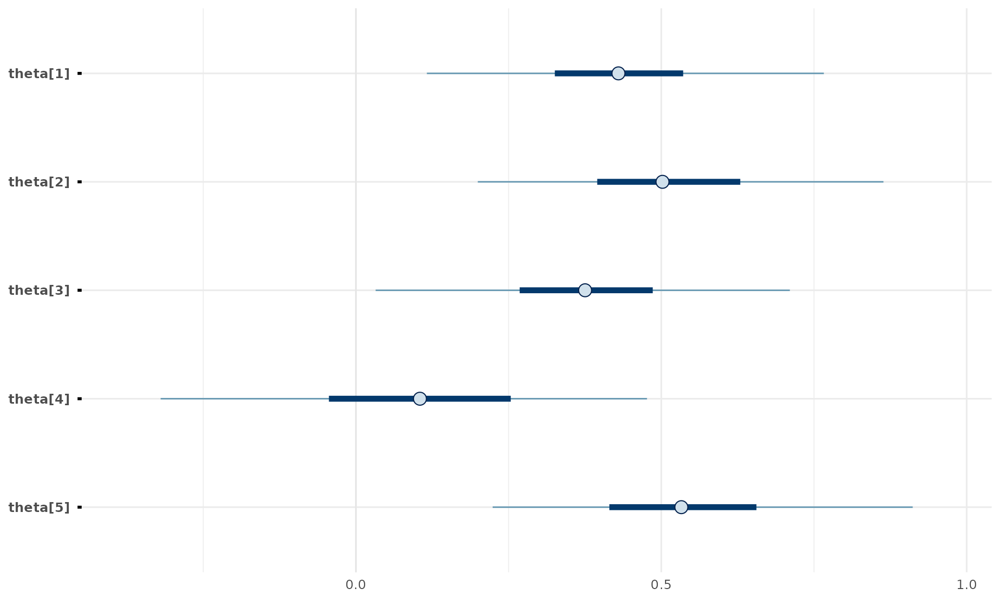

``` r


# With point estimates
mcmc_intervals_data(draws, regex_pars = "theta") %>%
  ggplot(aes(y = parameter)) +
  geom_pointrange(aes(x = m, xmin = ll, xmax = hh)) +
  geom_point(aes(x = m), size = 3) +
  labs(title = "Posterior Intervals for Regional Effects", x = "Effect Size", y = NULL)
```

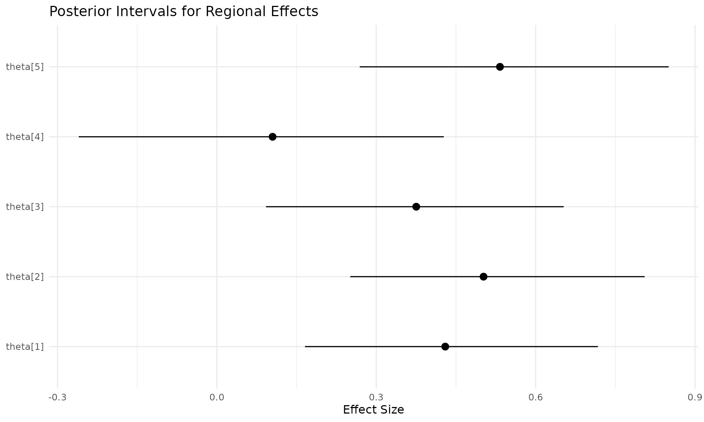

### Area Plots

Density plots with shaded intervals:

``` r

# Hyperparameters
mcmc_areas(draws, pars = c("mu", "tau"), prob = 0.95, prob_outer = 0.99)
```

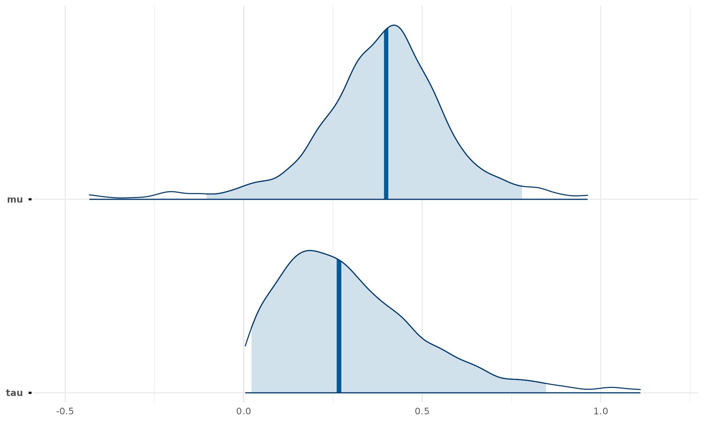

``` r


# All thetas
mcmc_areas(draws, regex_pars = "theta", prob = 0.8)
```

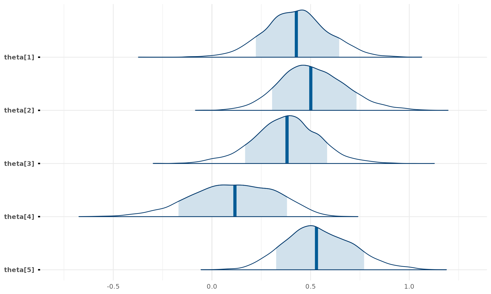

## Tidy Analysis with tidybayes

**tidybayes** makes it easy to manipulate and visualize posteriors using
tidy principles.

### Spread and Gather Draws

``` r

# Gather theta parameters into long format
theta_tidy <- draws %>%
  gather_draws(theta[region]) %>%
  mutate(region = region_names[region])

head(theta_tidy)
#> # A tibble: 6 × 6
#> # Groups:   region, .variable [1]
#>   region .chain .iteration .draw .variable .value
#>   <chr>   <int>      <int> <int> <chr>      <dbl>
#> 1 North       1          1     1 theta      0.557
#> 2 North       1          2     2 theta      0.504
#> 3 North       1          3     3 theta      0.615
#> 4 North       1          4     4 theta      0.515
#> 5 North       1          5     5 theta      0.197
#> 6 North       1          6     6 theta      0.358

# Spread into wide format
theta_wide <- draws %>%
  spread_draws(theta[region]) %>%
  mutate(region = region_names[region])

head(theta_wide)
#> # A tibble: 6 × 5
#> # Groups:   region [1]
#>   region theta .chain .iteration .draw
#>   <chr>  <dbl>  <int>      <int> <int>
#> 1 North  0.557      1          1     1
#> 2 North  0.504      1          2     2
#> 3 North  0.615      1          3     3
#> 4 North  0.515      1          4     4
#> 5 North  0.197      1          5     5
#> 6 North  0.358      1          6     6
```

### Point and Interval Summaries

``` r

# Median and 95% quantile intervals
theta_tidy %>%
  group_by(region) %>%
  median_qi(.value, .width = 0.95)
#> # A tibble: 5 × 7
#>   region  .value  .lower .upper .width .point .interval
#>   <chr>    <dbl>   <dbl>  <dbl>  <dbl> <chr>  <chr>    
#> 1 Central  0.530  0.227   0.911   0.95 median qi       
#> 2 East     0.380  0.0203  0.709   0.95 median qi       
#> 3 North    0.428  0.106   0.756   0.95 median qi       
#> 4 South    0.501  0.203   0.870   0.95 median qi       
#> 5 West     0.117 -0.318   0.481   0.95 median qi

# Multiple interval widths
theta_tidy %>%
  group_by(region) %>%
  median_qi(.value, .width = c(0.5, 0.8, 0.95))
#> # A tibble: 15 × 7
#>    region  .value  .lower .upper .width .point .interval
#>    <chr>    <dbl>   <dbl>  <dbl>  <dbl> <chr>  <chr>    
#>  1 Central  0.530  0.424   0.660   0.5  median qi       
#>  2 East     0.380  0.272   0.484   0.5  median qi       
#>  3 North    0.428  0.321   0.532   0.5  median qi       
#>  4 South    0.501  0.395   0.622   0.5  median qi       
#>  5 West     0.117 -0.0367  0.272   0.5  median qi       
#>  6 Central  0.530  0.325   0.771   0.8  median qi       
#>  7 East     0.380  0.168   0.584   0.8  median qi       
#>  8 North    0.428  0.223   0.645   0.8  median qi       
#>  9 South    0.501  0.305   0.733   0.8  median qi       
#> 10 West     0.117 -0.169   0.380   0.8  median qi       
#> 11 Central  0.530  0.227   0.911   0.95 median qi       
#> 12 East     0.380  0.0203  0.709   0.95 median qi       
#> 13 North    0.428  0.106   0.756   0.95 median qi       
#> 14 South    0.501  0.203   0.870   0.95 median qi       
#> 15 West     0.117 -0.318   0.481   0.95 median qi

# Mean and HDI (highest density interval)
theta_tidy %>%
  group_by(region) %>%
  mean_hdi(.value, .width = 0.95)
#> # A tibble: 5 × 7
#>   region  .value  .lower .upper .width .point .interval
#>   <chr>    <dbl>   <dbl>  <dbl>  <dbl> <chr>  <chr>    
#> 1 Central  0.543  0.211   0.887   0.95 mean   hdi      
#> 2 East     0.377  0.0159  0.700   0.95 mean   hdi      
#> 3 North    0.428  0.122   0.765   0.95 mean   hdi      
#> 4 South    0.512  0.195   0.858   0.95 mean   hdi      
#> 5 West     0.110 -0.296   0.495   0.95 mean   hdi
```

### Custom Summaries with dplyr

``` r

# Probability of positive effect
theta_tidy %>%
  group_by(region) %>%
  summarise(
    mean_effect = mean(.value),
    sd_effect = sd(.value),
    prob_positive = mean(.value > 0),
    prob_clinically_meaningful = mean(.value > 0.3),
    .groups = "drop"
  ) %>%
  arrange(desc(prob_positive))
#> # A tibble: 5 × 5
#>   region  mean_effect sd_effect prob_positive prob_clinically_meaningful
#>   <chr>         <dbl>     <dbl>         <dbl>                      <dbl>
#> 1 Central       0.543     0.175         1.000                      0.927
#> 2 South         0.512     0.169         0.999                      0.908
#> 3 North         0.428     0.166         0.993                      0.794
#> 4 East          0.377     0.168         0.983                      0.690
#> 5 West          0.110     0.212         0.695                      0.207
```

### Computing Contrasts

``` r

# Method 1: Using shrinkr's built-in function
L <- rbind(
  "South - North" = c(-1, 1, 0, 0, 0),
  "Central - North" = c(-1, 0, 0, 0, 1),
  "South - West" = c(0, 1, 0, -1, 0)
)
contrasts <- theta_contrasts(fit, L, labels = rownames(L))
summarise_draws(contrasts)
#> # A tibble: 3 × 10
#>   variable        mean median    sd   mad       q5   q95  rhat ess_bulk ess_tail
#>   <chr>          <dbl>  <dbl> <dbl> <dbl>    <dbl> <dbl> <dbl>    <dbl>    <dbl>
#> 1 South - North 0.0831 0.0661 0.223 0.196 -0.257   0.475 1.00     4043.    2691.
#> 2 Central - No… 0.114  0.0894 0.227 0.204 -0.229   0.517 1.000    3714.    3437.
#> 3 South - West  0.402  0.388  0.288 0.317 -0.00529 0.900 1.00     1351.    1525.

# Method 2: Using tidybayes compare_levels
theta_wide %>%
  compare_levels(theta, by = region, comparison = "pairwise") %>%
  group_by(region) %>%
  median_qi(theta) %>%
  arrange(desc(theta))
#> # A tibble: 10 × 7
#>    region            theta .lower .upper .width .point .interval
#>    <chr>             <dbl>  <dbl>  <dbl>  <dbl> <chr>  <chr>    
#>  1 South - East     0.111  -0.297 0.631    0.95 median qi       
#>  2 South - North    0.0661 -0.338 0.564    0.95 median qi       
#>  3 North - East     0.0382 -0.383 0.505    0.95 median qi       
#>  4 South - Central -0.0200 -0.459 0.387    0.95 median qi       
#>  5 North - Central -0.0894 -0.601 0.305    0.95 median qi       
#>  6 East - Central  -0.135  -0.663 0.236    0.95 median qi       
#>  7 West - East     -0.244  -0.808 0.142    0.95 median qi       
#>  8 West - North    -0.290  -0.878 0.0819   0.95 median qi       
#>  9 West - South    -0.388  -0.987 0.0471   0.95 median qi       
#> 10 West - Central  -0.421  -1.05  0.0376   0.95 median qi
```

## Modern Visualizations with ggdist

**ggdist** provides publication-ready distribution visualizations.

### Halfeye Plots

Eye + interval visualization:

``` r

theta_tidy %>%
  ggplot(aes(y = region, x = .value)) +
  stat_halfeye(
    .width = c(0.66, 0.95),
    fill = "steelblue"
  ) +
  geom_vline(xintercept = 0, linetype = "dashed", alpha = 0.5) +
  labs(
    title = "Regional Treatment Effects",
    subtitle = "Posterior distributions with median and 66%/95% intervals",
    x = "Treatment Effect",
    y = NULL
  )
```

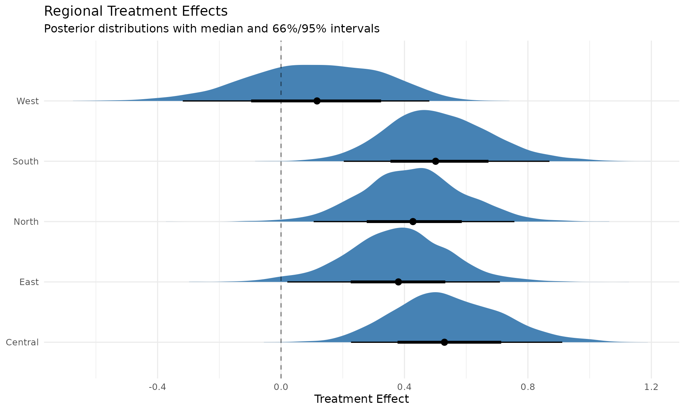

### Slab + Interval

Density with separate interval layer:

``` r

theta_tidy %>%
  ggplot(aes(y = region, x = .value)) +
  stat_slab(aes(fill_ramp = after_stat(level)), fill = "steelblue", alpha = 0.8) +
  stat_pointinterval(.width = c(0.66, 0.95), position = position_nudge(y = -0.15)) +
  scale_fill_ramp_discrete(range = c(1, 0.2), guide = "none") +
  labs(
    title = "Posterior Densities with Quantile Intervals",
    x = "Treatment Effect",
    y = NULL
  )
```

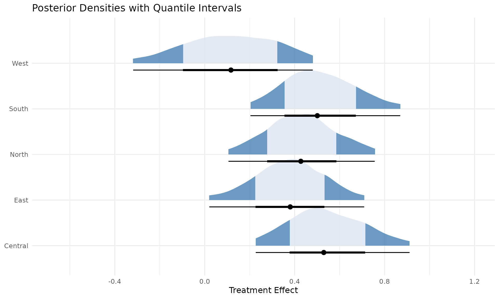

### Quantile Dotplots

Each dot = quantile of the distribution:

``` r

theta_tidy %>%
  ggplot(aes(y = region, x = .value)) +
  stat_dots(quantiles = 100) +
  geom_vline(xintercept = 0, linetype = "dashed", alpha = 0.5) +
  labs(
    title = "Quantile Dotplots",
    subtitle = "Each dot represents 1% of the posterior",
    x = "Treatment Effect",
    y = NULL
  )
```

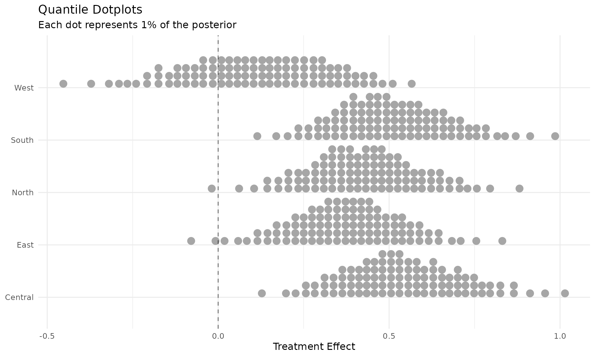

### Gradient Intervals

Continuous representation of uncertainty:

``` r

theta_tidy %>%
  ggplot(aes(y = region, x = .value)) +
  stat_gradientinterval(.width = ppoints(50)) +
  scale_color_brewer(palette = "Blues", guide = "none") +
  labs(
    title = "Gradient Interval Representation",
    x = "Treatment Effect",
    y = NULL
  )
```

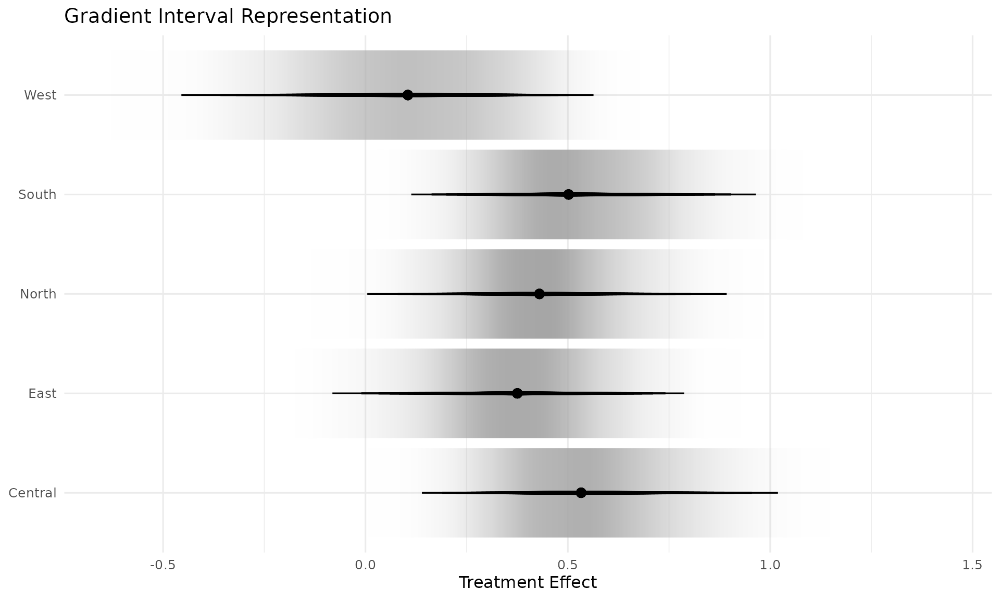

## Comparing Pre- and Post-Shrinkage

### Extract Both Estimates

``` r

# Get pre-shrunk estimates from mixture
pre_shrunk <- summarise_theta(fit) %>%
  mutate(type = "Pre-shrunk")

# Get post-shrunk estimates
post_shrunk <- summarise_theta(fit) %>%
  mutate(type = "Post-shrunk")

# Or use shrinkr's built-in plot
plot(fit, group_names = region_names)
```

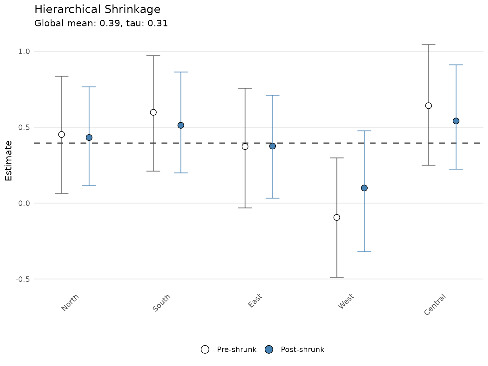

### Custom Comparison Plot

``` r

# Get the hierarchical mean (mu)
mu_draws <- draws %>% spread_draws(mu)
mu_mean <- mean(mu_draws$mu)

# Combine with Stage 1 samples
stage1_draws <- lapply(seq_along(samples_list), function(i) {
  data.frame(
    region = region_names[i],
    .value = samples_list[[i]][,1],
    type = "Stage 1"
  )
}) %>% bind_rows()

stage2_draws <- theta_tidy %>%
  mutate(type = "Stage 2 (Shrunk)")

# Plot side by side
bind_rows(stage1_draws, stage2_draws) %>%
  ggplot(aes(y = region, x = .value, fill = type)) +
  stat_halfeye(alpha = 0.7, position = position_dodge(width = 0.4)) +
  geom_vline(xintercept = 0, linetype = "dashed", alpha = 0.5, color = "gray50") +
  geom_vline(xintercept = mu_mean, linetype = "solid", alpha = 0.8, 
             color = "darkred", linewidth = 1) +
  annotate("text", x = mu_mean, y = 0.5, 
           label = sprintf("Global mean (μ) = %.2f", mu_mean),
           hjust = -0.1, color = "darkred", size = 3.5) +
  scale_fill_manual(values = c("Stage 1" = "gray70", "Stage 2 (Shrunk)" = "steelblue")) +
  labs(
    title = "Stage 1 vs Stage 2: Effect of Hierarchical Shrinkage",
    subtitle = "Stage 2 estimates are pulled toward the global mean",
    x = "Treatment Effect",
    y = NULL,
    fill = NULL
  ) +
  theme(legend.position = "bottom")
```

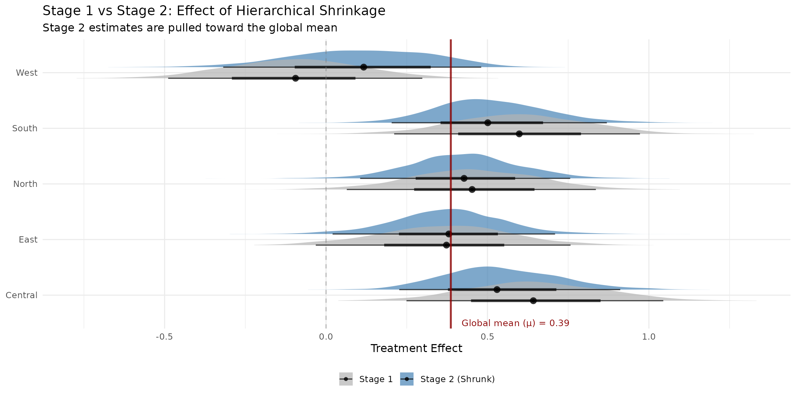

## Complete Workflow Example

Here’s a typical analysis workflow using tidy principles:

``` r

# 1. Extract and prepare data
analysis_data <- draws %>%
  spread_draws(mu, tau, theta[i]) %>%
  mutate(region = region_names[i])

# 2. Compute summaries
summary_table <- analysis_data %>%
  group_by(region) %>%
  summarise(
    mean = mean(theta),
    median = median(theta),
    sd = sd(theta),
    q025 = quantile(theta, 0.025),
    q975 = quantile(theta, 0.975),
    prob_positive = mean(theta > 0),
    prob_clinically_important = mean(theta > 0.3),
    .groups = "drop"
  ) %>%
  arrange(desc(median))

print(summary_table)
#> # A tibble: 5 × 8
#>   region   mean median    sd    q025  q975 prob_positive prob_clinically_impor…¹
#>   <chr>   <dbl>  <dbl> <dbl>   <dbl> <dbl>         <dbl>                   <dbl>
#> 1 Central 0.543  0.530 0.175  0.227  0.911         1.000                   0.927
#> 2 South   0.512  0.501 0.169  0.203  0.870         0.999                   0.908
#> 3 North   0.428  0.428 0.166  0.106  0.756         0.993                   0.794
#> 4 East    0.377  0.380 0.168  0.0203 0.709         0.983                   0.690
#> 5 West    0.110  0.117 0.212 -0.318  0.481         0.695                   0.207
#> # ℹ abbreviated name: ¹​prob_clinically_important

# 3. Create advanced figure
library(patchwork)

p1 <- analysis_data %>%
  ggplot(aes(y = reorder(region, theta), x = theta)) +
  stat_halfeye(.width = c(0.66, 0.95), fill = "steelblue") +
  geom_vline(xintercept = 0, linetype = "dashed", alpha = 0.5) +
  labs(
    title = "A. Regional Treatment Effects",
    x = "Effect Size",
    y = NULL
  )

p2 <- analysis_data %>%
  dplyr::ungroup() %>%
  dplyr::select(mu, tau, .draw) %>%
  dplyr::distinct() %>%
  tidyr::pivot_longer(cols = c(mu, tau), names_to = "name", values_to = "value") %>%
  ggplot(aes(x = value, fill = name)) +
  stat_halfeye(alpha = 0.7) +
  facet_wrap(~name, scales = "free", labeller = label_both) +
  scale_fill_brewer(palette = "Set2") +
  labs(
    title = "B. Hyperparameters",
    x = "Value",
    y = "Density"
  ) +
  theme(legend.position = "none")

p3 <- analysis_data %>%
  dplyr::ungroup() %>%
  dplyr::select(.draw, region, theta) %>%
  compare_levels(theta, by = region) %>%
  ggplot(aes(y = region, x = theta)) +
  stat_halfeye(fill = "coral", alpha = 0.7) +
  geom_vline(xintercept = 0, linetype = "dashed", color = "red", alpha = 0.5) +
  labs(
    title = "C. Pairwise Regional Comparisons",
    x = "Difference in Effect Size",
    y = NULL
  )

p4 <- analysis_data %>%
  dplyr::ungroup() %>%
  dplyr::select(.draw, mu, tau) %>%
  dplyr::distinct() %>%
  ggplot(aes(x = mu, y = tau)) +
  geom_hex(bins = 30) +
  stat_ellipse(level = 0.95, color = "red", linewidth = 1) +
  scale_fill_viridis_c() +
  labs(
    title = "D. Hyperparameter Correlation",
    x = expression(mu~"(global mean)"),
    y = expression(tau~"(heterogeneity)")
  )

(p1 + p2) / (p3 + p4) +
  plot_annotation(
    title = "Complete Bayesian Shrinkage Analysis",
    subtitle = sprintf(
      "Global effect: %.2f [%.2f, %.2f] | Heterogeneity (tau): %.2f",
      median(analysis_data$mu),
      quantile(analysis_data$mu, 0.025),
      quantile(analysis_data$mu, 0.975),
      median(analysis_data$tau)
    )
  )
```

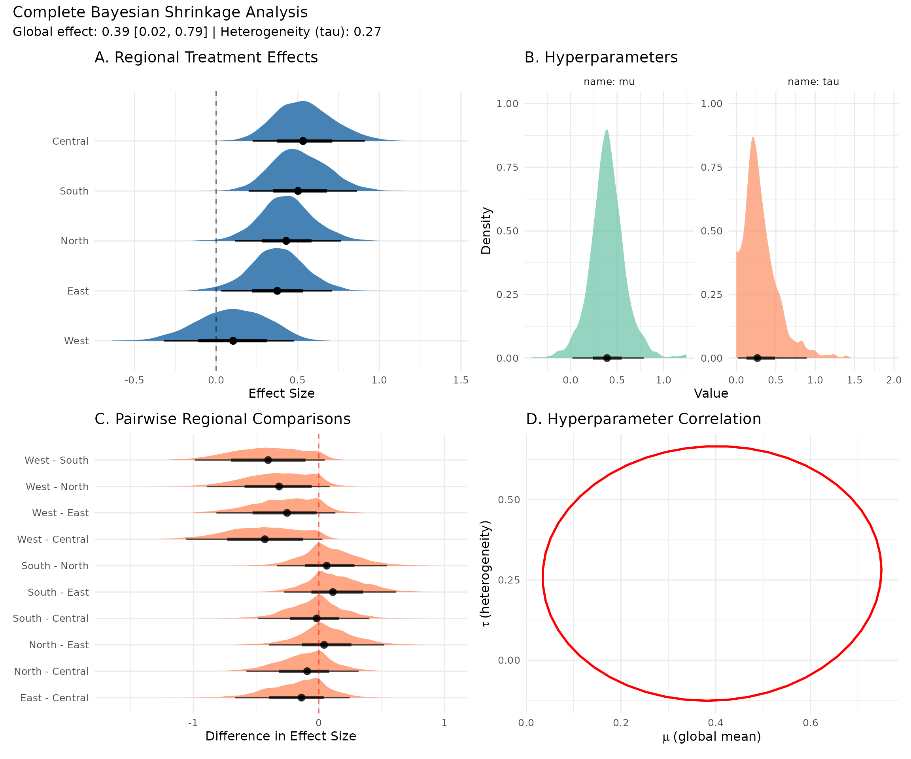

## Advanced: Custom Analyses

### Probability Statements

``` r

# Which region is best?
analysis_data %>%
  group_by(.draw) %>%
  slice_max(theta, n = 1) %>%
  ungroup() %>%
  count(region) %>%
  mutate(probability = n / sum(n)) %>%
  arrange(desc(probability))
#> # A tibble: 5 × 3
#>   region      n probability
#>   <chr>   <int>       <dbl>
#> 1 Central  1628      0.407 
#> 2 South    1294      0.324 
#> 3 North     655      0.164 
#> 4 East      377      0.0942
#> 5 West       46      0.0115

# Alternative: probability each region is best
analysis_data %>%
  group_by(.draw) %>%
  mutate(rank = rank(-theta)) %>%
  ungroup() %>%
  group_by(region) %>%
  summarise(
    prob_best = mean(rank == 1),
    prob_top2 = mean(rank <= 2),
    mean_rank = mean(rank),
    .groups = "drop"
  ) %>%
  arrange(mean_rank)
#> # A tibble: 5 × 4
#>   region  prob_best prob_top2 mean_rank
#>   <chr>       <dbl>     <dbl>     <dbl>
#> 1 Central    0.407     0.693       2.05
#> 2 South      0.324     0.623       2.24
#> 3 North      0.164     0.382       2.84
#> 4 East       0.0942    0.27        3.21
#> 5 West       0.0115    0.0322      4.65

# Pairwise comparisons: Probability that South > North
# Create wide format for comparisons
theta_wide_for_contrasts <- analysis_data %>%
  ungroup() %>%
  dplyr::select(.draw, region, theta) %>%
  tidyr::pivot_wider(names_from = region, values_from = theta)

theta_wide_for_contrasts %>%
  summarise(
    prob_south_beats_north = mean(South > North),
    prob_south_beats_north_by_02 = mean((South - North) > 0.2),
    prob_central_beats_all = mean(
      Central > North & Central > South & 
      Central > East & Central > West
    )
  )
#> # A tibble: 1 × 3
#>   prob_south_beats_north prob_south_beats_north_by_02 prob_central_beats_all
#>                    <dbl>                        <dbl>                  <dbl>
#> 1                  0.644                        0.271                  0.407
```

### Tail Probabilities

``` r

# Classify effects into categories
theta_tidy %>%
  group_by(region) %>%
  summarise(
    prob_harm = mean(.value < -0.1),
    prob_null = mean(abs(.value) < 0.1),
    prob_small_benefit = mean(.value > 0.1 & .value < 0.3),
    prob_large_benefit = mean(.value > 0.3),
    .groups = "drop"
  ) %>%
  arrange(desc(prob_large_benefit))
#> # A tibble: 5 × 5
#>   region  prob_harm prob_null prob_small_benefit prob_large_benefit
#>   <chr>       <dbl>     <dbl>              <dbl>              <dbl>
#> 1 Central   0          0.004              0.069               0.927
#> 2 South     0          0.0045             0.0872              0.908
#> 3 North     0.00175    0.0217             0.183               0.794
#> 4 East      0.00325    0.0488             0.258               0.690
#> 5 West      0.167      0.309              0.317               0.207

# Visualize classification
theta_tidy %>%
  mutate(
    category = case_when(
      .value < -0.1 ~ "Harm",
      abs(.value) < 0.1 ~ "Null",
      .value > 0.1 & .value < 0.3 ~ "Small Benefit",
      .value > 0.3 ~ "Large Benefit"
    )
  ) %>%
  count(region, category) %>%
  group_by(region) %>%
  mutate(probability = n / sum(n)) %>%
  ggplot(aes(x = probability, y = region, fill = category)) +
  geom_col(position = "stack") +
  scale_fill_manual(
    values = c(
      "Harm" = "red",
      "Null" = "gray",
      "Small Benefit" = "lightblue",
      "Large Benefit" = "darkblue"
    )
  ) +
  labs(
    title = "Classification of Treatment Effects",
    x = "Probability",
    y = NULL,
    fill = "Effect Category"
  ) +
  theme(legend.position = "bottom")
```

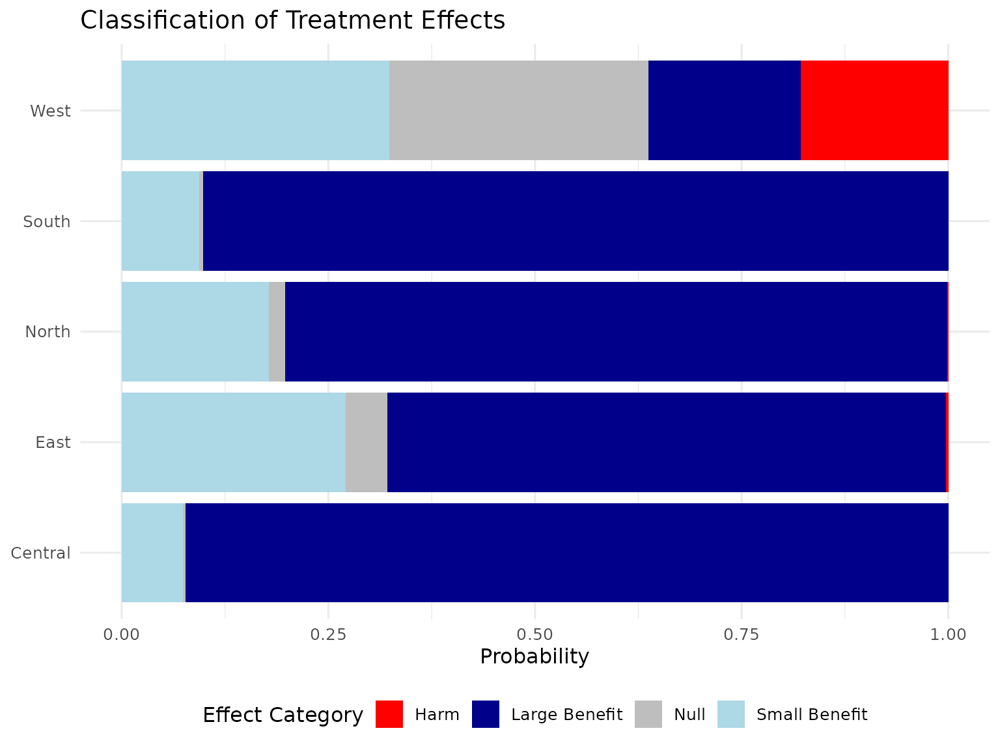

### Ranking Analysis

``` r

# Compute ranks for each draw
rank_data <- analysis_data %>%
  group_by(.draw) %>%
  mutate(rank = rank(-theta)) %>%
  ungroup()

# Summary statistics
rank_summary <- rank_data %>%
  group_by(region) %>%
  summarise(
    mean_rank = mean(rank),
    median_rank = median(rank),
    prob_rank1 = mean(rank == 1),
    prob_rank2 = mean(rank == 2),
    prob_top3 = mean(rank <= 3),
    .groups = "drop"
  ) %>%
  arrange(mean_rank)

print(rank_summary)
#> # A tibble: 5 × 6
#>   region  mean_rank median_rank prob_rank1 prob_rank2 prob_top3
#>   <chr>       <dbl>       <dbl>      <dbl>      <dbl>     <dbl>
#> 1 Central      2.05           2     0.407      0.286     0.876 
#> 2 South        2.24           2     0.324      0.300     0.839 
#> 3 North        2.84           3     0.164      0.218     0.675 
#> 4 East         3.21           3     0.0942     0.176     0.528 
#> 5 West         4.65           5     0.0115     0.0208    0.0818

# Visualize ranking distribution
rank_data %>%
  ggplot(aes(x = rank, y = reorder(region, -theta))) +
  stat_dots(quantiles = 100) +
  scale_x_continuous(breaks = 1:5) +
  labs(
    title = "Ranking Distribution",
    subtitle = "Each dot represents 1% of posterior draws",
    x = "Rank (1 = best, 5 = worst)",
    y = NULL
  )
```

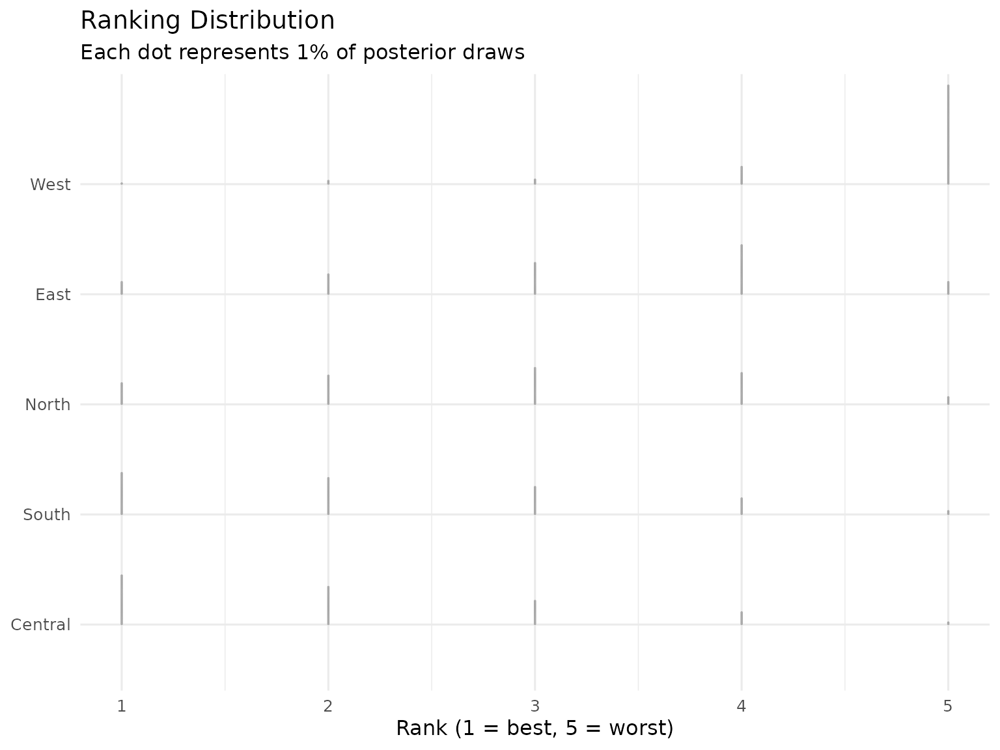

``` r


# Alternative: bar chart of ranking probabilities
rank_data %>%
  count(region, rank) %>%
  group_by(region) %>%
  mutate(probability = n / sum(n)) %>%
  ggplot(aes(x = rank, y = probability, fill = region)) +
  geom_col() +
  facet_wrap(~region, ncol = 1) +
  scale_x_continuous(breaks = 1:5) +
  scale_fill_brewer(palette = "Set2") +
  labs(
    title = "Probability of Each Rank by Region",
    x = "Rank (1 = best)",
    y = "Probability"
  ) +
  theme(legend.position = "none")
```

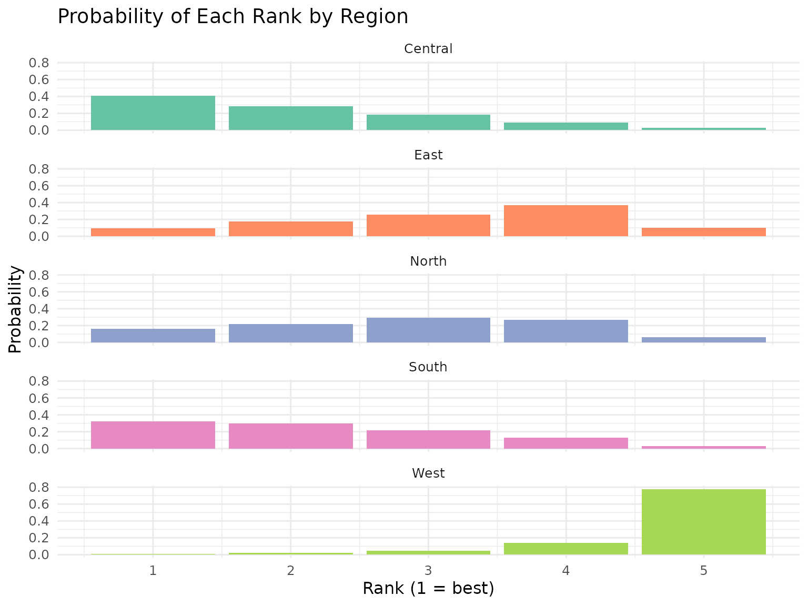

## Further Reading

- **posterior** package: <https://mc-stan.org/posterior/>
- **bayesplot** package: <https://mc-stan.org/bayesplot/>
- **tidybayes** package: <http://mjskay.github.io/tidybayes/>
- **ggdist** package: <https://mjskay.github.io/ggdist/>
